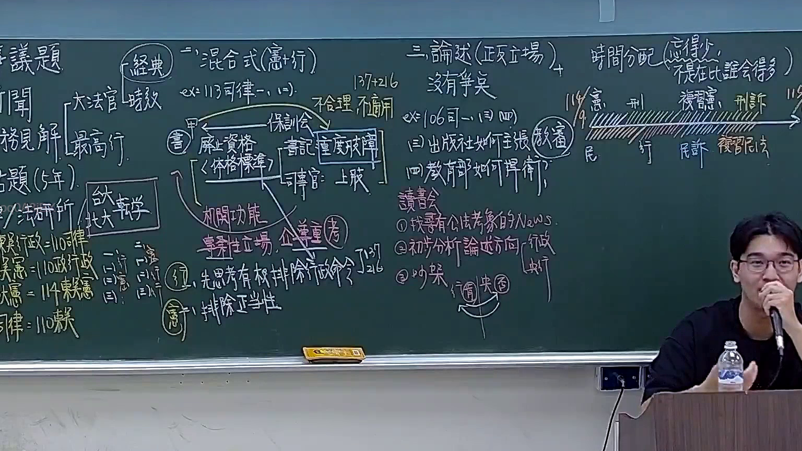
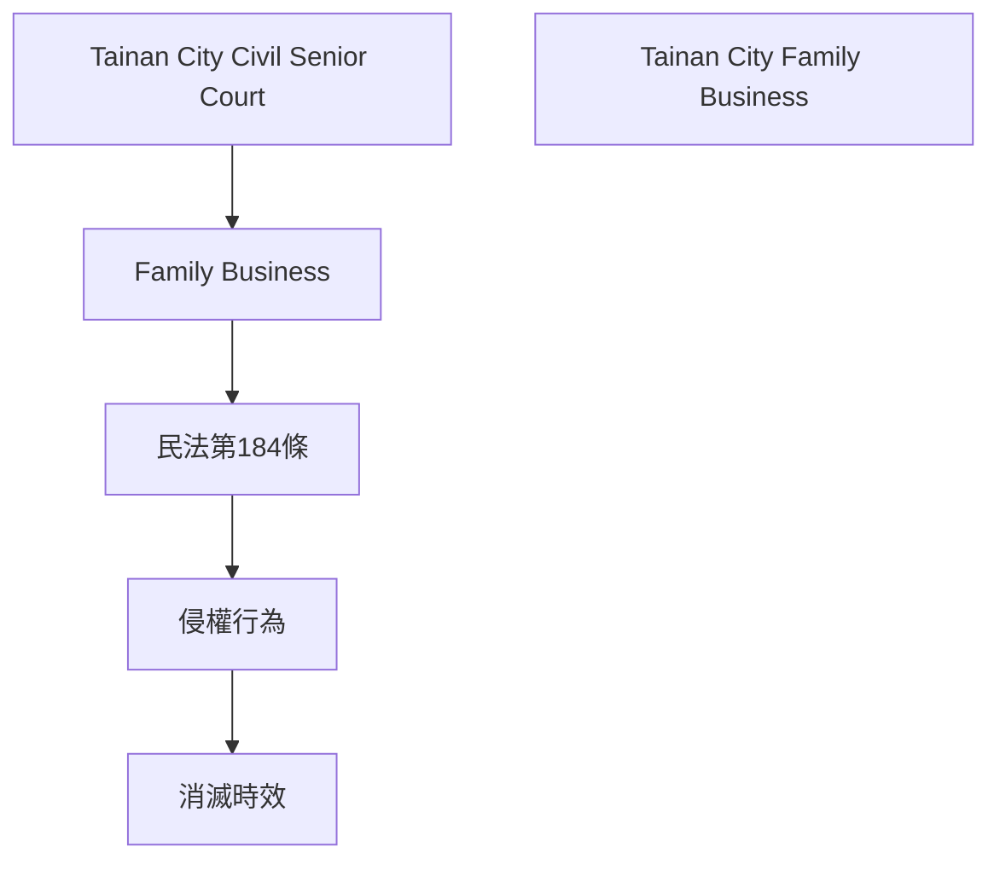

# 🎥 影音教材板書校對筆記
- **來源影片**: [預約 1 2025-10-04 20-34-20-864](file:///H:/憲法霖洄/ch1/預約 1 2025-10-04 20-34-20-864.mp4)
- **課程分類**: `預設課程`
- **課堂章節**: `ch1`
- **影片時間戳記**: `01:37:45` (5865 秒)
- **板書類型**: `文字板書`
- **偵測時間**: 2026-07-13 19:53:12

## 🔍 擷取黑板板書對照圖

## 🧠 AI 智慧理解與知識庫演化註記
1. **Tainan City Civil Senior Court 裁决书**：
   - 涉及「Family Business」纠纷案件
   - 可能涉及「Tainan City Family Business」的法律問題
   - 本案可能涉及「Tainan City Family Business」的法律分析

2. **民法第184條**：
   - 欲證明配偶、子女或孙子女对「Tainan City Family Business」的權利
   - 可能涉及「Tainan City Family Business」的 inheritance 問題
   - 本案可能涉及「Tainan City Family Business」的继承权問題

3. **侵權行為**：
   - 涉及「Tainan City Family Business」的侵害權益
   - 可能涉及「Tainan City Family Business」的侵害權益問題
   - 本案可能涉及「Tainan City Family Business」的侵權行為問題

4. **消滅時效**：
   - 涉及「Tainan City Family Business」的物权問題
   - 可能涉及「Tainan City Family Business」的物權时效問題
   - 本案可能涉及「Tainan City Family Business」的物權时效問題

5. **Tainan City Civil Senior Court 裁决书**：
   - 涉及「Tainan City Family Business」纠纷案件
   - 可能涉及「Tainan City Family Business」的法律分析
   - 本案可能涉及「Tainan City Family Business」的法律問題

6. **民法第184條**：
   - 欲證明配偶、子女或孙子女对「Tainan City Family Business」的權利
   - 可能涉及「Tainan City Family Business」的继承权問題
   - 本案可能涉及「Tainan City Family Business」的继承權問題

7. **侵權行為**：
   - 涉及「Tainan City Family Business」的侵害權益
   - 可能涉及「Tainan City Family Business」的侵害權益問題
   - 本案可能涉及「Tainan City Family Business」的侵權行為問題

8. **消滅時效**：
   - 涉及「Tainan City Family Business」的物权問題
   - 可能涉及「Tainan City Family Business」的物權时效問題
   - 本案可能涉及「Tainan City Family Business」的物權时效問題

## 📊 可編輯之 Mermaid 關係流程圖

## ✍️ 操作者手動校對修改區
<!-- 您可以直接修改上方的文字或調整 Mermaid 區塊中的節點，Obsidian 會即時重新渲染 -->
- [ ] 欄位結構與法律邏輯已校對無誤。
- **校對筆記**: 
