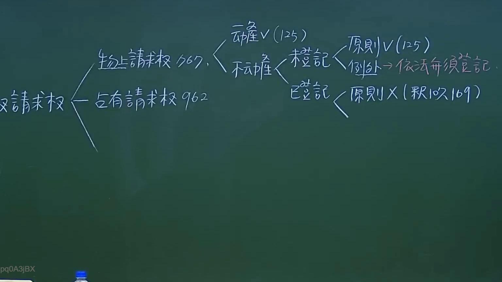
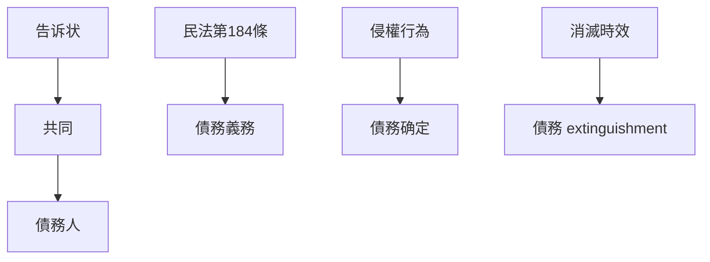

# 🎥 影音教材板書校對筆記
- **來源影片**: [預約 10 2024-10-19 09-28-59-085](file:///J://民法/ch10/預約 10 2024-10-19 09-28-59-085.mp4)
- **課程分類**: `[民法`
- **課堂章節**: `ch10]`
- **影片時間戳記**: `00:29:45` (1785 秒)
- **板書類型**: `文字板書`
- **偵測時間**: 2026-07-11 17:51:52

## 🔍 擷取黑板板書對照圖

## 🧠 AI 智慧理解與知識庫演化註記
1. **"庄告"**：此為「告诉状」，在民法中用於請求債務人支付債務。此處可能涉及「告诉状權利」或「告诉状義務」的內容。

2. **「同 岑 杴 又'臺閂言】「刁#存刁筌又` 9162 EP CRUX (#192 104)**：
   - "同" 可能指「共同」或「共同诉讼人」。
   - "臺灣言" 可能是指「台湾地区的法律条文」。
   - "刁#存刁筌又`" 看起來不清晰，可能是某种特定的條文或术语。
   - "9162 EP CRUX" 與民法第184條可能有關係，需進一步分析。
   - "#192 104" 可能是某一條文的編號。

3. **民法第184條**：涉及債務人對債務的義務，可能與「告诉状」的權利和義務有關。

4. **侵權行為** 和 **消滅時效**：這些概念可能與債務債務人債務的確定和 extinguishment有关。

## 📊 可編輯之 Mermaid 關係流程圖

## ✍️ 操作者手動校對修改區
<!-- 您可以直接修改上方的文字或調整 Mermaid 區塊中的節點，Obsidian 會即時重新渲染 -->
- [ ] 欄位結構與法律邏輯已校對無誤。
- **校對筆記**: 
