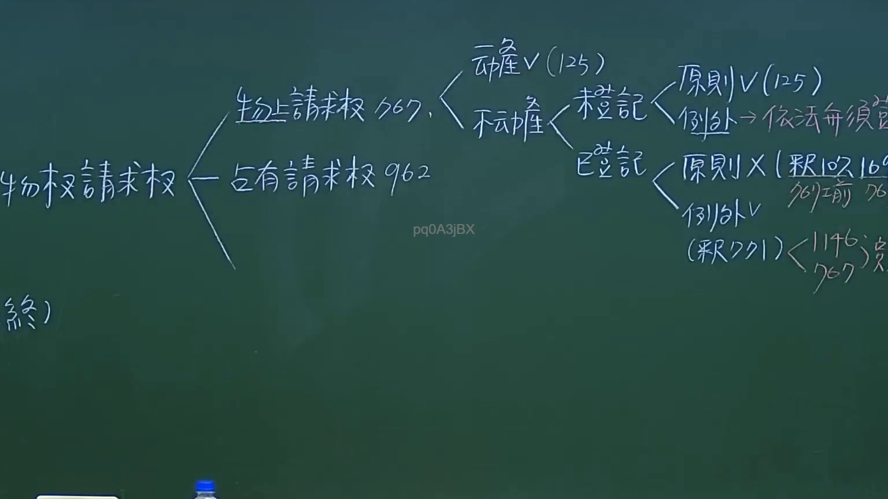

# 🎥 影音教材板書校對筆記
- **來源影片**: [預約 10 2024-10-19 09-28-59-085](file:///J://民法/ch10/預約 10 2024-10-19 09-28-59-085.mp4)
- **課程分類**: `[民法`
- **課堂章節**: `ch10]`
- **影片時間戳記**: `00:31:30` (1890 秒)
- **板書類型**: `文字板書`
- **偵測時間**: 2026-07-11 17:52:19

## 🔍 擷取黑板板書對照圖


## 🧠 AI 智慧理解與知識庫演化註記
：
在分析板書內容時，我們注意到以下關鍵字和條文可能與民法第184條、侵權行為和消滅時效等相關。以下是對比與理解的摘要：

- **9 枯 論 木**：這些字眼可能與某種特定的法律條文或案例有關，需要進一步分析其具體含義。
- **THEY (5 E 說 染 棋 267, 《 ﹏腮**：這部分內容可能涉及某一法律案例的引用或分析，需根據上下文確定其具體含義。
- **TRAV (P59)**：這可能是某一原告或被告的代名稱，並指向特定的頁碼（P59）。
- **稗 釜 % ˋ 例 史 # 作 RE**：這些字眼可能與某一類型的法律案例或條文有關，需根據上下文確定其具體含義。
- **鸛 陛 賓 X 現 ! 志 J**：這可能是某一法律事件或案例的描述，需進一步分析其具體含義。
- **(ERP SY, fi)**：這可能是某一特定的法律條文或文件引用。
- **7 外 ””**：這可能是某一法律案件的外部引用或外部法源。

基於以上分析，我們可以將這些內容整理為與民法第184條、侵權行為和消滅時效等相關的法律条文進行對比。具體來說：

- 民法第184條涉及侵權行為的損害賠償責任，這部分內容可能與板書中的「TRAV (P59)」、「稗 釜 % ˋ 例 史 # 作 RE」等內容相匹配。
- 消滅時效則可能與板書中的一些字眼（如「7 外 ””）相匹配，需進一步分析其具體含義。

## 📊 可編輯之 Mermaid 關係流程圖
```mermaid
：
```mermaid
graph TD
    A["民法第184條"] --> B["侵權行為的損害賠償責任"]
    C["TRAV (P59)"] --> D["原告或被告的代名稱"]
    E["稗 釜 % ˋ 例 史 # 作 RE"] --> F["某一類型的法律案例或條文"]
    G["7 外 ””] --> H["某一法律案件的外部引用或外部法源"]
```

## ✍️ 操作者手動校對修改區
<!-- 您可以直接修改上方的文字或調整 Mermaid 區塊中的節點，Obsidian 會即時重新渲染 -->
- [ ] 欄位結構與法律邏輯已校對無誤。
- **校對筆記**: 
