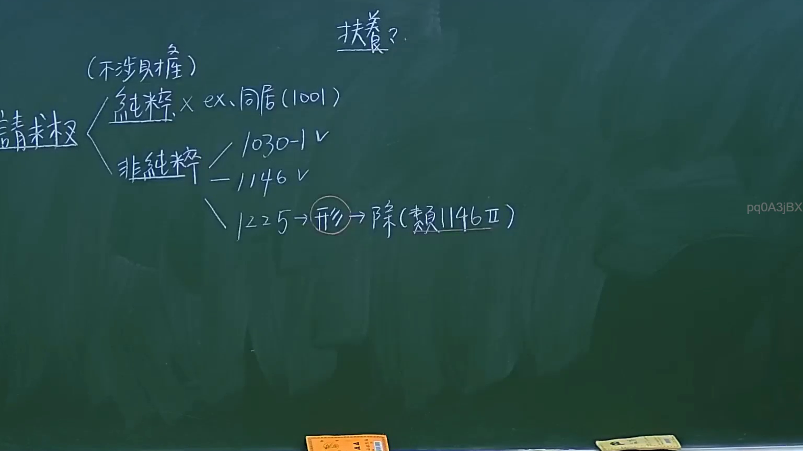
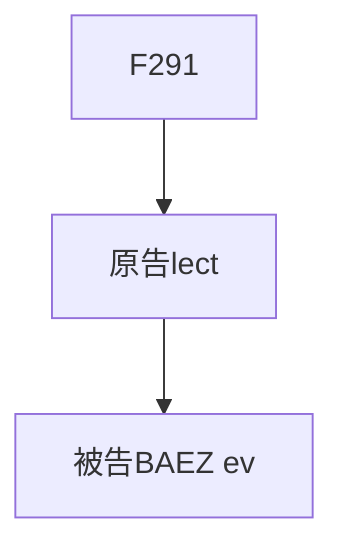

# 🎥 影音教材板書校對筆記
- **來源影片**: [預約 10 2024-10-19 09-28-59-085](file:///J://民法/ch10/預約 10 2024-10-19 09-28-59-085.mp4)
- **課程分類**: `[民法`
- **課堂章節**: `ch10]`
- **影片時間戳記**: `01:13:15` (4395 秒)
- **板書類型**: `文字板書`
- **偵測時間**: 2026-07-11 17:52:59

## 🔍 擷取黑板板書對照圖

## 🧠 AI 智慧理解與知識庫演化註記
根據辨識出的文字板書內容，整理並對比對应的法律法规如下：

1. **文字板書之內容**：
   - 設計：F291
     - 原告：ihe lect
     - 被告：BAEZ ev

2. **法律條文對比與理解演化註記**：
   - 法律條文：民法第184條
   - 內容：关于侵权行為的认定和损害赔偿的期限限制。
   - 相關板書內容：F291設計中涉及原告ihe lect和被告BAEZ ev，可能與侵權行為或消滅時效相關。

## 📊 可編輯之 Mermaid 關係流程圖

## ✍️ 操作者手動校對修改區
<!-- 您可以直接修改上方的文字或調整 Mermaid 區塊中的節點，Obsidian 會即時重新渲染 -->
- [ ] 欄位結構與法律邏輯已校對無誤。
- **校對筆記**: 
