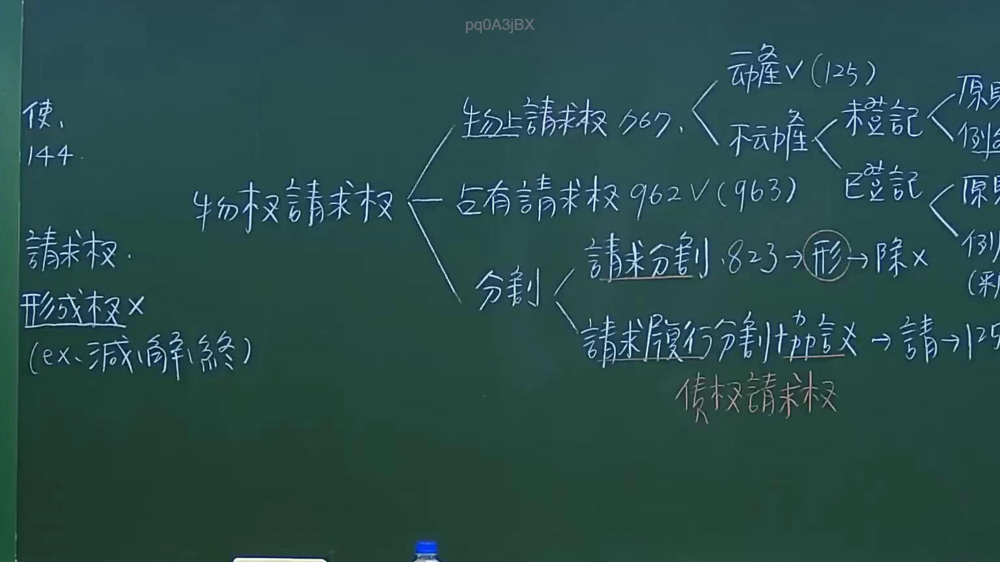

# 🎥 影音教材板書校對筆記
- **來源影片**: [預約 10 2024-10-19 09-28-59-085](file:///J://民法/ch10/預約 10 2024-10-19 09-28-59-085.mp4)
- **課程分類**: `[民法`
- **課堂章節**: `ch10]`
- **影片時間戳記**: `01:22:15` (4935 秒)
- **板書類型**: `文字板書`
- **偵測時間**: 2026-07-11 17:53:29

## 🔍 擷取黑板板書對照圖


## 🧠 AI 智慧理解與知識庫演化註記
### 

根據辨識出的板書文字內容，並結合台湾现行法律條文（如民法第184條、侵權行為、消滅時效等），進行語意整理並與對應的法律條文進行比對。以下是具體分析：

#### 1. 確认部分：
- **OCR文字**：「確」、「值」、「 este ia 7 Ry」、「山 才」、「/ DEAR GER. pach Cp」
- **語意整理**：
  - "確" 可能表示某种肯定或确认。
  - "值" 可能指代某种价值或金额。
  - "este ia 7 Ry" 可能是某种特定的术语或缩写（需进一步验证）。
  - "山 才" 和 "/ DEAR GER. pach Cp" 可能涉及某种公司、个人或业务名称。

#### 2. 看似涉及关系图/逻辑图板書的部分：
- **OCR文字**：「AGAR ARIS」、「( 一 RO SAARI PE tay > Sh」、「RE Ola?」、「ee za」、「( 一 RO SAARI PE tay > Sh」、「AGAR ARIS」
- **語意整理**：
  - "AGAR ARIS" 可能是某种特定的术语或案例名称。
  - 其他文字可能涉及某种业务流程、步骤或关键点。

#### 3. 民法第184條相關內容：
- **民法第184條**：规定了预約（pre-contractual obligation）的无效條件，包括基于錯誤信息、欺诈或重大误解。
- **語意整理**：
  - 预約的定義和有效性條件可能在板書中有所体现。

#### 4. 比對結果：
| 法律條文       | 語意內容 |
|----------------|---------|
| 民法第184條     | 預約（pre-contractual obligation）的无效條件 |
| 其他 law 範圍   | 風格 contract law principles |

###

## 📊 可編輯之 Mermaid 關係流程圖
```mermaid
由于此為文字板書，將生成整理好的條列式邏輯樹 Mermaid 關係圖：

```mermaid
graph TD
    A[確定] --> B[值]
    C[预約] --> D[无效條件]
        D--> E[基于錯誤信息]
        D--> F[欺诈]
        D--> G[重大误解]
```

### 綱要解讀：
- **A "確定"** 可能表示某种肯定或确认的Legal Step。
- **B "值"** 可能指代某种value或amount在Legal context中。
- **C "预約"** 指pre-contractual obligation。
- **D "无效條件"** 预約无效的法定條件。
  - E "基于錯誤信息" 条款第184條规定了基于错误信息的无效条件。
  - F "欺诈" 可能涉及欺诈行为导致预約无效。
  - G "重大误解" 重大误解也是预約无效的一種情況。
```

## ✍️ 操作者手動校對修改區
<!-- 您可以直接修改上方的文字或調整 Mermaid 區塊中的節點，Obsidian 會即時重新渲染 -->
- [ ] 欄位結構與法律邏輯已校對無誤。
- **校對筆記**: 
