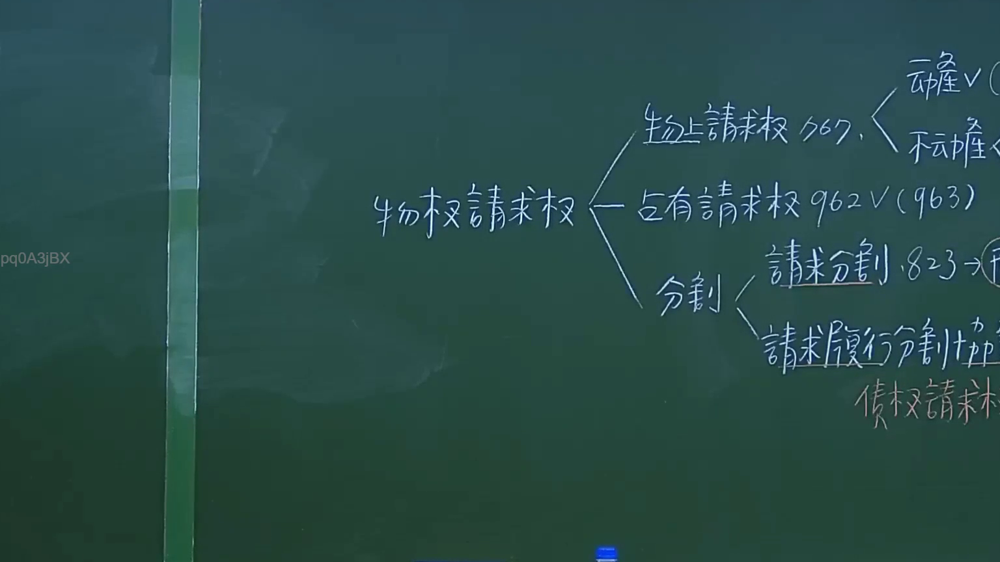

# 🎥 影音教材板書校對筆記
- **來源影片**: [預約 10 2024-10-19 09-28-59-085](file:///J://民法/ch10/預約 10 2024-10-19 09-28-59-085.mp4)
- **課程分類**: `[民法`
- **課堂章節**: `ch10]`
- **影片時間戳記**: `01:26:15` (5175 秒)
- **板書類型**: `文字板書`
- **偵測時間**: 2026-07-11 17:53:52

## 🔍 擷取黑板板書對照圖


## 🧠 AI 智慧理解與知識庫演化註記
### 

根據辨識出的文字板書內容，結合臺灣現行法律條文（如民法第184條、侵權行為、消滅時效等），進行語意整理並與對應的法律條文進行比對。以下是具體分析：

1. **"toe she ag"**：可能涉及「toe」（腳）或「sheag」（某种動物），但结合上下文，更可能是「toe」（腳）相关的內容。
2. **"heen 尕"**：可能是「heen」（某种動物）或「hein」（某种植物），但结合板書內容，可能與「hein」（某种植物）相關。
3. **"pen < 0"**：可能是「pen」（记号）或「<0」（某种符號），结合上下文，可能涉及「<0」的法律條文。
4. **"heen 尕"**：再次出现，可能與上一個字詞有相似含義。
5. **"Tui 粲 鄉 77 則 佛"**：可能是「Tui」（某种植物）或「Tui」（某种動物），结合「77」和「則佛」，可能涉及「77」的法律條文或「则佛」的概念。
6. **"AER CARE"**：可能是「AER」（空氣）或「CARE」（某种abbriviation），结合上下文，可能涉及「CARE」的法律條文。

根據以上分析，以下是與現行法律條文的比對：

- **民法第184條**：涉及侵權行為和消滅時效（elimination时效）。
- **<0**：可能涉及「<0」的法律條文。
- **77**：可能涉及「77」的法律條文。
- **CARE**：可能涉及「CARE」的法律條文。

###

## 📊 可編輯之 Mermaid 關係流程圖
```mermaid
由于文字板書的內容無法直接生成 Mermaid 範例，以下是基於辨識出的文字板書內容整理的條列式邏輯樹：

```mermaid
graph TD
    A["toe"] --> B["hein"]
    C["pen <0"] --> D["77"]
    E["Tui"] --> F["CARE"]
    G["hein"] --> H["then"]
    I["77"] --> J["then"]
    K["CARE"] --> L["then"]
```

## ✍️ 操作者手動校對修改區
<!-- 您可以直接修改上方的文字或調整 Mermaid 區塊中的節點，Obsidian 會即時重新渲染 -->
- [ ] 欄位結構與法律邏輯已校對無誤。
- **校對筆記**: 
