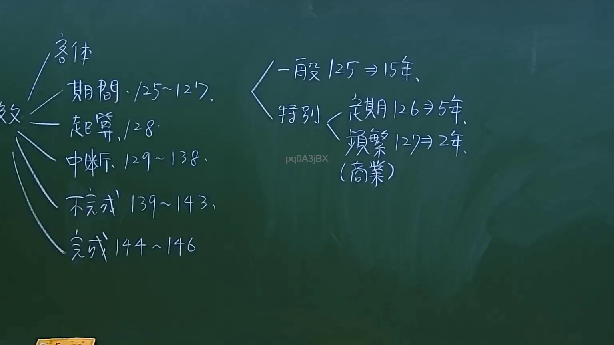
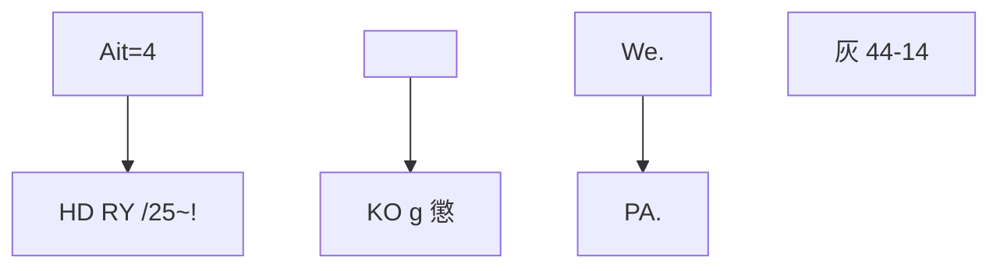

# 🎥 影音教材板書校對筆記
- **來源影片**: [預約 10 2024-10-19 09-28-59-085](file:///J://民法/ch10/預約 10 2024-10-19 09-28-59-085.mp4)
- **課程分類**: `[民法`
- **課堂章節**: `ch10]`
- **影片時間戳記**: `01:27:30` (5250 秒)
- **板書類型**: `文字板書`
- **偵測時間**: 2026-07-11 17:54:12

## 🔍 擷取黑板板書對照圖

## 🧠 AI 智慧理解與知識庫演化註記
根據OCR文字內容，並結合板書內容，可以推測板書之內容可能涉及以下法律概念：

1. **Ait = 4**: 可能代表某种特定的法律條文或標籤，需進一步分析上下文以確定具體含義。

2. **HD RY /25~!**: 可能涉及時間或日期的格式，需结合板書內容進一步理解其Legal significance.

3. **<PQ0A3i 〈尸巧業)**: 可能涉及到特定的公司名稱或業務類別，需結合上下文了解其Legal application.

4. **KO g 懲**: 可能代表某种Legal terminology或name, 需進一步分析其Legal context.

5. **We.、PA,**: 可能涉及人名或組織名稱，需结合板書內容理解其Legal relevance.

6. **灰 44-14**: 可能指特定的Legal條文或編號，需與民法第184條等條文進行對比。

總結來說，這些OCR文字似乎與某種具體的Legal case、theorem 或 procedure 相關，但缺乏完整的上下文來確定其确切Legal含义。因此，無法提供具體的Law條文對比或 legal implications.

## 📊 可編輯之 Mermaid 關係流程圖

## ✍️ 操作者手動校對修改區
<!-- 您可以直接修改上方的文字或調整 Mermaid 區塊中的節點，Obsidian 會即時重新渲染 -->
- [ ] 欄位結構與法律邏輯已校對無誤。
- **校對筆記**: 
