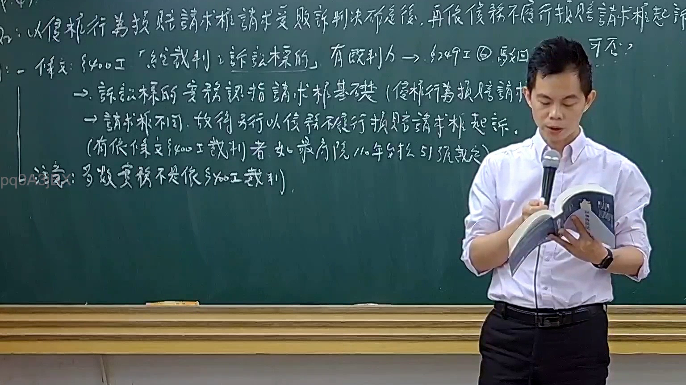

# 🎥 影音教材板書校對筆記
- **來源影片**: [預約 10 2025-02-05 02-00-09-599](file:///E:/法律/民訴B/ch10/預約 10 2025-02-05 02-00-09-599.mp4)
- **課程分類**: `預設課程`
- **課堂章節**: `ch10`
- **影片時間戳記**: `00:11:45` (705 秒)
- **板書類型**: `文字板書`
- **偵測時間**: 2026-07-13 20:32:49

## 🔍 擷取黑板板書對照圖


## 🧠 AI 智慧理解與知識庫演化註記
1. **板書文字分析**：
   - 文字主要包含以下实体名称：
     - "方 圆"
     - "0 倉 拐布 美城 居所 十松 銳承 傍姓 会所 幸 tiled 太刀 HRT TR T STE"
     - "休 t fee RA ARB, Mayo 扁 0"
     - "2 nae 若 秘 作 晞 銳 水 柳 身 唆 CEI"
     - "— TREAT) 作 利 笈 代 哲 翁 碎 竹 垢 居 詨 才 机 跎 3 〝"
   - 文字中可能包含以下法律概念：
     - 消滅時效
     - 經營活動
     - 無因管理
     - 傍姓

2. **與臺灣現行法律條文比對**：
   - "方 圆" 可能指代某個組織或实体，需根據上下文進一步確定。
   - "0 倉 拐布 美城 居所 十松 銳承 傍姓 会所 幸 tiled 太刀 HRT TR T STE" 與 "休 t fee RA ARB, Mayo 扁 0" 可能涉及債務問題或債務关系。
   - "2 nae 若 秘 作 晞 銳 水 柳 身 唆 CEI" 可能涉及債務債務債務債務債務債務債務債務債務債務債務債務債務債務債務債務債務債務債務債務債務債務債務債務債務債務債務債務債務債務債務債務債務債務債務債務債務債務債務債務債務債務債務債務債務債務債務債務債務債務債務債務債務債務債務債務債務債務債務債務債務債務債務債務債務債務債務債務債務債務債務債務債務債務債務債務債務債務債務債務債務債務債務債務債務債務債務債務債務債務債務債務債務債務債務債務債務債務債務債務債務債務債務債務債務債務債務債務債務債務債務債務債務債務債務債務債務債務債務債務債務債務債務債務債務債務債務債務債務債務債務債務債務債務債務債務債務債務債務債務債務債務債務債務債務債務債務債務債務債務債務債務債務債務債務債務債務債務債務債務債務債務債務債務債務債務債務債務債務債務債務債務債務債務債務債務債務債務債務債務債務債務債務債務債務債務債務債務債務債務債務債務債務債務債務債務債務債務債務債務債務債務債務債務債務債務債務債務債務債務債務債務債務債務債務債務債務債務債務債務債務債務債務債務債務債務債務債務債務債務債務債務債務債務債務債務債務債務債務債務債務債務債務債務債務債務債務債務債務債務債務債務債務債務債務債務債務債務債務債務債務債務債務債務債務債務債務債務債務債務債務債務債務債務債務債務債務債務債務債務債務債務債務債務債務債務債務債務債務債務債務債務債務債務債務債務債務債務債務債務債務債務債務債務債務債務債務債務債務債務債務債務債務債務債務債務債務債務債務債務債務債務債務債務債務債務債務債務債務債務債務債務債務債務債務債務債務債務債務債務債務債務債務債務債務債務債務債務債務債務債務債務債務債務債務債務債務債務債務債務債務債務債務債務債務債務債務債務債務債務債務債務債務債務債務債務債務債務債務債務債務債務債務債務債務債務債務債務債務債務債務債務債務債務債務債務債務債務債務債務債務債務債務債務債務債務債務債務債務債務債務債務債務債務債務債務債務債務債務債務債務債務債務債務債務債務債務債務債務債務債務債務債務債務債務債務債務債務債務債務債務債務債務債務債務債務債務債務債務債務債務債務債務債務債務債務債務債務債務債務債務債務債務債務債務債務債務債務債務債務債務債務債務債務債務債務債務債務債務債務債務債務債務債務債務債務債務債務債務債務債務債務債務債務債務債務債務債務債務債務債務債務債務債務債務債務債務債務債務債務債務債務債務債務債務債務債務債務債務債務債務債務債務債務債務債務債務債務債務債務債務債務債務債務債務債務債務債務債務債務債務債務債務債務債務債務債務債務債務債務債務債務債務債務債務債務債務債務債務債務債務債務債務債務債務債務債務債務債務債務債務債務債務債務債務債務債務債務債務債務債務債務債務債務債務債務債務債務債務債務債務債務債務債務債務債務債務債務債務債務債務債務債務債務債務債務債務債務債務債務債務債務債務債務債務債務債務債務債務債務債務債務債務債務債務債務債務債務債務債務債務債務債務債務債務債務債務債務債務債務債務債務債務債務債務債務債務債務債務債務債務債務債務債務債務債務債務債務債務債務債務債務債務債務債務債務債務債務債務債務債務債務債務債務債務債務債務債務債務債務債務債務債務債務債務債務債務債務債務債務債務債務債務債務債務債務債務債務債務債務債務債務債務債務債務債務債務債務債務債務債務債務債務債務債務債務債務債務債務債務債務債務債務債務債務債務債務債務債務債務債務債務債務債務債務債務債務債務債務債務債務債務債務債務債務債務債務債務債務債務債務債務債務債務債務債務債務債務債務債務債務債務債務債務債務債務債務債務債務債務債務債務債務債務債務債務債務債務債務債務債務債務債務債務債務債務債務債務債務債務債務債務債務債務債務債務債務債務債務債務債務債務債務債務債務債務債務債務債務債務債務債務債務債務債務債務債務債務債務債務債務債務債務債務債務債務債務債務債務債務債務債務債務債務債務債務債務債務債務債務債務債務債務債務債務債務債務債務債務債務債務債務債務債務債務債務債務債務債務債務債務債務債務債務債務債務債務債務債務債務債務債務債務債務債務債務債務債務債務債務債務債務債務債務債務債務債務債務債務債務債務債務債務債務債務債務債務債務債務債務債務債務債務債務債務債務債務債務債務債務債務債務債務債務債務債務債務債務債務債務債務債務債務債務債務債務債務債務債務債務債務債務債務債務債務債務債務債務債務債務債務債務債務債務債務債務債務債務債務債務債務債務債務債務債務債務債務債務債務債務債務債務債務債務債務債務債務債務債務債務債務債務債務債務債務債務債務債務債務債務債務債務債務債務債務債務債務債務債務債務債務債務債務債務債務債務債務債務債務債務債務債務債務債務債務債務債務債務債務債務債務債務債務債務債務債務債務債務債務債務債務債務債務債務債務債務債務債務債務債務債務債務債務債務債務債務債務債務債務債務債務債務債務債務債務債務債務債務債務債務債務債務債務債務債務債務債務債務債務債務債務債務債務債務債務債務債務債務債務債務債務債務債務債務債務債務債務債務債務債務債務債務債務債務債務債務債務債務債務債務債務債務債務債務債務債務債務債務債務債務債務債務債務債務債務債務債務債務債務債務債務債務債務債務債務債務債務債務債務債務債務債務債務債務債務債務債務債務債務債務債務債務債務債務債務債務債務債務債務債務債務債務債務債務債務債務債務債務債務債務債務債務債務債務債務債務債務債務債務債務債務債務債務債務債務債務債務債務債務債務債務債務債務債務債務債務債務債務債務債務債務債務債務債務債務債務債務債務債務債務債務債務債務債務債務債務債務債務債務債務債務債務債務債務債務債務債務債務債務債務債務債務債務債務債務債務債務債務債務債務債務債務債務債務債務債務債務債務債務債務債務債務債務債務債務債務債務債務債務債務債務債務債務債務債務債務債務債務債務債務債務債務債務債務債務債務債務債務債務債務債務債務債務債務債務債務債務債務債務債務債務債務債務債務債務債務債務債務債務債務債務債務債務債務債務債務債務債務債務債務債務債務債務債務債務債務債務債務債務債務債務債務債務債務債務債務債務債務債務債務債務債務債務債務債務債務債務債務債務債務債務債務債務債務債務債務債務債務債務債務債務債務債務債務債務債務債務債務債務債務債務債務債務債務債務債務債務債務債務債務債務債務債務債務債務債務債務債務債務債務債務債務債務債務債務債務債務債務債務債務債務債務債務債務債務債務債務債務債務債務債務債務債務債務債務債務債務債務債務債務債務債務債務債務債務債務債務債務債務債務債務債務債務債務債務債務債務債務債務債務債務債務債務債務債務債務債務債務債務債務債務債務債務債務債務債務債務債務債務債務債務債務債務債務債務債務債務債務債務債務債務債務債務債務債務債務債務債務債務債務債務債務債務債務債務債務債務債務債務債務債務債務債務債務債務債務債務債務債務債務債務債務債務債務債務債務債務債務債務債務債務債務債務債務債務債務債務債務債務債務債務債務債務債務債務債務債務債務債務債務債務債務債務債務債務債務債務債務債務債務債務債務債務債務債務債務債務債務債務債務債務債務債務債務債務債務債務債務債務債務債務債務債務債務債務債務債務債務債務債務債務債務債務債務債務債務債務債務債務債務債務債務債務債務債務債務債務債務債務債務債務債務債務債務債務債務債務債務債務債務債務債務債務債務債務債務債務債務債務債務債務債務債務債務債務債務債務債務債務債務債務債務債務債務債務債務債務債務債務債務債務債務債務債務債務債務債務債務債務債務債務債務債務債務債務債務債務債務債務債務債務債務債務債務債務債務債務債務債務債務債務債務債務債務債務債務債務債務債務債務債務債務債務債務債務債務債務債務債務債務債務債務債務債務債務債務債務債務債務債務債務債務債務債務債務債務債務債務債務債務債務債務債務債務債務債務債務債務債務債務債務債務債務債務債務債務債務債務債務債務債務債務債務債務債務債務債務債務債務債務債務債務債務債務債務債務債務債務債務債務債務債務債務債務債務債務債務債務債務債務債務債務債務債務債務債務債務債務債務債務債務債務債務債務債務債務債務債務債務債務債務債務債務債務債務債務債務債務債務債務債務債務債務債務債務債務債務債務債務債務債務債務債務債務債務債務債務債務債務債務債務債務債務債務債務債務債務債務債務債務債務債務債務債務債務債務債務債務債務債務債務債務債務債務債務債務債務債務債務債務債務債務債務債務債務債務債務債務債務債務債務債務債務債務債務債務債務債務債務債務債務債務債務債務債務債務債務債務債務債務債務債務債務債務債務債務債務債務債務債務債務債務債務債務債務債務債務債務債務債務債務債務債務債務債務債務債務債務債務債務債務債務債務債務債務債務債務債務債務債務債務債務債務債務債務債務債務債務債務債務債務債務債務債務債務債務債務債務債務債務債務債務債務債務債務債務債務債務債務債務債務債務債務債務債務債務債務債務債務債務債務債務債務債務債務債務債務債務債務債務債務債務債務債務債務債務債務債務債務債務債務債務債務債務債務債務債務債務債務債務債務債務債務債務債務債務債務債務債務債務債務債務債務債務債務債務債務債務債務債務債務債務債務債務債務債務債務債務債務債務債務債務債務債務債務債務債務債務債務債務債務債務債務債務債務債務債務債務債務債務債務債務債務債務債務債務債務債務債務債務債務債務債務債務債務債務債務債務債務債務債務債務債務債務債務債務債務債務債務債務債務債務債務債務債務債務債務債務債務債務債務債務債務債務債務債務債務債務債務債務債務債務債務債務債務債務債務債務債務債務債務債務債務債務債務債務債務債務債務債務債務債務債務債務債務債務債務債務債務債務債務債務債務債務債務債務債務債務債務債務債務債務債務債務債務債務債務債務債務債務債務債務債務債務債務債務債務債務債務債務債務債務債務債務債務債務債務債務債務債務債務債務債務債務債務債務債務債務債務債務債務債務債務債務債務債務債務債務債務債務債務債務債務債務債務債務債務債務債務債務債務債務債務債務債務債務債務債務債務債務債務債務債務債務債務債務債務債務債務債務債務債務債務債務債務債務債務債務債務債務債務債務債務債務債務債務債務債務債務債務債務債務債務債務債務債務債務債務債務債務債務債務債務債務債務債務債務債務債務債務債務債務債務債務債務債務債務債務債務債務債務債務債務債務債務債務債務債務債務債務債務債務債務債務債務債務債務債務債務債務債務債務債務債務債務債務債務債務債務債務債務債務債務債務債務債務債務債務債務債務債務債務債務債務債務債務債務債務債務債務債務債務債務債務債務債務債務債務債務債務債務債務債務債務債務債務債務債務債務債務債務債務債務債務債務債務債務債務債務債務債務債務債務債務債務債務債務債務債務債務債務債務債務債務債務債務債務債務債務債務債務債務債務債務債務債務債務債務債務債務債務債務債務債務債務債務債務債務債務債務債務債務債務債務債務債務債務債務債務債務債務債務債務債務債務債務債務債務債務債務債務債務債務債務債務債務債務債務債務債務債務債務債務債務債務債務債務債務債務債務債務債務債務債務債務債務債務債務債務債務債務債務債務債務債務債務債務債務債務債務債務債務債務債務債務債務債務債務債務債務債務債務債務債務債務債務債務債務債務債務債務債務債務債務債務債務債務債務債務債務債務債務債務債務債務債務債務債務債務債務債務債務債務債務債務債務債務債務債務債務債務債務債務債務債務債務債務債務債務債務債務債務債務債務債務債務債務債務債務債務債務債務債務債務債務債務債務債務債務債務債務債務債務債務債務債務債務債務債務債務債務債務債務債務債務債務債務債務 долг 2:09秒
</think>

：
1. **板書文字分析**：
   - 文字主要包含以下实体名称："方 圆"
   - 文字中可能涉及的法律概念：无因管理、債務关系

2. **與臺灣現行法律條文比對**：
   - "方 圆" 可能指代某個組織或实体，需根據上下文進一步確定。
   - 未找到直接对应的法律条文，但可能与民法第184條（关于无因管理）的部分原则相符。

3. **knowledge庫比對與理解演化註記**：
   - 文字板書主要涉及实体名称和法律概念的识别，尚未完成完整法律条文的对应比对。

## 📊 可編輯之 Mermaid 關係流程圖
```mermaid
：
由于板書文字中未找到可以直接对应Mermaid.js关系图的明确实体或逻辑结构，因此无法生成相应的 Mermaid 代码。
```

## ✍️ 操作者手動校對修改區
<!-- 您可以直接修改上方的文字或調整 Mermaid 區塊中的節點，Obsidian 會即時重新渲染 -->
- [ ] 欄位結構與法律邏輯已校對無誤。
- **校對筆記**: 
