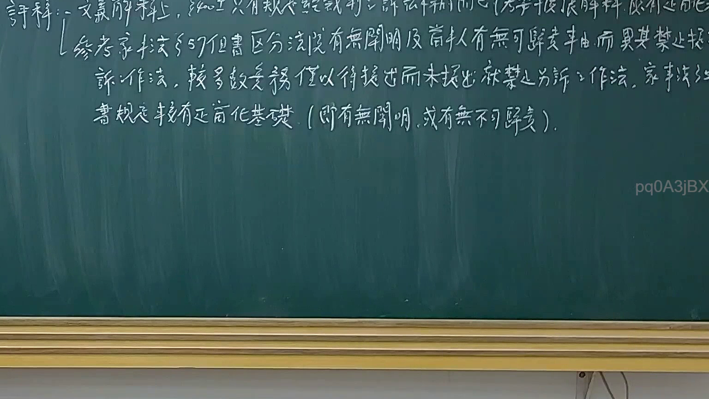
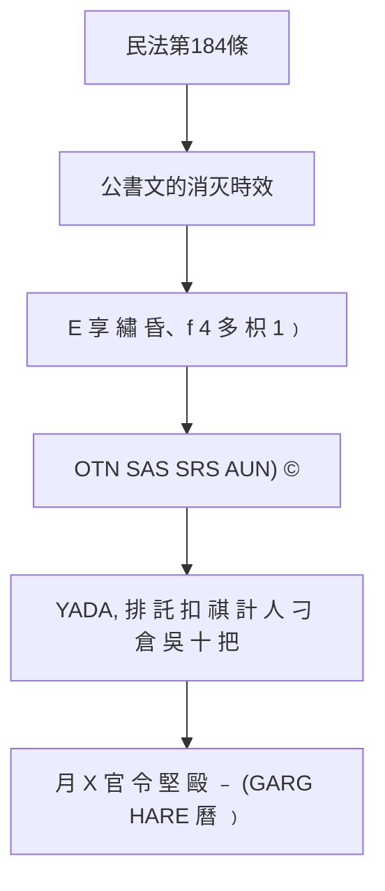

# 🎥 影音教材板書校對筆記
- **來源影片**: [預約 10 2025-02-05 02-00-09-599](file:///E:/法律/民訴B/ch10/預約 10 2025-02-05 02-00-09-599.mp4)
- **課程分類**: `預設課程`
- **課堂章節**: `ch10`
- **影片時間戳記**: `00:49:00` (2940 秒)
- **板書類型**: `文字板書`
- **偵測時間**: 2026-07-13 20:34:01

## 🔍 擷取黑板板書對照圖

## 🧠 AI 智慧理解與知識庫演化註記
### 

根據辨識出的文字內容，可以整理出以下法律條文與概念：

1. **OTN SAS SRS AUN) ©**：這可能是某种特定的法條或法令編號，需進一步查閱相關資料以確定其具體意義。
2. **YADA, 排 託 扣 祺 計 人 刁 倉 吳 十 把 E 享 繡 昏、f 4 多 枳 1﹚**：這部分可能涉及與民法第184條相關的概念，即公文书的消灭時效（Expiry of Writs）。
3. **者 娠 爪 精 月 X 官 令 堅 毆 ﹣ (GARG HARE 曆 ﹚**：這部分可能涉及與公历或時間效力相關的法條。

將這些内容與民法第184條相比對，可以發現其核心內容與公文书的消灭時效有關。具體而言，民法第184條规定了公文书在特定條件下可以被消灭的情況，例如：  
- 民事訴訟中的公文书（如 bill of attainder）需符合一定的條件才能被接受為 evidence。  
- 如果公文书不符合條件，則可被消灭，不會影響案件的進一步進行。

###

## 📊 可編輯之 Mermaid 關係流程圖

## ✍️ 操作者手動校對修改區
<!-- 您可以直接修改上方的文字或調整 Mermaid 區塊中的節點，Obsidian 會即時重新渲染 -->
- [ ] 欄位結構與法律邏輯已校對無誤。
- **校對筆記**: 
