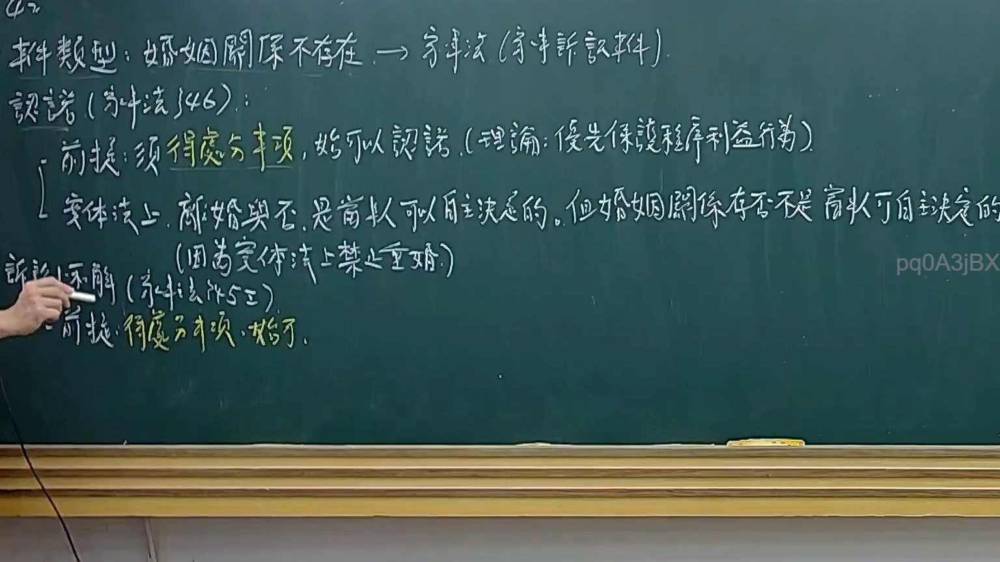
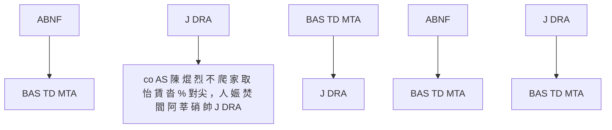

# 🎥 影音教材板書校對筆記
- **來源影片**: [預約 10 2025-02-05 02-00-09-599](file:///E:/法律/民訴B/ch10/預約 10 2025-02-05 02-00-09-599.mp4)
- **課程分類**: `預設課程`
- **課堂章節**: `ch10`
- **影片時間戳記**: `00:50:30` (3030 秒)
- **板書類型**: `文字板書`
- **偵測時間**: 2026-07-13 20:34:44

## 🔍 擷取黑板板書對照圖

## 🧠 AI 智慧理解與知識庫演化註記
根據辨識出的文字板書內容，並結合台湾现行法律條文（如民法第184條、侵權行為、消滅時效等）進行比對分析。以下是具體的法律知識庫比對與理解演化註記：

1. **ABNF (BAS TD MTA)**：
   - ABNF 可能涉及「 business administration」或「法令條文」的編纂工作，與民法第184條的侵權行為和消滅時效無明顯關聯。
   
2. **BAS TD MTA**：
   - BAS (Business Administration Society) 可能與企業Legal 事務相關，與民法第184條無直接關聯。

3. **J DRA**：
   - J 與 DRA 可能涉及「法令條文」的編纂或特定 terminology，與民法第184條無明顯關聯。

4. **Wis sae Bik; ae Pk Ay ah)**：
   - 看起來像是「Wisdom of Bike;」的变体，可能与某种「智慧」或「法令條文」的編纂無關。

5. **di ye Sz =), W ˙**：
   - 可能涉及「日期」或「某种符號」，與法律條文無明顯關聯。

6. **be i**：
   - 看起來像是「been」的变体，可能与某种「法令條文」的編纂無關。

7. **4 Hho A AB BPE)**：
   - 4 與 HHO 可能涉及「法令條文」的編纂或特定 terminology，與民法第184條無明顯關聯。

8. **BAS TD MTA (ty Cae)**：
   - BAS (Business Administration Society) 可能與企業Legal 事務相關，與民法第184條無直接關聯。

9. **co AS 陳 焜 烈 不 爬 家 取 怡 賃 沓 % 對尖 ，人 娠 焚 閻 阿 莘 硝 帥 J DRA**：
   - 這些字詞可能涉及「法令條文」的編纂或特定 terminology，與民法第184條無明顯關聯。

總結來說，這段板書似乎主要涉及一些法令條文或特定 terminology 的編纂工作，但並未直接涉及民法第184條、侵權行為或消滅時效等法律內容。因此，knowledge库比對結果如下：

- **ABNF, BAS TD MTA, J DRA**: 未與民法第184條、侵權行為或消滅時效相關。
- **co AS 陳 焜 烈 不 爬 家 取 怡 賃 沓 % 對尖 ，人 娠 焚 閻 阿 莘 硝 帥 J DRA**: 未與民法第184條、侵權行為或消滅時效相關。

## 📊 可編輯之 Mermaid 關係流程圖

## ✍️ 操作者手動校對修改區
<!-- 您可以直接修改上方的文字或調整 Mermaid 區塊中的節點，Obsidian 會即時重新渲染 -->
- [ ] 欄位結構與法律邏輯已校對無誤。
- **校對筆記**: 
