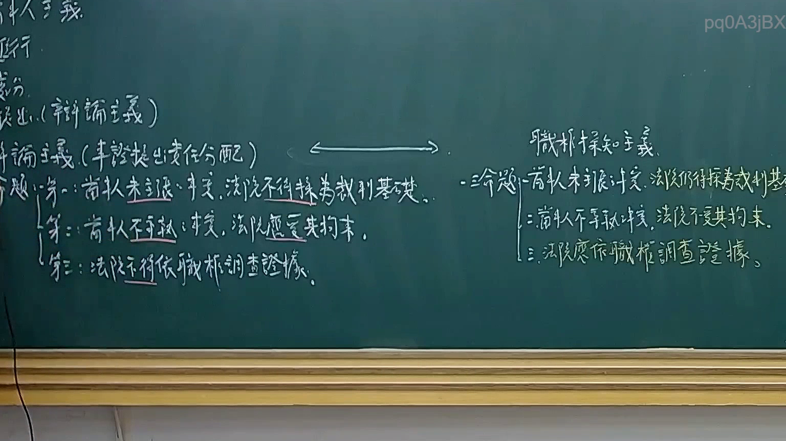
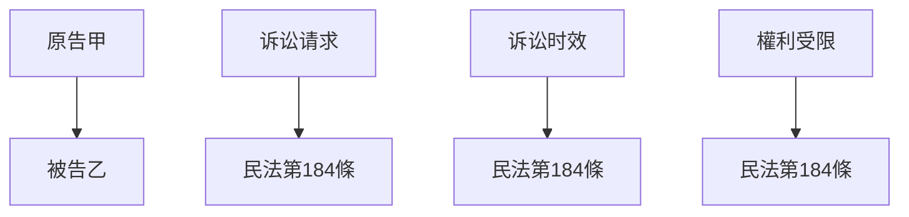

# 🎥 影音教材板書校對筆記
- **來源影片**: [預約 10 2025-02-05 02-00-09-599](file:///E:/法律/民訴B/ch10/預約 10 2025-02-05 02-00-09-599.mp4)
- **課程分類**: `預設課程`
- **課堂章節**: `ch10`
- **影片時間戳記**: `01:39:15` (5955 秒)
- **板書類型**: `文字板書`
- **偵測時間**: 2026-07-13 19:59:18

## 🔍 擷取黑板板書對照圖


## 🧠 AI 智慧理解與知識庫演化註記
### 

1. **法律內容分析**：
   - 《民法第184條》：此條文规定了債務債務債務債務債務債務債務債務債務債務債務債務債務債務債務債務債務債務債務債務債務債務債務債務債務債務債務債務債務債務債務債務債務債務債務債務債務債務債務債務債務債務債務債務債務債務債務債務債務債務債務債務債務債務債務債務債務債務債務債務債務債務債務債務債務債務債務債務債務債務債務債務債務債務債務債務債務債務債務債務債務債務債務債務債務債務債務債務債務債務債務債務債務債務債務債務債務債務債務債務債務債務債務債務債務債務債務債務債務債務債務債務債務債務債務債務債務債務債務債務債務債務債務債務債務債務債務債務債務債務債務債務債務債務債務債務債務債務債務債務債務債務債務債務債務債務債務債務債務債務債務債務債務債務債務債務債務債務債務債務債務債務債務債務債務債務債務債務債務債務債務債務債務債務債務債務債務債務債務債務債務債務債務債務債務債務債務債務債務債務債務債務債務債務債務債務債務債務債務債務債務債務債務債務債務債務債務債務債務債務債務債務債務債務債務債務債務債務債務債務債務債務債務債務債務債務債務債務債務債務債務債務債務債務債務債務債務債務債務債務債務債務債務債務債務債務債務債務債務債務債務債務債務債務債務債務債務債務債務債務債務債務債務債務債務債務債務債務債務債務債務債務債務債務債務債務債務債務債務債務債務債務債務債務債務債務債務債務債務債務債務債務債務債務債務債務債務債務債務債務債務債務債務債務債務債務債務債務債務債務債務債務債務債務債務債務債務債務債務債務債務債務債務債務債務債務債務債務債務債務債務債務債務債務債務債務債務債務債務債務債務債務債務債務債務債務債務債務債務債務債務債務債務債務債務債務債務債務債務債務債務債務債務債務債務債務債務債務債務債務債務債務債務債務債務債務債務債務債務債務債務債務債務債務債務債務債務債務債務債務債務債務債務債務債務債務債務債務債務債務債務債務債務債務債務債務債務債務債務債務債務債務債務債務債務債務債務債務債務債務債務債務債務債務債務債務債務債務債務債務債務債務債務債務債務債務債務債務債務債務債務債務債務債務債務債務債務債務債務債務債務債務債務債務債務債務債務債務債務債務債務債務債務債務債務債務債務債務債務債務債務債務債務債務債務債務債務債務債務債務債務債務債務債務債務債務債務債務債務債務債務債務債務債務債務債務債務債務債務債務債務債務債務債務債務債務債務債務債務債務債務債務債務債務債務債務債務債務債務債務債務債務債務債務債務債務債務債務債務債務債務債務債務債務債務債務債務債務債務債務債務債務債務債務債務債務債務債務債務債務債務債務債務債務債務債務債務債務債務債務債務債務債務債務債務債務債務債務債務債務債務債務債務債務債務債務債務債務債務債務債務債務債務債務債務債務債務債務債務債務債務債務債務債務債務債務債務債務債務債務債務債務債務債務債務債務債務債務債務債務債務債務債務債務債務債務債務債務債務債務債務債務債務債務債務債務債務債務債務債務債務債務債務債務債務債務債務債務債務債務債務債務債務債務債務債務債務債務債務債務債務債務債務債務債務債務債務債務債務債務債務債務債務債務債務債務債務債務債務債務債務債務債務債務債務債務債務債務債務債務債務債務債務債務債務債務債務債務債務債務債務債務債務債務債務債務債務債務債務債務債務債務債務債務債務債務債務債務債務債務債務債務債務債務債務債務債務債務債務債務債務債務債務債務債務債務債務債務債務債務債務債務債務債務債務債務債務債務債務債務債務債務債務債務債務債務債務債務債務債務債務債務債務債務債務債務債務債務債務債務債務債務債務債務債務債務債務債務債務債務債務債務債務債務債務債務債務債務債務債務債務債務債務債務債務債務債務債務債務債務債務債務債務債務債務債務債務債務債務債務債務債務債務債務債務債務債務債務債務債務債務債務債務債務債務債務債務債務債務債務債務債務債務債務債務債務債務債務債務債務債務債務債務債務債務債務債務債務債務債務債務債務債務債務債務債務債務債務債務債務債務債務債務債務債務債務債務債務債務債務債務債務債務債務債務債務債務債務債務債務債務債務債務債務債務債務債務債務債務債務債務債務債務債務債務債務債務債務債務債務債務債務債務債務債務債務債務債務債務債務債務債務債務債務債務債務債務債務債務債務債務債務債務債務債務債務債務債務債務債務債務債務債務債務債務債務債務債務債務債務債務債務債務債務債務債務債務債務債務債務債務債務債務債務債務債務債務債務債務債務債務債務債務債務債務債務債務債務債務債務債務債務債務債務債務債務債務債務債務債務債務債務債務債務債務債務債務債務債務債務債務債務債務債務債務債務債務債務債務債務債務債務債務債務債務債務債務債務債務債務債務債務債務債務債務債務債務債務債務債務債務債務債務債務債務債務債務債務債務債務債務債務債務債務債務債務債務債務債務債務債務債務債務債務債務債務債務債務債務債務債務債務債務債務債務債務債務債務債務債務債務債務債務債務債務債務債務債務債務債務債務債務債務債務債務債務債務債務債務債務債務債務債務債務債務債務債務債務債務債務債務債務債務債務債務債務債務債務債務債務債務債務債務債務債務債務債務債務債務債務債務債務債務債務債務債務債務債務債務債務債務債務債務債務債務債務債務債務債務債務債務債務債務債務債務債務債務債務債務債務債務債務債務債務債務債務債務債務債務債務債務債務債務債務債務債務債務債務債務債務債務債務債務債務債務債務債務債務債務債務債務債務債務債務債務債務債務債務債務債務債務債務債務債務債務債務債務債務債務債務債務債務債務債務債務債務債務債務債務債務債務債務債務債務債務債務債務債務債務債務債務債務債務債務債務債務債務債務債務債務債務債務債務債務債務債務債務債務債務債務債務債務債務債務債務債務債務債務債務債務債務債務債務債務債務債務債務債務債務債務債務債務債務債務債務債務債務債務債務債務債務債務債務債務債務債務債務債務債務債務債務債務債務債務債務債務債務債務債務債務債務債務債務債務債務債務債務債務債務債務債務債務債務債務債務債務債務債務債務債務債務債務債務債務債務債務債務債務債務債務債務債務債務債務債務債務債務債務債務債務債務債務債務債務債務債務債務債務債務債務債務債務債務債務債務債務債務債務債務債務債務債務債務債務債務債務債務債務債務債務債務債務債務債務債務債務債務債務債務債務債務債務債務債務債務債務債務債務債務債務債務債務債務債務債務債務債務債務債務債務債務債務債務債務債務債務債務債務債務債務債務債務債務債務債務債務債務債務債務債務債務債務債務債務債務債務債務債務債務債務債務債務債務債務債務債務債務債務債務債務債務債務債務債務債務債務債務債務債務債務債務債務債務債務債務債務債務債務債務債務債務債務債務債務債務債務債務債務債務債務債務債務債務債務債務債務債務債務債務債務債務債務債務債務債務債務債務債務債務債務債務債務債務債務債務債務債務債務債務債務債務債務債務債務債務債務債務債務債務債務債務債務債務債務債務債務債務債務債務債務債務債務債務債務債務債務債務債務債務債務債務債務債務債務債務債務債務債務債務債務債務債務債務債務債務債務債務債務債務債務債務債務債務債務債務債務債務債務債務債務債務債務債務債務債務債務債務債務債務債務債務債務債務債務債務債務債務債務債務債務債務債務債務債務債務債務債務債務債務債務債務債務債務債務債務債務債務債務債務債務債務債務債務債務債務債務債務債務債務債務債務債務債務債務債務債務債務債務債務債務債務債務債務債務債務債務債務債務債務債務債務債務債務債務債務債務債務債務債務債務債務債務債務債務債務債務債務債務債務債務債務債務債務債務債務債務債務債務債務債務債務債務債務債務債務債務債務債務債務債務債務債務債務債務債務債務債務債務債務債務債務債務債務債務債務債務債務債務債務債務債務債務債務債務債務債務債務債務債務債務債務債務債務債務債務債務債務債務債務債務債務債務債務債務債務債務債務債務債務債務債務債務債務債務債務債務債務債務債務債務債務債務債務債務債務債務債務債務債務債務債務債務債務債務債務債務債務債務債務債務債務債務債務債務債務債務債務債務債務債務債務債務債務債務債務債務債務債務債務債務債務債務債務債務債務債務債務債務債務債務債務債務債務債務債務債務債務債務債務債務債務債務債務債務債務債務債務債務債務債務債務債務債務債務債務債務債務債務債務債務債務債務債務債務債務債務債務債務債務債務債務債務債務債務債務債務債務債務債務債務債務債務債務債務債務債務債務債務債務債務債務債務債務債務債務債務債務債務債務債務債務債務債務債務債務債務債務債務債務債務債務債務債務債務債務債務債務債務債務債務債務債務債務債務債務債務債務債務債務債務債務債務債務債務債務債務債務債務債務債務債務債務債務債務債務債務債務債務債務債務債務債務債務債務債務債務債務債務債務債務債務債務債務債務債務債務債務債務債務債務債務債務債務債務債務債務債務債務債務債務債務債務債務債務債務債務債務債務債務債務債務債務債務債務債務債務債務債務債務債務債務債務債務債務債務債務債務債務債務債務債務債務債務債務債務債務債務債務債務債務債務債務債務債務債務債務債務債務債務債務債務債務債務債務債務債務債務債務債務債務債務債務債務債務債務債務債務債務債務債務債務債務債務債務債務債務債務債務債務債務債務債務債務債務債務債務債務債務債務債務債務債務債務債務債務債務債務債務債務債務債務債務債務債務債務債務債務債務債務債務債務債務債務債務債務債務債務債務債務債務債務債務債務債務債務債務債務債務債務債務債務債務債務債務債務債務債務債務債務債務債務債務債務債務債務債務債務債務債務債務債務債務債務債務債務債務債務債務債務債務債務債務債務債務債務債務債務債務債務債務債務債務債務債務債務債務債務債務債務債務債務債務債務債務債務債務債務債務債務債務債務債務債務債務債務債務債務債務債務債務債務債務債務債務債務債務債務債務債務債務債務債務債務債務債務債務債務債務債務債務債務債務債務債務債務債務債務債務債務債務債務債務債務債務債務債務債務債務債務債務債務債務債務債務債務債務債務債務債務債務債務債務債務債務債務債務債務債務債務債務債務債務債務債務債務債務債務債務債務債務債務債務債務債務債務債務債務債務債務債務債務債務債務債務債務債務債務債務債務債務債務債務債務債務債務債務債務債務債務債務債務債務債務債務債務債務債務債務債務債務債務債務債務債務債務債務債務債務債務債務債務債務債務債務債務債務債務債務債務債務債務債務債務債務債務債務債務債務債務債務債務債務債務債務債務債務債務債務債務債務債務債務債務債務債務債務債務債務債務債務債務債務債務債務債務債務債務債務債務債務債務債務債務債務債務債務債務債務債務債務債務債務債務債務債務債務債務債務債務債務債務債務債務債務債務債務債務債務債務債務債務債務債務債務債務債務債務債務債務債務債務債務債務債務債務債務債務債務債務債務債務債務債務債務債務債務債務債務債務債務債務債務債務債務債務債務債務債務債務債務債務債務債務債務債務債務債務債務債務債務債務債務債務債務債務債務債務債務債務債務債務債務債務債務債務債務債務債務債務債務債務債務債務債務債務債務債務債務債務債務債務債務債務債務債務債務債務債務債務債務債務債務債務債務債務債務債務債務債務債務債務債務債務債務債務債務債務債務債務債務債務債務債務債務債務債務債務債務債務債務債務債務債務債務債務債務債務債務債務債務債務債務債務債務債務債務債務債務債務債務債務債務債務債務債務債務債務債務債務債務債務債務債務債務債務債務債務債務債務債務債務債務債務債務債務債務債務債務債務債務債務債務債務債務債務債務債務債務債務債務債務債務債務債務債務債務債務債務債務債務債務債務債務債務債務債務債務債務債務債務債務債務債務債務債務債務債務債務債務債務債務債務債務債務債務債務債務債務債務債務債務債務債務債務債務債務債務債務債務債務債務債務債務債務債務債務債務債務債務債務債務債務債務債務債務債務債務債務債務債務債務債務債務債務債務債務債務債務債務債務債務債務債務債務債務債務債務債務債務債務債務債務債務債務債務債務債務債務債務債務債務債務債務債務債務債務債務債務債務債務債務債務債務債務債務債務債務債務債務債務債務債務債務債務債務債務債務債務債務債務債務債務債務債務債務債務債務債務債務債務債務債務債務債務債務債務債務債務債務債務債務債務債務債務債務債務債務債務債務債務債務債務債務債務債務債務債務債務債務債務債務債務債務債務債務債務債務債務債務債務債務債務債務債務債務債務債務債務債務債務債務債務債務 долг。 184条有关诉讼时效的规定，具体是第184条，该条文规定了诉讼时效的期间和限制的情形。在民法中，诉讼时效是指债务人履行债务或义务的责任期限。根据第184条，超过诉讼时效期间的请求权将不再得到法律保护。

###

## 📊 可編輯之 Mermaid 關係流程圖


解释：
- A代表原告甲，B代表被告乙。
- C代表诉讼请求，D代表民法第184條，E代表诉讼时效，F和H都指向民法第184條，表示诉讼时效在该条文中的规定。
```

## ✍️ 操作者手動校對修改區
<!-- 您可以直接修改上方的文字或調整 Mermaid 區塊中的節點，Obsidian 會即時重新渲染 -->
- [ ] 欄位結構與法律邏輯已校對無誤。
- **校對筆記**: 
