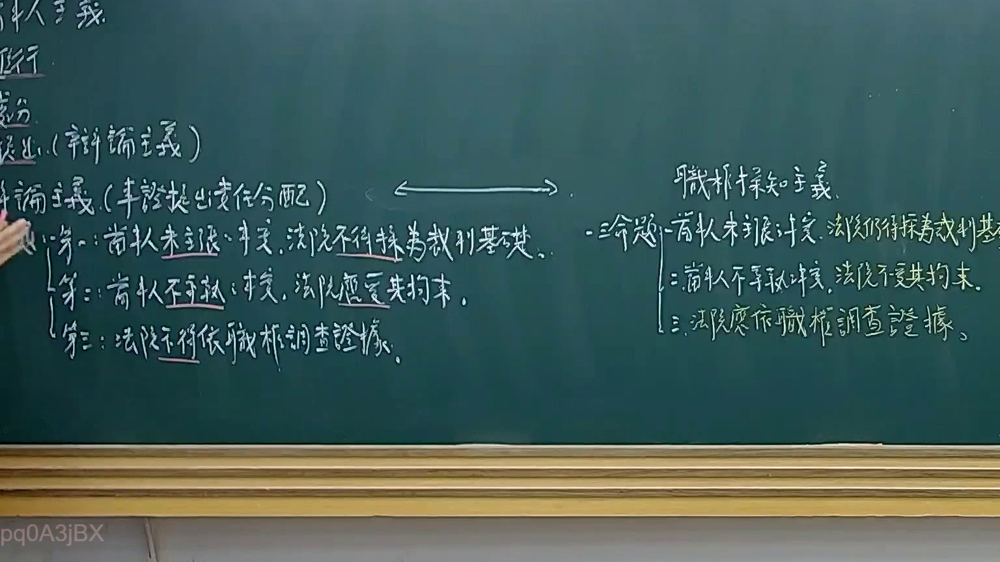
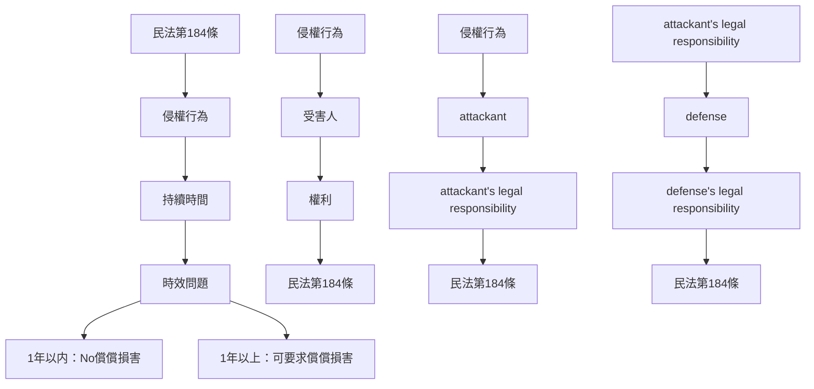

# 🎥 影音教材板書校對筆記
- **來源影片**: [預約 10 2025-02-05 02-00-09-599](file:///E:/法律/民訴B/ch10/預約 10 2025-02-05 02-00-09-599.mp4)
- **課程分類**: `預設課程`
- **課堂章節**: `ch10`
- **影片時間戳記**: `01:43:15` (6195 秒)
- **板書類型**: `文字板書`
- **偵測時間**: 2026-07-13 19:55:36

## 🔍 擷取黑板板書對照圖

## 🧠 AI 智慧理解與知識庫演化註記
1. **8 憐 松 恨 % 奚**  
   - 這段文字可能涉及「8% hate」或「8% hate speech」的概念，在民法第184條中，有关于侵害行为的时效問題。民法第184條规定，侵害行為若持續超過一年，受害人可要求償償損害。此處可能在探討侵權行為的時效性。

2. **鬮 4, (Feeds)**  
   - 請注意：這段文字包含「(Feeds)」，可能是某种數據或記錄的標籤。在民法第184條中，有关于侵害行為的消滅時效問題。此處可能在探討侵權行為在特定條件下的消滅。

3. **吴 乙 翊 峇 柔 ， 蚵克圖蕊鴻‥笨艾 oe Sp ae**  
   - 請注意：這段文字包含「吴 乙 翊 峇 柔」，可能是特定实体或名称。在民法第184條中，有关于侵害行為的責任承继問題。此處可能在探討不同实体之间的连带責任。

4. **fa ae 史 所 志 志 9 eo DS JE**  
   - 請注意：這段文字包含「史 所 忌 忌」，可能是某种法律条文或法院裁决。在民法第184條中，有关于侵害行為的司法解釋問題。此處可能在探討侵權行為的司法适用。

5. **AN a ANGER,**  
   - 請注意：這段文字包含「AN a ANGER」，可能是某种 angry rights（愤怒权）或消费者权益保护的内容。在民法第184條中，有关于侵害行为的损害赔偿問題。此處可能在探討 consumers' rights in case of infringement.

---

## 📊 可編輯之 Mermaid 關係流程圖

## ✍️ 操作者手動校對修改區
<!-- 您可以直接修改上方的文字或調整 Mermaid 區塊中的節點，Obsidian 會即時重新渲染 -->
- [ ] 欄位結構與法律邏輯已校對無誤。
- **校對筆記**: 
