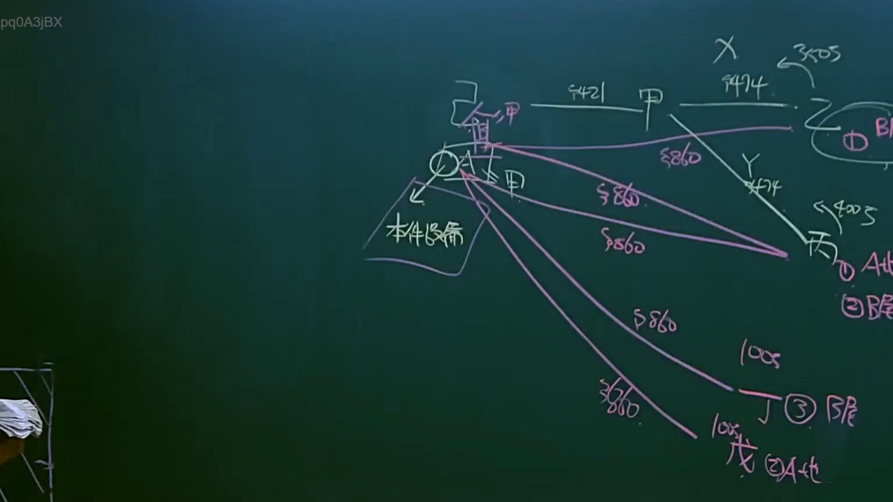
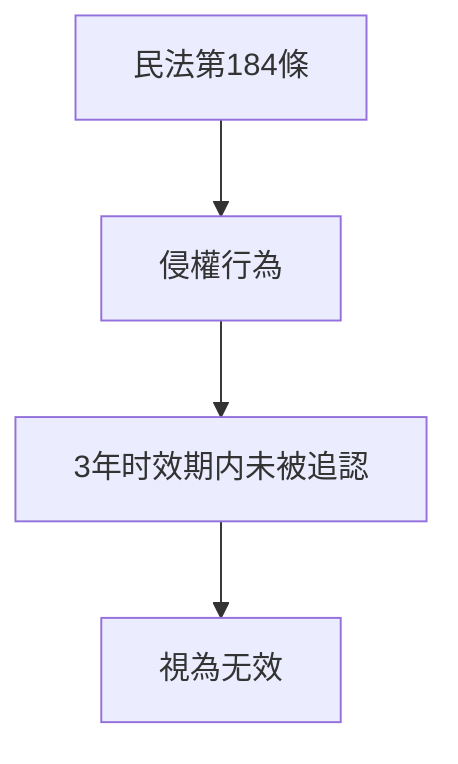

# 🎥 影音教材板書校對筆記
- **來源影片**: [預約 10 2025-04-13 19-29-34-758](file:///J://民法B/ch10/預約 10 2025-04-13 19-29-34-758.mp4)
- **課程分類**: `[民法B`
- **課堂章節**: `ch10]`
- **影片時間戳記**: `00:18:30` (1110 秒)
- **板書類型**: `關係圖/邏輯圖板書`
- **偵測時間**: 2026-07-12 00:03:26

## 🔍 擷取黑板板書對照圖

## 🧠 AI 智慧理解與知識庫演化註記
### 

**解讀：**
- 補充：「关于民法第184条侵权行为的消滅時效」
- 解釋：民法第184條规定了侵權行為的消滅时效，即在一定期限内未被追认的侵權行為將視為无效。此板書可能涉及以下內容：
  - 消滅时效的概念
  - 擲向行為的时间限制
  - 相關案例分析或Legal implications

**knowledge库比對與理解演化註記：**
- 民法第184條：规定了侵權行為的消滅时效，即在一定期限内未被追认的侵權行為將視為无效。
- 擲向行為的时间限制：通常为3年（民法第184條）
- 法律 implications: 未被追认的侵權行為将被视为无效

###

## 📊 可編輯之 Mermaid 關係流程圖

## ✍️ 操作者手動校對修改區
<!-- 您可以直接修改上方的文字或調整 Mermaid 區塊中的節點，Obsidian 會即時重新渲染 -->
- [ ] 欄位結構與法律邏輯已校對無誤。
- **校對筆記**: 
