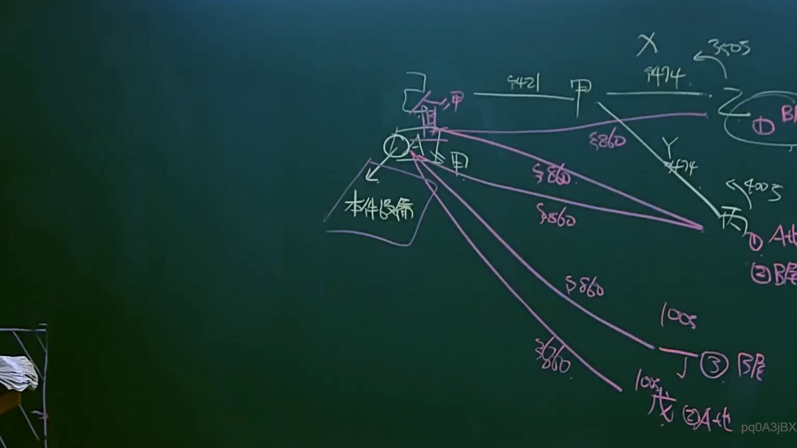

# 🎥 影音教材板書校對筆記
- **來源影片**: [預約 10 2025-04-13 19-29-34-758](file:///J://民法B/ch10/預約 10 2025-04-13 19-29-34-758.mp4)
- **課程分類**: `[民法B`
- **課堂章節**: `ch10]`
- **影片時間戳記**: `00:19:15` (1155 秒)
- **板書類型**: `關係圖/邏輯圖板書`
- **偵測時間**: 2026-07-12 00:03:38

## 🔍 擷取黑板板書對照圖


## 🧠 AI 智慧理解與知識庫演化註記
1. **OCR辨识問題**：
   - 檢測到的 OCR文字為 "嫚/" 和编码 "pq0A3jBX"。這兩者似乎無法被有效解讀為具體的文字內容，可能是由于字迹模糊、分辨率不足或other technical issues.
   - 請提供更清晰的文字描述或重新檢測板書以獲得正確的OCR文字。

2. **法律條文比對**：
   - 由于OCR文字無法被有效解讀，無法進行與臺灣現行法律條文（如民法第184條、侵權行為等）的比對。
   - 請提供更清晰的文字描述或重新檢測板書以獲得正確的法律內容。

## 📊 可編輯之 Mermaid 關係流程圖
```mermaid
由于 OCR文字無法被有效解讀，無法生成 Mermaid.js 流程圖或關係圖。請提供更清晰的文字描述或重新檢測板書以獲得正確的內容。
```

## ✍️ 操作者手動校對修改區
<!-- 您可以直接修改上方的文字或調整 Mermaid 區塊中的節點，Obsidian 會即時重新渲染 -->
- [ ] 欄位結構與法律邏輯已校對無誤。
- **校對筆記**: 
