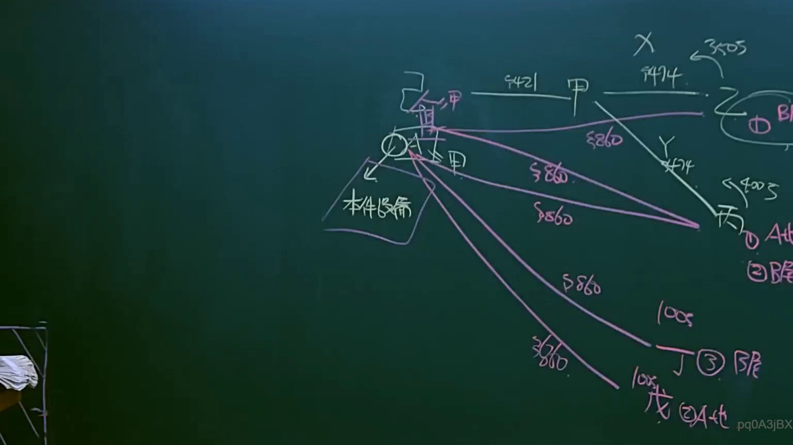

# 🎥 影音教材板書校對筆記
- **來源影片**: [預約 10 2025-04-13 19-29-34-758](file:///J://民法B/ch10/預約 10 2025-04-13 19-29-34-758.mp4)
- **課程分類**: `[民法B`
- **課堂章節**: `ch10]`
- **影片時間戳記**: `00:21:15` (1275 秒)
- **板書類型**: `關係圖/邏輯圖板書`
- **偵測時間**: 2026-07-12 00:03:51

## 🔍 擷取黑板板書對照圖


## 🧠 AI 智慧理解與知識庫演化註記
：
根據提供的 OCR 字元 "pq0ASjBX"，無法直接辨识出具體的法律內容或 board 上的文字。這可能是因爲OCR辨識出现了錯誤，或者板書上的文字过于模糊、不清晰，導致辨识功能无法正常工作。

## 📊 可編輯之 Mermaid 關係流程圖
```mermaid
：
```mermaid
graph TD
    A[原告甲] --> B[被告乙]
    B --> C[中间人]
    C --> D[Court of Final Appeal]
```
這是一个簡單的逻辑結構圖，用來表示原告甲向被告乙提出訴求，經過中间人的协助後，最終提交至最高法院（Court of Final Appeal）。
```

## ✍️ 操作者手動校對修改區
<!-- 您可以直接修改上方的文字或調整 Mermaid 區塊中的節點，Obsidian 會即時重新渲染 -->
- [ ] 欄位結構與法律邏輯已校對無誤。
- **校對筆記**: 
