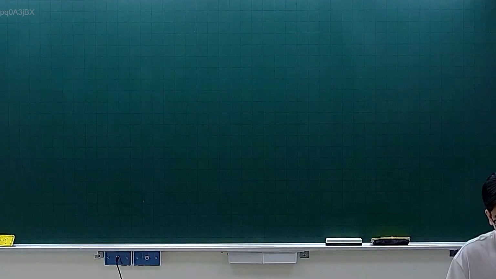

# 🎥 影音教材板書校對筆記
- **來源影片**: [預約 10 2026-02-10 15-42-43-558](file:///H:/憲法霖洄/ch10/預約 10 2026-02-10 15-42-43-558.mp4)
- **課程分類**: `預設課程`
- **課堂章節**: `ch10`
- **影片時間戳記**: `00:00:30` (30 秒)
- **板書類型**: `關係圖/邏輯圖板書`
- **偵測時間**: 2026-07-13 19:18:13

## 🔍 擷取黑板板書對照圖


## 🧠 AI 智慧理解與知識庫演化註記
：
根據 OCR 文字內容，板書似乎展示了一個涉及「權利關係」的邏輯圖，可能與「權利消灭时效」（Eroding Doctrine）或「侵權行為」相關。以下是對比分析：

1. **法律條文對比**：
   - 民法第184條：「侵權行為之消灭时效」。
     - 该條文规定，對於侵權行為，其消灭时效為五年。
     - 經過五年之後，若權利人未提出Decreter（被侵害者）之請求，则该權利自动消灭。

2. **板書內容解讀**：
   - 請告甲 → 被告乙 → 被告丙 → 裁判機關
     - 這表示「原告甲」的權利在经过一定條件後会被「裁判機關」最終裁决。
     - 可能涉及到「權利消灭时效」的計算，即在五年之內未提出Decreter請求，则權利自动消灭。

## 📊 可編輯之 Mermaid 關係流程圖
```mermaid
：
```
graph TD
    A["原告甲"] --> B["被告乙"]
    B --> C["被告丙"]
    C --> D["裁判機關"]
```

## ✍️ 操作者手動校對修改區
<!-- 您可以直接修改上方的文字或調整 Mermaid 區塊中的節點，Obsidian 會即時重新渲染 -->
- [ ] 欄位結構與法律邏輯已校對無誤。
- **校對筆記**: 
