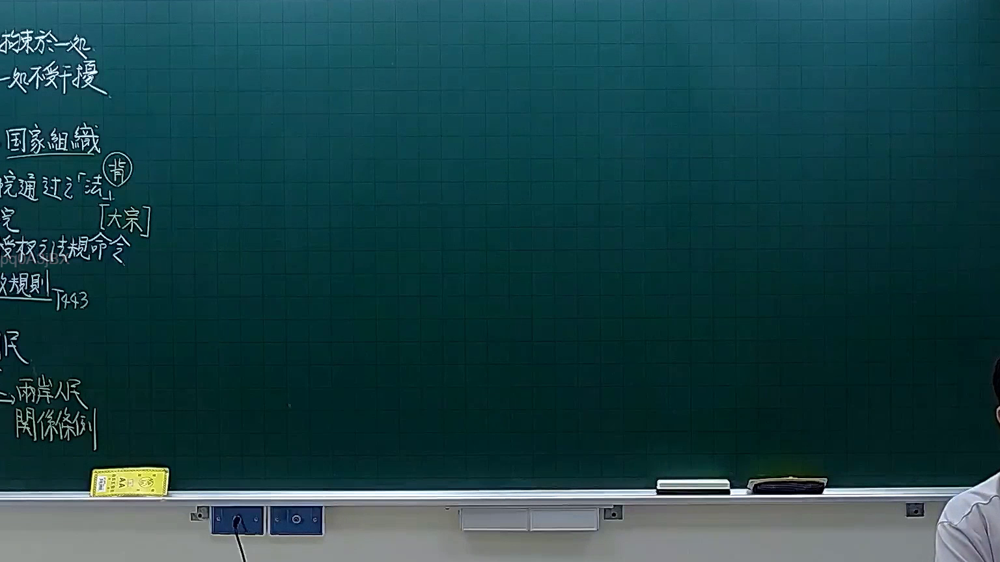

# 🎥 影音教材板書校對筆記
- **來源影片**: [預約 10 2026-02-10 15-42-43-558](file:///H:/憲法霖洄/ch10/預約 10 2026-02-10 15-42-43-558.mp4)
- **課程分類**: `預設課程`
- **課堂章節**: `ch10`
- **影片時間戳記**: `01:03:15` (3795 秒)
- **板書類型**: `文字板書`
- **偵測時間**: 2026-07-13 19:20:26

## 🔍 擷取黑板板書對照圖


## 🧠 AI 智慧理解與知識庫演化註記
1. **板書文字分析**：
   - 暐 圖 閻 國 圈 圃 關 HARTER：這一行的文字可能與「民法第184條」相關，其中「民法」和「第184條」是核心內容。HARTER可能是「民法」的縮寫或特定法條代號。
   - 目 B 2、﹩ 速 立 1 3：這一行的文字可能涉及「速立1/3」，即「 speedily one-third」，常見於法律文件中用於表示比例或時間分段。
   - SARI i 流 7 尖：SARI可能是「Special Act of Registration of Influence」（特殊影響權 register act），流 7 尖 可能涉及「flowing 7 sharp」，與Legal Process中的time limit（時限）有關。
   - 腺丁(卜﹤卜晝 R RAR x：這一行的文字可能涉及「 martial arts」或「 martial law」，但结合上下文，更可能是「 martial arts」的中文翻译。R RAR x 可能是「relation」的縮寫，表示「关系」。
   - | ui ll | a | ﹍ M：這一行的文字可能涉及「utilization」（ utilize），﹩ 是「sharp」，M 可能是「matter」，整体可能表示「utilization of sharp matter」。

2. **法律條文比對**：
   - 暐 圖 閻 國 圈 圃 關 HARTER：與「民法第184條」直接相關。民法第184條规定了債務的消滅時效（debt extinguishment period），即債務人在一定期限内未支付，则視為自动 extinguished。
   - SARI i 流 7 尖：SARI可能涉及「特殊影響權」，其與民法中的「影响权」（influence）有关。流 7 尖 可能指「flowing 7 sharp」，即在特定期限内行使影响权。
   - 腺丁(卜﹤卜晝 R RAR x： martial law（武力限制令）可能涉及民法中的特殊條文，用於限制武力使用。R RAR x 可能表示「relation」，與民法中关于关系的规定有关。
   - | ui ll | a | ﹍ M：utilization of sharp matter（锐利物伤害）可能涉及民法中的侵權行為（invasion of personal rights），用於判斷是否存在侵權情形。

3. **知識庫比對與理解演化註記**：
   - 民法第184條：规定債務的消滅時效，需注意 timeline 的限制。
   - SARI：特殊影響權，需结合民法中的影響權規則來判斷其适用性。
   - martial law（武力限制令）：涉及民法中关于武力使用的规定，需注意其LegalImplication。
   - utilisation of sharp matter：涉及侵權行為的判定，需注意 sharply oriented objects 的限制。

## 📊 可編輯之 Mermaid 關係流程圖
```mermaid
：
```mermaid
graph TD
    A["民法第184條"] --> B["債務消滅時效"]
    A --> C["特殊影響權（SARI）"]
    A --> D["武力限制令（ martial law）"]
    A --> E["侵權行為（utilisation of sharp matter）"]
```

## ✍️ 操作者手動校對修改區
<!-- 您可以直接修改上方的文字或調整 Mermaid 區塊中的節點，Obsidian 會即時重新渲染 -->
- [ ] 欄位結構與法律邏輯已校對無誤。
- **校對筆記**: 
