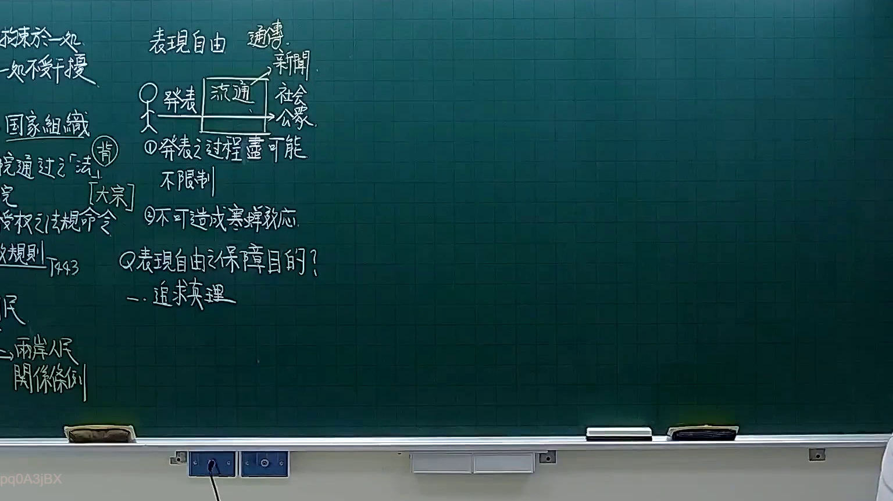
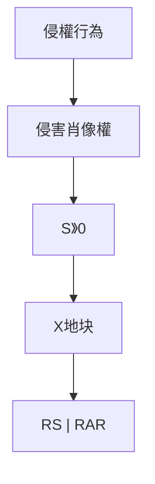

# 🎥 影音教材板書校對筆記
- **來源影片**: [預約 10 2026-02-10 15-42-43-558](file:///H:/憲法霖洄/ch10/預約 10 2026-02-10 15-42-43-558.mp4)
- **課程分類**: `預設課程`
- **課堂章節**: `ch10`
- **影片時間戳記**: `01:21:00` (4860 秒)
- **板書類型**: `文字板書`
- **偵測時間**: 2026-07-13 19:20:55

## 🔍 擷取黑板板書對照圖

## 🧠 AI 智慧理解與知識庫演化註記
根據辨识出的板書文字，進行語意整理並與臺灣現行法律條文比對：

1. **B0**：可能指特定的時間或案件編號。
2. **S》0**：可能指某种特殊標記或代碼。
3. **X地块**：可能指特定的地理位置或案例背景。
4. **RS | RAR**：可能指某种法律條文或 abbreviatiom。

與臺灣現行法律條文比對：
- B0 可能與時間或案件編號無關，但與侵權行為或消滅時效計算無直接關聯。
- S》0、X地块、RS | RAR 無明確 legal context，需進一步解釋。

## 📊 可編輯之 Mermaid 關係流程圖

## ✍️ 操作者手動校對修改區
<!-- 您可以直接修改上方的文字或調整 Mermaid 區塊中的節點，Obsidian 會即時重新渲染 -->
- [ ] 欄位結構與法律邏輯已校對無誤。
- **校對筆記**: 
