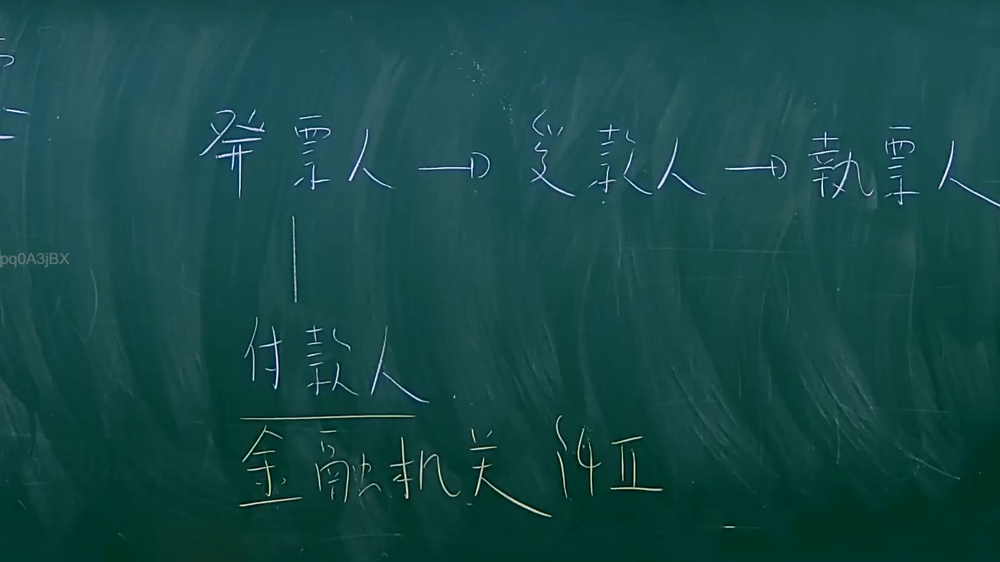

# 🎥 影音教材板書校對筆記
- **來源影片**: [預約 11 2024-09-07 03-22-58-356](file:///J://票據法/ch1/預約 11 2024-09-07 03-22-58-356.mp4)
- **課程分類**: `[票據法`
- **課堂章節**: `ch1]`
- **影片時間戳記**: `00:36:15` (2175 秒)
- **板書類型**: `影音板書`
- **偵測時間**: 2026-07-10 01:04:36

## 🔍 擷取黑板板書對照圖


## 🧠 AI 智慧理解與知識庫演化註記
：
這張板書圖片詳細描繪了票據（特別是支票或匯票）交易中的主要當事人及其關係。
1.  **發票人 (Drawer/Issuer)**：指簽發票據，委託付款人支付一定金額給受款人或執票人的人。在支票情境中，就是開立支票的帳戶持有人。
2.  **受款人 (Payee)**：指票據上載明享有受領票據金額權利的人，是票據最初的受益人。
3.  **執票人 (Holder)**：指合法持有票據並依票據法享有票據權利的人。執票人可能是最初的受款人，也可能是經由背書或交付等方式取得票據權利的後手。
4.  **付款人 (Drawee/Payer)**：指票據上被命令支付票據金額的人。在支票情境中，付款人必須是「金融機關」。在匯票情境中，付款人則可以是任何被指定的人，但實務上常為銀行。
5.  **金融機關 (Financial Institution)**：這是對付款人的具體化說明，表示在許多票據交易中（尤其是支票），付款人即為銀行或其他金融機構。

**關係邏輯：**
*   **發票人** 簽發票據給 **受款人**。
*   **受款人** 可以將票據轉讓給其他 **執票人**。
*   **發票人** 下達支付指令給 **付款人**（通常是 **金融機關**），要求其向執票人支付票據金額。
*   最終 **執票人** 向 **付款人** 提示票據，請求支付。

**法條對照與聯想：**
此板書內容直接對應臺灣《票據法》所規範的票據關係：
*   **《票據法》第3條（匯票定義）**：「稱匯票者，謂發票人簽發，委託付款人於見票時或在一定之日期，無條件支付與受款人或執票人之票據。」這清楚定義了發票人、付款人、受款人、執票人的角色。
*   **《票據法》第4條（支票定義）**：「稱支票者，謂發票人簽發一定之金額，委託金融業者於見票時無條件支付與受款人或執票人之票據。」此條明確指出支票的付款人必須是「金融業者」（即板書中的「金融機關」）。
*   **《票據法》第6條**：「票據上之權利，依票據之所載而定。」
*   **《票據法》第12條**：「票據債務人，不得以自己與發票人或執票人之前手間所存抗辯之事由，對抗執票人。」（善意取得與文義性、無因性、流通性原則）

這份圖表是理解票據法律關係的基礎，屬於商業法範疇。它主要闡述了票據的「發行」、「流通」與「支付」三大階段中的當事人角色。雖然與民法第184條（侵權行為）或消滅時效等直接關聯不大，但在票據遭拒絕付款、偽造、變造或有其他糾紛時，仍可能牽涉到民事侵權責任、不當得利或相關訴訟的時效問題。此圖著重於票據本身的法律構造與流程，是學習票據法的重要起點。

## 📊 可編輯之 Mermaid 關係流程圖
```mermaid
：
graph LR
    A["發票人"] --> B["受款人"]
    B["受款人"] --> C["執票人"]
    A["發票人"] --> D["付款人"]
    D["付款人"] -- (通常為) --> E["金融機關"]
```

## ✍️ 操作者手動校對修改區
<!-- 您可以直接修改上方的文字或調整 Mermaid 區塊中的節點，Obsidian 會即時重新渲染 -->
- [ ] 欄位結構與法律邏輯已校對無誤。
- **校對筆記**: 
