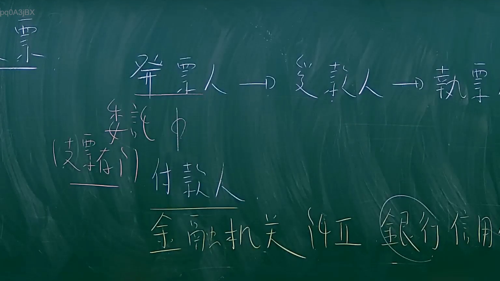

# 🎥 影音教材板書校對筆記
- **來源影片**: [預約 11 2024-09-07 03-22-58-356](file:///J://票據法/ch1/預約 11 2024-09-07 03-22-58-356.mp4)
- **課程分類**: `[票據法`
- **課堂章節**: `ch1]`
- **影片時間戳記**: `00:38:45` (2325 秒)
- **板書類型**: `影音板書`
- **偵測時間**: 2026-07-10 01:06:53

## 🔍 擷取黑板板書對照圖


## 🧠 AI 智慧理解與知識庫演化註記
：
本板書主要闡述臺灣《票據法》中關於「支票」交易的基本當事人關係與其法律性質。

**1. 板書高精度 OCR 辨識：**
*   **文字**:
    *   票 (位於左上角，應為主題概括性標題)
    *   發票人
    *   受款人
    *   執票人
    *   委託
    *   (支票)
    *   付款人
    *   金融機關
    *   銀行
    *   信用
*   **符號與關係**:
    *   發票人 → 受款人 (箭頭指示流程)
    *   受款人 → 執票人 (箭頭指示流程)
    *   發票人 垂直連接 付款人，並標示「委託」 (表示委託關係)
    *   「付款人」下方有底線 (表示強調)
    *   「支票」以括號形式位於「付款人」之前 (作為對付款人角色的補充說明)
    *   「銀行」被圈起 (表示特指或強調該類別)
    *   「金融機關」、「銀行」、「信用」依序排列於「付款人」下方 (描述付款人的性質及相關概念)

**2. 板書詳細解讀與法條對照：**
此板書描繪的是票據法中「支票」這一特定票據的基本當事人關係與其法律性質。
*   **發票人 (Drawer)**: 指簽發支票的人，他向付款人發出無條件支付票載金額的命令或委託。在實際交易中，發票人通常是與銀行簽訂存款契約，並有足夠存款或透支額度者。
*   **受款人 (Payee)**: 指支票上所載明應收取款項的人。他是支票的原始權利人。
*   **執票人 (Holder)**: 指合法持有支票，並得依票據法行使票據權利的人。受款人是原始執票人；若支票經背書轉讓，則受讓者亦可成為執票人。
*   **委託 (Mandate/Commission)**: 這是發票人與付款人之間最核心的關係。發票人透過簽發支票，委託其往來的金融機構（即付款人）從其存款帳戶中支付款項給執票人。此委託是無條件的支付命令。
*   **(支票) 付款人 (Drawee/Payer)**: 支票的付款人是指被發票人命令支付款項的人。板書中的括號「支票」強調此付款人是針對支票而言。底線則有強調作用。在臺灣《票據法》中，支票的付款人有其特殊性。
*   **金融機關 (Financial Institution)**: 這是支票付款人的法律性質。根據法規要求，支票的付款人必須是銀行或其他經財政部核准設立的金融機構。
*   **銀行 (Bank)**: 在所有金融機關中，銀行是最常見且典型的支票付款人，因此在板書中被特別圈起以示強調。
*   **信用 (Credit)**: 指銀行在作為付款人時，會根據發票人的帳戶存款餘額或其與銀行之間的信用額度（如透支契約）來決定是否支付。這體現了銀行與發票人之間的信用關係。

**臺灣現行法律條文對照與註記：**
1.  **《票據法》第4條**: 定義了支票是依本法簽發的票據。
2.  **《票據法》第125條**: 規定支票應記載的事項中，包括「付款人名稱」與「無條件支付之委託」。這直接對應了板書中「發票人」向「付款人」發出「委託」的關係。
3.  **《票據法》第126條**: 明確規定：「支票之付款人，以銀行及其他經財政部核准設立之金融機構為限。」此條文完全印證了板書中「付款人」必須是「金融機關」，且實務上以「銀行」為主要角色的說明。
4.  **《票據法》第12條**: 闡釋了「執票人」的定義，即合法持有票據並得依票據法行使票據權利之人。
總結而言，板書內容為《票據法》中關於支票基本構造與當事人的核心概念，是理解票據法學理的入門基礎。

## 📊 可編輯之 Mermaid 關係流程圖
```mermaid
：
graph TD
    A["發票人"] --> B["受款人"]
    B --> C["執票人"]
    A -- "委託" --> D["(支票) 付款人"]
    D --> E["金融機關"]
    E --> ((F["銀行"]))
    F --> G["信用"]
```

## ✍️ 操作者手動校對修改區
<!-- 您可以直接修改上方的文字或調整 Mermaid 區塊中的節點，Obsidian 會即時重新渲染 -->
- [ ] 欄位結構與法律邏輯已校對無誤。
- **校對筆記**: 
