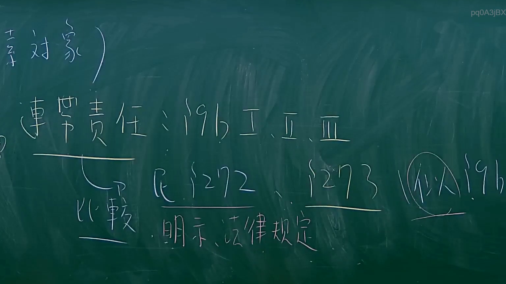

# 🎥 影音教材板書校對筆記
- **來源影片**: [預約 11 2024-09-07 03-22-58-356](file:///J://票據法/ch1/預約 11 2024-09-07 03-22-58-356.mp4)
- **課程分類**: `[票據法`
- **課堂章節**: `ch1]`
- **影片時間戳記**: `01:00:45` (3645 秒)
- **板書類型**: `影音板書`
- **偵測時間**: 2026-07-10 01:09:36

## 🔍 擷取黑板板書對照圖


## 🧠 AI 智慧理解與知識庫演化註記
：
本板書主要探討臺灣民法中關於「連帶責任」的不同類型及其法源依據，並進行比較。

1.  **牽涉對象**：此為板書開頭，可能作為主題的引導，表示接下來討論的內容所涉及的主體或範圍。
2.  **連帶責任：§196 I、II、III**：
    *   **連帶責任** (Joint and Several Liability)：指數人負同一債務，債權人得向其中一人或數人或全體請求全部或一部之給付。在臺灣民法中，連帶責任主要分為兩大類：一是由法律直接規定（如共同侵權行為），二是由當事人約定（如連帶保證）。
    *   **§196 I、II、III**：此處的條文編號「§196」及其後羅馬數字「I、II、III」是辨識上的最大挑戰。
        *   **臺灣民法第196條**的內容為：「不法侵害他人之人格法益者，被害人雖非財產上之損害，亦得請求賠償相當之金額。其名譽被侵害者，並得請求回復名譽之適當處分。」此條文關乎人格權受侵害的非財產上損害賠償，與「連帶責任」無直接關係，且民法第196條並無明確的「I、II、III」項次劃分。
        *   **可能推測**：
            *   **筆誤**：最有可能的解釋是老師在書寫時的筆誤。在探討連帶責任時，最常與「債務人連帶責任」相對照的「由法律規定之連帶責任」是**民法第185條（共同侵權行為人之連帶責任）**。民法第185條有兩項：「數人共同不法侵害他人之權利者，連帶負損害賠償責任。不能知其中孰為加害人者，亦同。」若「I、II、III」為老師對該條文或其延伸概念的區分，例如第一項為「共同行為」，第二項為「無法分辨加害人」，第三項則可能是指「教唆、幫助犯」或「其他間接共同行為」。
            *   **教學材料中的特定編號**：亦有可能此「§196」並非指民法典條文，而是老師課堂講義或參考書中的特定章節、案例編號，或針對某個外國法條文的引用，其下有三種次要情況。
            *   **概念性指涉**：老師可能將「§196」作為一個概括性的代號，指涉某類由特定法規或法律原則所產生的連帶責任，並將其細分為三種類型。
        *   基於上下文與臺灣法律體系，此處的「§196 I、II、III」應是代表某種「法定連帶責任」的範疇，與後續「民法§272、§273」所代表的「意定或法定連帶債務」形成對比。

3.  **比較**：板書下方「連帶責任」處拉出一條線指向「比較」，表明本段教學的核心在於比較不同類型的連帶責任。

4.  **民 §272、§273**：
    *   **民法第272條**：「數人負同一債務，明示對於債權人各負全部給付之責任者，為連帶債務人。無前項之明示者，除法律另有規定外，不適用之。」此條規定了連帶債務的成立，主要透過當事人「明示約定」，或「法律另有規定」。
    *   **民法第273條**：「連帶債務之債權人，得向其中之一人或數人或其全體，請求全部或一部之給付。」此條規定了連帶債務的效力，即債權人可選擇對任一連帶債務人為全部或一部之請求。
    *   這兩條條文明確規範了「連帶債務人」的連帶責任，主要強調其成立方式（約定或法律規定）與效力。

5.  **明示、法律規定**：此批註是針對「民法§272、§273」而言。
    *   **明示**：指連帶債務的成立可透過當事人之間的「明示約定」，這符合民法第272條前段的規定。
    *   **法律規定**：指連帶債務的成立除了明示約定外，也可以是「法律另有規定」，這符合民法第272條後段的規定。

6.  **(類似 §196)**：此批註是對「民法§272、§273」所規定的連帶責任與「§196」所指涉的連帶責任之間的關係。
    *   儘管法源依據可能不同（例如§196若指§185為侵權行為的法定連帶責任，而§272主要涉及契約或特定法定連帶債務），但它們在「連帶」的法律效果上是相似的，即債權人對各債務人皆可請求全部給付。

**總結板書邏輯：**
老師可能在講解「連帶責任」這一法律概念時，比較了兩種或兩類主要來源的連帶責任：
一類是由「§196 I、II、III」所代表的連帶責任（高度可能是指民法第185條共同侵權行為等**法定連帶責任**，並依不同情境細分）。
另一類是由「民法§272、§273」所代表的連帶責任，其成立需有「明示約定」或「法律規定」（主要涉及**意定連帶債務**及部分法定連帶債務）。
板書指出這兩種連帶責任在效果上是「類似」的，但其成立條件與適用情境有所差異。

## 📊 可編輯之 Mermaid 關係流程圖
```mermaid
：
graph TD
    A["牽涉對象"]
    B["連帶責任"]
    C["依 §196 I、II、III 所生之連帶責任"]
    D["依 民法 §272、§273 所生之連帶責任"]
    E["進行比較"]
    F["成立基礎：明示、法律規定"]
    G["與C之關係：類似"]

    A --> B
    B --> C
    B -- "探討不同類型" --> E
    E --> C
    E --> D
    D -- "特性" --> F
    D --> G
    G --> C
```

## ✍️ 操作者手動校對修改區
<!-- 您可以直接修改上方的文字或調整 Mermaid 區塊中的節點，Obsidian 會即時重新渲染 -->
- [ ] 欄位結構與法律邏輯已校對無誤。
- **校對筆記**: 
