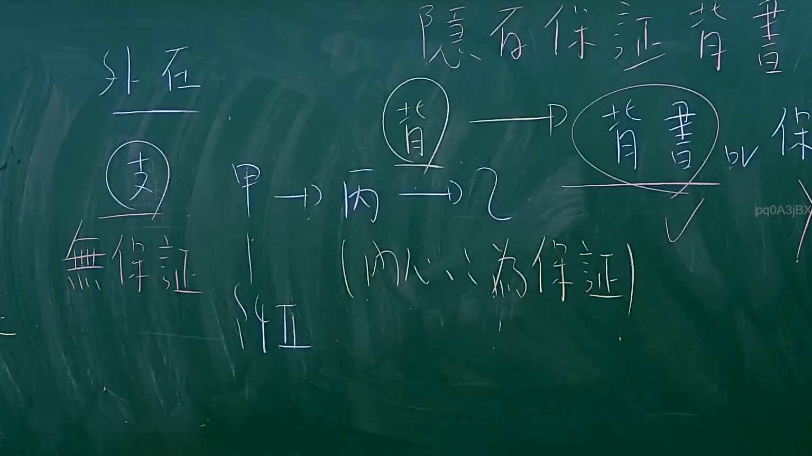

# 🎥 影音教材板書校對筆記
- **來源影片**: [預約 11 2024-09-07 03-22-58-356](file:///J://票據法/ch1/預約 11 2024-09-07 03-22-58-356.mp4)
- **課程分類**: `[票據法`
- **課堂章節**: `ch1]`
- **影片時間戳記**: `01:14:45` (4485 秒)
- **板書類型**: `影音板書`
- **偵測時間**: 2026-07-10 01:11:45

## 🔍 擷取黑板板書對照圖


## 🧠 AI 智慧理解與知識庫演化註記
：
這張板書是臺灣票據法中關於「背書」性質的討論，特別是探討「背書」與「保證」之間的關係。老師透過對比「外在」形式與「內心/實質」意涵，並引用「隨俗」的概念來解釋背書所附帶的保證責任。

板書內容高精度辨識如下：

1.  **隨俗保證背書**：這是板書最上方的主題。
    *   **解讀**：指依據商業習慣或法律規定，背書本身即附帶有保證效力。即使背書人僅在票據背面簽名，未明確註明「保證」，此行為在通常情況下仍被視為一種對票據承兌和付款的保證。
    *   **法條對照**：對應《票據法》第31條第1項：「匯票之背書人，除記載相反之文句外，負擔保其承兌及付款之責。」這條文確立了背書的「法定保證」原則，即背書人預設負擔保證責任，除非另有聲明（如無追索權背書）。

2.  **外在**：板書左側上方標題。
    *   **解讀**：代表票據行為的客觀形式或外觀。在此脈絡下，主要是指「背書」這個動作或形式本身。

3.  **支 (在圓圈中)**：位於「外在」下方。
    *   **解讀**：通常指「支票」或泛指「票據」。這裡可能代表作為背書客體的票據。

4.  **無保證**：位於「支」下方。
    *   **解讀**：指「無追索權背書」。依《票據法》第31條第1項但書，背書人可以透過明確記載（如「無追索權」、「免除保證責任」等）來免除其承兌及付款的擔保責任。這與「隨俗保證背書」形成對比，顯示背書的保證責任並非絕對不可免除。

5.  **甲** (位於「無保證」右側，後續有線條及「仲」)
    *   **解讀**：甲代表票據流程中的一個當事人，可能是最初的發票人、持票人或背書人。下面的「仲」可能代表「中介人」或另一個當事人。

6.  **(背) -> (背書) 或 保**：板書中上部分，以箭頭連接。
    *   **解讀**：
        *   「(背)」：代表背書的行為動詞。
        *   「(背書)」：代表背書行為所產生的法律形式或結果。
        *   「或 保」：表示背書行為「或」者其結果「保證」了票據的承兌與付款。這再次強調了背書行為在《票據法》中預設的保證性質。
    *   **法條對照**：直接體現《票據法》第31條第1項的精神，即背書行為本身即附帶保證責任。

7.  **甲 -> 丙 -> 乙**：位於「背書」流程下方。
    *   **解讀**：這是一個典型的票據轉讓鏈條。甲將票據背書轉讓給丙，丙再背書轉讓給乙。在這個鏈條中，根據《票據法》第31條第1項，甲和丙都對乙負有承兌和付款的保證責任。

8.  **(内心為保證)**：位於「甲 -> 丙 -> 乙」下方。
    *   **解讀**：對應「外在」而言，這代表背書行為的「實質意涵」或「主觀意圖」。它強調即便背書的「外在」形式只是簽名，其「內心」或法律實質已是提供了一種保證。這呼應了「隨俗保證背書」和《票據法》的規定，即法律賦予了背書此一「內在」保證功能。

9.  **✓ (打勾符號)**：位於「背書 或 保」下方。
    *   **解讀**：表示「背書」或其「保證」效果是成立的、有效的或被確認的。

## 📊 可編輯之 Mermaid 關係流程圖
```mermaid
：
graph TD
    A["隨俗保證背書"]
    B["外在 (形式)"]
    C["票據 (支)"]
    D["無保證"]
    E["背 (動作)"]
    F["背書 (法律行為)"]
    G["保證 (法律效果)"]
    H["甲 (背書人)"]
    I["丙 (被背書人)"]
    J["乙 (最終持票人)"]
    K["內心為保證 (實質意涵)"]
    L["效果成立 ✓"]

    A --> F
    A --> G

    B --> C
    C --> D

    E -- "產生" --> F
    F -- "或具備" --> G

    H -- "背書轉讓予" --> I
    I -- "背書轉讓予" --> J

    F -- "其本質/意涵為" --> K
    G -- "符合此" --> K

    F --> L
    G --> L
```

## ✍️ 操作者手動校對修改區
<!-- 您可以直接修改上方的文字或調整 Mermaid 區塊中的節點，Obsidian 會即時重新渲染 -->
- [ ] 欄位結構與法律邏輯已校對無誤。
- **校對筆記**: 
