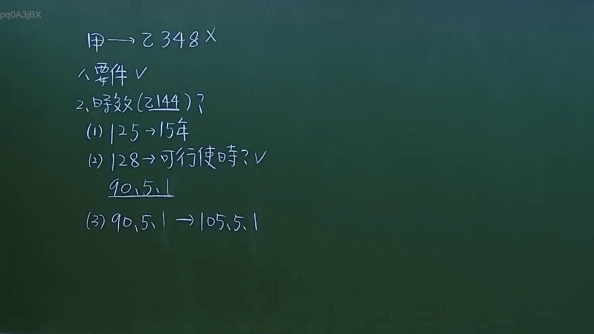

# 🎥 影音教材板書校對筆記
- **來源影片**: [預約 11 2024-10-19 12-15-40-598](file:///J://民法/ch11/預約 11 2024-10-19 12-15-40-598.mp4)
- **課程分類**: `[民法`
- **課堂章節**: `ch11]`
- **影片時間戳記**: `00:08:00` (480 秒)
- **板書類型**: `文字板書`
- **偵測時間**: 2026-07-12 16:59:08

## 🔍 擷取黑板板書對照圖


## 🧠 AI 智慧理解與知識庫演化註記
### 

1. **板書之內容分析**：
   - 文字板書內容似乎涉及民法第184條的內容，即「侵權行為不得以内消滅時效」。這段法文條文规定了侵權行為在特定條件下不得以内消滅時效。
   - "ASV" 可能是某个缩寫或特定术语，需根據上下文進一步解讀。
   - "JAMES? V" 可能是指某個特定的案例或人名，需根據板書背景了解其具體含義。
   - "(3) 40,5. 1 > ]o5.5." 可能是條文的编号或其他相關信息。

2. **與臺灣現行法律條文的比對**：
   - 文字板書之內容主要涉及民法第184條，即「侵權行為不得以内消滅時效」。這段法文條文规定了侵權行為在特定條件下不得以内消滅時效。
   - "ASV" 可能是指某個特定的条文或案例编号，需根據上下文進一步解讀。
   - "JAMES? V" 可能是指某個特定的案例或人名，需根據板書背景了解其具體含義。
   - "(3) 40,5. 1 > ]o5.5." 可能是條文的编号或其他相關信息。

###

## 📊 可編輯之 Mermaid 關係流程圖
```mermaid
graph TD
    A[民法第184條] --> B["侵權行為不得以内消滅時效"]
    C["ASV"] --> D["JAMES? V"]
    E[(3) 40,5. 1 > ]o5.5."
```

## ✍️ 操作者手動校對修改區
<!-- 您可以直接修改上方的文字或調整 Mermaid 區塊中的節點，Obsidian 會即時重新渲染 -->
- [ ] 欄位結構與法律邏輯已校對無誤。
- **校對筆記**: 
