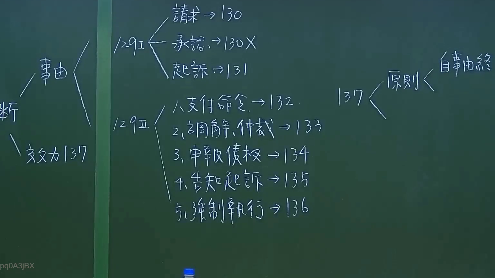
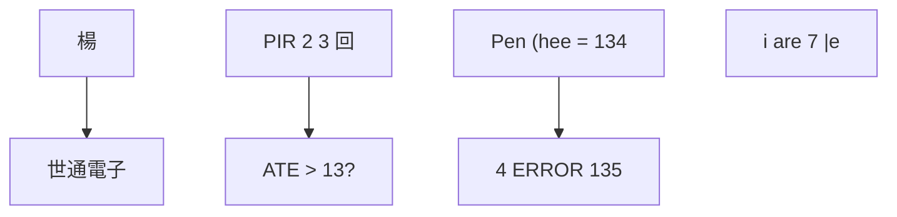

# 🎥 影音教材板書校對筆記
- **來源影片**: [預約 11 2024-10-19 12-15-40-598](file:///J://民法/ch11/預約 11 2024-10-19 12-15-40-598.mp4)
- **課程分類**: `[民法`
- **課堂章節**: `ch11]`
- **影片時間戳記**: `00:19:30` (1170 秒)
- **板書類型**: `文字板書`
- **偵測時間**: 2026-07-12 16:59:35

## 🔍 擷取黑板板書對照圖

## 🧠 AI 智慧理解與知識庫演化註記
1. **日期或文件编号**：
   - OCR文字“cht > |”可能代表日期或某种文件编号，但缺乏上下文无法确定其具体含义。

2. **人名或实体识别**：
   - “ye (Wine ayy SA”可能指“楊”（杨）作为人名。
   - “al \ JS ee PTC”可能是公司名称“世通電子”（PTC）。
   - “PIR 2 3 回 的 ATE > 13?”可能涉及某种项目或流程编号。

3. **金额或笔划数**：
   - “ Pen (hee = 134”可能指金额为134元，但缺乏上下文无法确定其具体含义。
   - “4 ERROR 135”可能是错误信息，与法律条文无关。

4. **条目符号**：
   - “i are 7 |e”可能是项目符号，但内容不明确。

**與臺灣現行法律條文的比對**：
- 次數或錯誤信息（如“ERROR 135”）可能与法律条文无关。
- 其他文字可能涉及特定领域的内容，但由于缺乏上下文，无法确定其具体法律条文。

---

## 📊 可編輯之 Mermaid 關係流程圖

## ✍️ 操作者手動校對修改區
<!-- 您可以直接修改上方的文字或調整 Mermaid 區塊中的節點，Obsidian 會即時重新渲染 -->
- [ ] 欄位結構與法律邏輯已校對無誤。
- **校對筆記**: 
