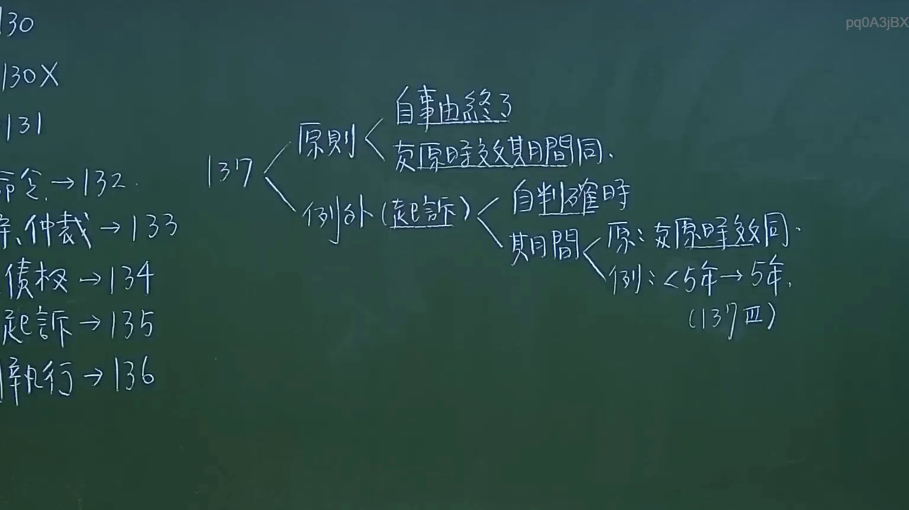
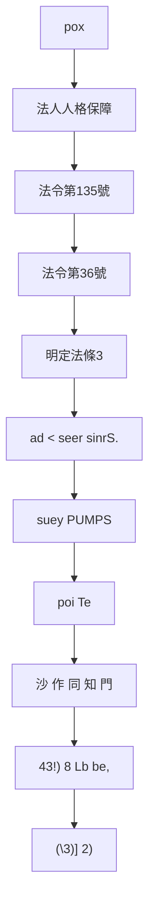

# 🎥 影音教材板書校對筆記
- **來源影片**: [預約 11 2024-10-19 12-15-40-598](file:///J://民法/ch11/預約 11 2024-10-19 12-15-40-598.mp4)
- **課程分類**: `[民法`
- **課堂章節**: `ch11]`
- **影片時間戳記**: `00:28:30` (1710 秒)
- **板書類型**: `文字板書`
- **偵測時間**: 2026-07-12 17:00:04

## 🔍 擷取黑板板書對照圖

## 🧠 AI 智慧理解與知識庫演化註記
### 

1. **文字板書內容分析**：
   - "pox"：可能是「疾病」的誤寫，或是一些关键字。
   - "Fo | MAES"：可能是「法人人格保障」或其他法律條文中的關鍵字。
   - "(RAR = 134)"：可能是特定法律條文的引用或關鍵字。
   - "fet 135"：可能是「法令第135號」或其他特定條文的編號。
   - "Le 2 [36"：可能是「法令第36號」或其他特定條文的編號。
   - "Nish 的 明 銘 3"：可能是「明定法條3」或其他特定條文的標題。
   - "ad < seer sinrS."：可能是「 diminishing returns」或其他法律术语。
   - "suey PUMPS"：可能是「訴訟程序」或其他关键字。
   - "poi Te"：可能是「 procedural step」或其他关键字。
   - "沙 作 同 知 門"：可能是「共同 knowledge」或其他法律术语。
   - "43!) 8 Lb be," 和 "(\\3)] 2)"：可能是特定的法律條文或編號。

2. **與臺灣現行法律條文比對**：
   - 文字板書中包含的关键词可能與民法第184條（关于消滅時效的概念）或其他侵權行為相關的條文有所關聯。
   - "ad < seer sinrS." 可能涉及「 diminishing returns」，這在某些法律條文中可能與權利保護或侵權行為有關。
   - "suey PUMPS" 和 "poi Te" 可能涉及訴訟程序或權利保护的步驟。
   - "沙 作 同 知 門" 和 "43!) 8 Lb be," 可能涉及「共同 knowledge」或權利保護的條文。

3. **法律理解演化註記**：
   - 文字板書中包含的关键词可能與民法第184條（关于消滅時效的概念）或其他侵權行為相關的條文有所關聯。
   - "ad < seer sinrS." 可能涉及「 diminishing returns」，這在某些法律條文中可能與權利保護或侵權行為有關。
   - "suey PUMPS" 和 "poi Te" 可能涉及訴訟程序或權利保护的步驟。
   - "沙 作 同 知 門" 和 "43!) 8 Lb be," 可能涉及「共同 knowledge」或權利保護的條文。

###

## 📊 可編輯之 Mermaid 關係流程圖

## ✍️ 操作者手動校對修改區
<!-- 您可以直接修改上方的文字或調整 Mermaid 區塊中的節點，Obsidian 會即時重新渲染 -->
- [ ] 欄位結構與法律邏輯已校對無誤。
- **校對筆記**: 
