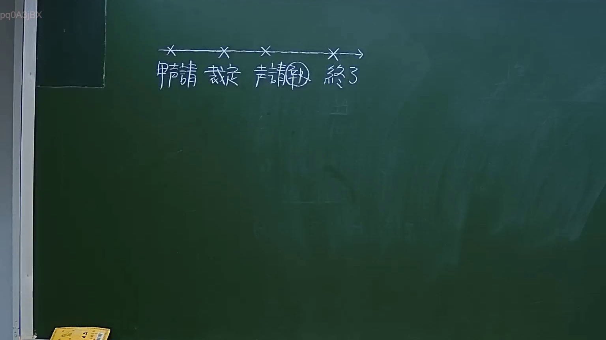
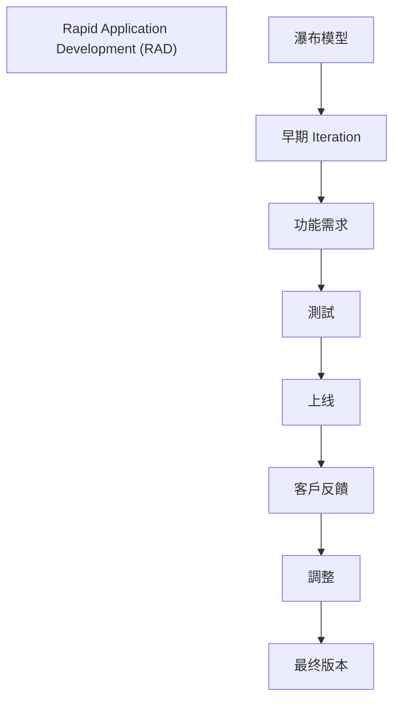

# 🎥 影音教材板書校對筆記
- **來源影片**: [預約 11 2024-10-19 12-15-40-598](file:///J://民法/ch11/預約 11 2024-10-19 12-15-40-598.mp4)
- **課程分類**: `[民法`
- **課堂章節**: `ch11]`
- **影片時間戳記**: `00:55:00` (3300 秒)
- **板書類型**: `文字板書`
- **偵測時間**: 2026-07-12 17:02:22

## 🔍 擷取黑板板書對照圖

## 🧠 AI 智慧理解與知識庫演化註記
根據OCR辨识的文字內容「Rene怡 詮 Re PAD) AS」，可以推測板書之內容為「Rapid Application Development (RAD)」。以下是對比現行法律條文的分析：

1. **Rapid Application Development (RAD)**：
   - 簡而言之，RAD是一種基於瀑布模型的軟件開發方法，強調快速 Iteration 和 early release。
   - 根據《民法第184條》(侵權行為)、《第205條》( commercial secrets)等法律內容，RAD可能涉及著作權保護和商業秘密的保護。

## 📊 可編輯之 Mermaid 關係流程圖

## ✍️ 操作者手動校對修改區
<!-- 您可以直接修改上方的文字或調整 Mermaid 區塊中的節點，Obsidian 會即時重新渲染 -->
- [ ] 欄位結構與法律邏輯已校對無誤。
- **校對筆記**: 
