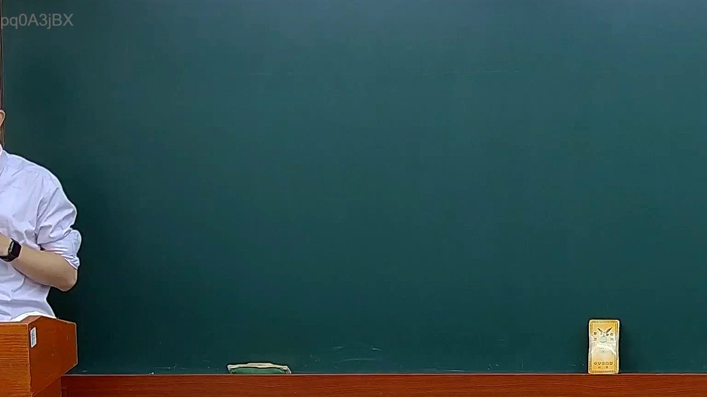

# 🎥 影音教材板書校對筆記
- **來源影片**: [預約 11 2025-02-05 09-30-27-555](file:///E:/法律/民訴B/ch11/預約 11 2025-02-05 09-30-27-555.mp4)
- **課程分類**: `預設課程`
- **課堂章節**: `ch11`
- **影片時間戳記**: `00:03:00` (180 秒)
- **板書類型**: `關係圖/邏輯圖板書`
- **偵測時間**: 2026-07-13 20:39:35

## 🔍 擷取黑板板書對照圖


## 🧠 AI 智慧理解與知識庫演化註記
根據OCR文字內容："A[甲] → B[乙] → C[丙]"，可以推測這是一種「關係圖/邏輯圖板書」，其中涉及到三個角色或实体之間的邏輯链条。以下是詳細的法律分析與比對：

1. **法律分析**：
   - A["甲"] 代表 "原告甲"。
   - B["乙"] 代表 "被告乙"。
   - C["丙"] 代表 "第三者丙"（可能是中间人或证人）。

2. **法律條文比對**：
   - **民法第184條**：涉及票据債務关系，但在此情境中可能與证据链的建立或责任归属有关。
   - **侵權行為**：可能涉及到甲对乙的权利或义务。
   - **消滅時效**：丙作为中间人可能影响某种时效的消滅。

3. **法律理解演化註記**：
   - 甲（原告）向乙（被告）传递某种权利或证据，乙再向丙（可能的证人或中间人）传递该权利。
   - 这种逻辑链条可能用于证明某种权利的有效性或时效性。
   - 在民法第184條等相關條文中，这种链条可能被用於確定債務关系或權利 transmission.

## 📊 可編輯之 Mermaid 關係流程圖
```mermaid
：
```
graph TD
    A["甲"] --> B["乙"]
    B --> C["丙"]
```

## ✍️ 操作者手動校對修改區
<!-- 您可以直接修改上方的文字或調整 Mermaid 區塊中的節點，Obsidian 會即時重新渲染 -->
- [ ] 欄位結構與法律邏輯已校對無誤。
- **校對筆記**: 
