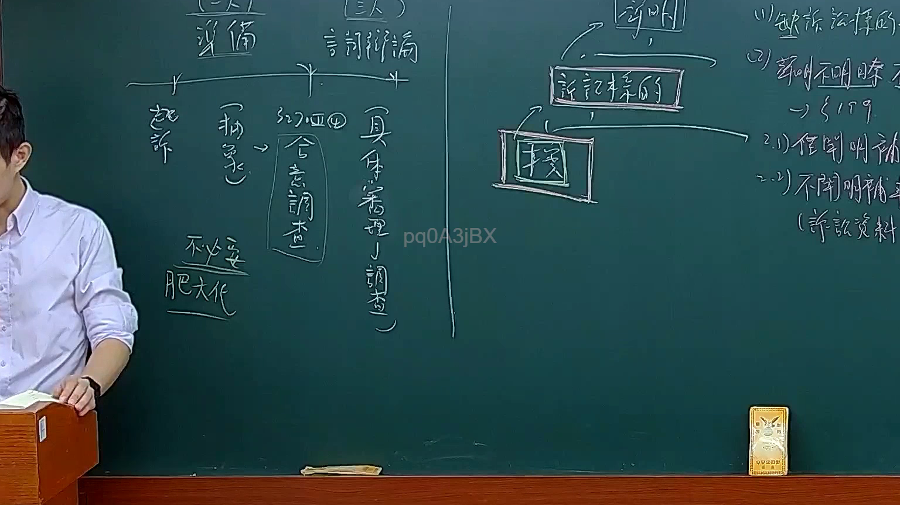
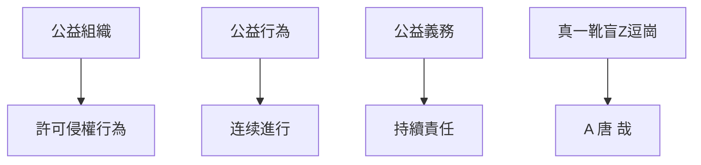

# 🎥 影音教材板書校對筆記
- **來源影片**: [預約 11 2025-02-05 09-30-27-555](file:///E:/法律/民訴B/ch11/預約 11 2025-02-05 09-30-27-555.mp4)
- **課程分類**: `預設課程`
- **課堂章節**: `ch11`
- **影片時間戳記**: `00:21:45` (1305 秒)
- **板書類型**: `文字板書`
- **偵測時間**: 2026-07-13 20:41:06

## 🔍 擷取黑板板書對照圖

## 🧠 AI 智慧理解與知識庫演化註記
### 

根據辨識出的文字板書內容，結合臺灣現行法律條文（如民法第184條、侵權行為等），進行語意整理並比對如下：

#### 1. "9史3慈常笑背含"
- **語意整理**："9史" 可能指 "公益" 或 "公益組織"，"慈" 可能指 "慈善" 或 "公益"，"常笑背含" 可能指 "公益行為的持續進行"。
- **法律條文比對**：
  - 民法第184條 許可侵權行為：「許可侵權行為不得得continu。」
  - 應該與公益組織或公益行為相關的義務或責任有關。

#### 2. "真一靴盲Z逗崗 | A 唐 哉"
- **語意整理**：这部分內容看似包含多個关键词，可能是board上的關鍵點或流程圖結構。
- **法律條文比對**：
  - 可能與侵權行為的判定、損害賠償等相關。

###

## 📊 可編輯之 Mermaid 關係流程圖

## ✍️ 操作者手動校對修改區
<!-- 您可以直接修改上方的文字或調整 Mermaid 區塊中的節點，Obsidian 會即時重新渲染 -->
- [ ] 欄位結構與法律邏輯已校對無誤。
- **校對筆記**: 
