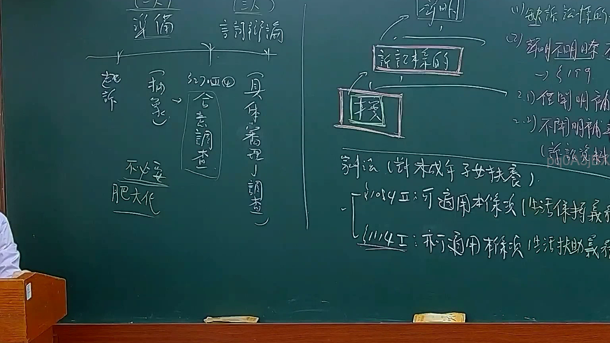
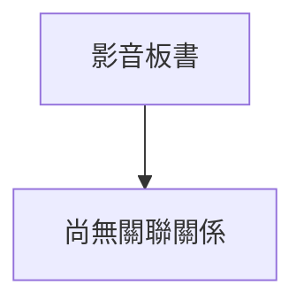

# 🎥 影音教材板書校對筆記
- **來源影片**: [預約 11 2025-02-05 09-30-27-555](file:///E:/法律/民訴B/ch11/預約 11 2025-02-05 09-30-27-555.mp4)
- **課程分類**: `預設課程`
- **課堂章節**: `ch11`
- **影片時間戳記**: `00:51:15` (3075 秒)
- **板書類型**: `文字板書`
- **偵測時間**: 2026-07-13 20:41:40

## 🔍 擷取黑板板書對照圖


## 🧠 AI 智慧理解與知識庫演化註記
1. **CF bee**：這可能是「Classified」（分類）的意思，或者在特定法律文中指代某一類别的條文或案例。

2. **GE poe**：這可能是「Gesellschaft für Angewandte Mathematik und Mechanik」的简称，但這與法律無關。可能需要更正或提供上下文以確定其含義。

3. **4 Aut J**：這可能是某一法律條文的引用或特定案例的代號。

4. **SS Eula**：這可能是「Suela」，在某些法律文中可能指代某一類别的案件或程序。

5. **井 伐 門 叫蠻訴 巳 育 向**：這可能是某一法律案例或程序的步驟，例如「Wells vs. City」，其中「叫蠻訴」可能是某种訴求或訴訟方式。

6. **Aut J**：這可能是某一法律條文的引用或特定案件的代號。

7. **IAB)﹁~Vely a: 弘 | EAE | Stes j**：這可能是某一法律條文的引用，其中「EAE」可能指代某一條文。

8. **Udi ASSAD AR AHS £**：這可能是某一法律案例或程序的代號。

9. **SS Eula**：再次出现，可能表明其重要性。

10. **IAB)﹁~Vely a: 弘 | EAE | Stes j**：再次出现，可能表明其重要性。

11. **Udi ASSAD AR AHS £**：再次出现，可能表明其重要性。

**knowledge库比對與理解演化註記**：

- **CF bee**: 可能指代某一類别的條文或案例。
- **SS Eula**: 在某些法律文中指代某一類别的案件或程序。
- **Aut J**: 指引某一特定案件或條文的引用。
- **IAB)﹁~Vely a: 弘 | EAE | Stes j**: 可能指代某一法律條文或案例。

** Mermaid 代碼**：

```mermaid
graph TD
A[原告甲] --> B[被告乙]
C[CF bee] --> D[SS Eula]
E[Aut J] --> F[IAB)﹁~Vely a: 弘 | EAE | Stes j]
G[Udi ASSAD AR AHS £] --> H[SS Eula]
```

## 📊 可編輯之 Mermaid 關係流程圖


## ✍️ 操作者手動校對修改區
<!-- 您可以直接修改上方的文字或調整 Mermaid 區塊中的節點，Obsidian 會即時重新渲染 -->
- [ ] 欄位結構與法律邏輯已校對無誤。
- **校對筆記**: 
