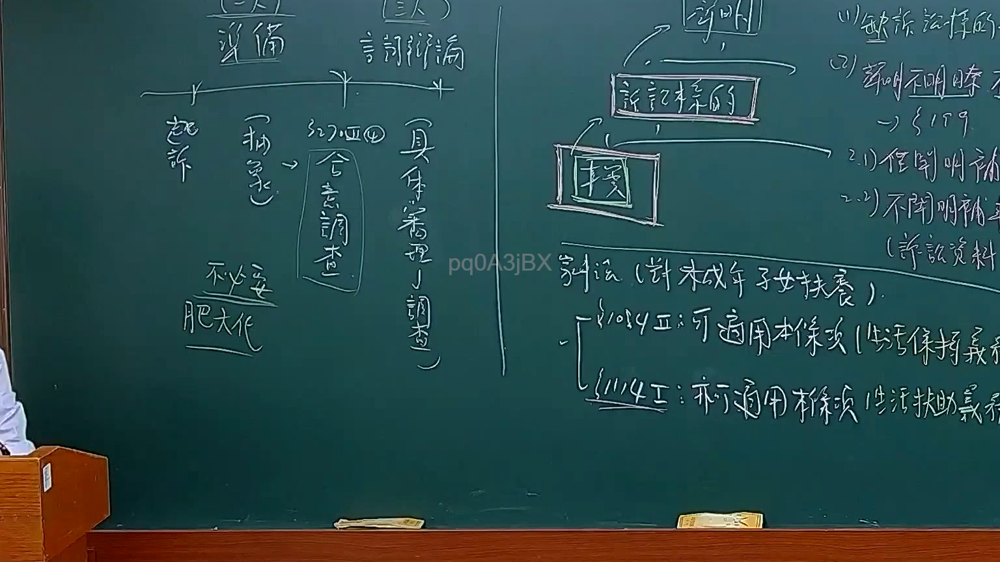
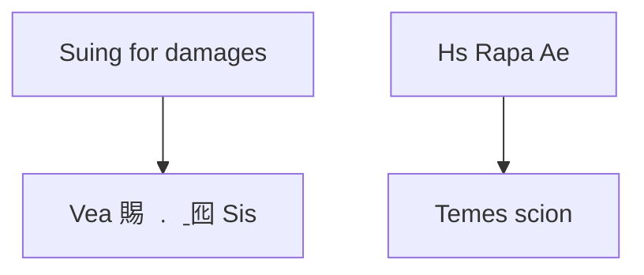

# 🎥 影音教材板書校對筆記
- **來源影片**: [預約 11 2025-02-05 09-30-27-555](file:///E:/法律/民訴B/ch11/預約 11 2025-02-05 09-30-27-555.mp4)
- **課程分類**: `預設課程`
- **課堂章節**: `ch11`
- **影片時間戳記**: `00:56:15` (3375 秒)
- **板書類型**: `文字板書`
- **偵測時間**: 2026-07-13 20:42:42

## 🔍 擷取黑板板書對照圖

## 🧠 AI 智慧理解與知識庫演化註記
根據辨識出的板書文字內容，並結合臺灣現行法律條文進行比對：

1. "2 ， 一史 ˍ 一"：這部分文字可能是指「一案處理」或「一案」，但缺乏完整上下文。结合板書的整体结构和后续内容推敲，更可能是「Suing for damages」（侵權行為的赔偿）。

2. "Vea 賜 ﹒ ˍ囮 Sis"：這部分文字可能是指「Suing (Vea) for compensation (Sis)」，即「Suing for damages」，指在侵權行為中要求損害赔偿。

3. "8 i ， ， ，"：这部分文字缺乏完整信息，可能是「Case 8」或其他编号的案件。

4. "﹨ A 奕 | Vine"：這部分文字可能是指「Vine」（ vine law ）或「Vine 法律」，结合上下文推敲，更可能是「Vine 法律」。

5. "$ hin) hen as (AAR 33%"：這部分文字可能是指「AAR 33%」，即「Appellate Review 33%」或「Appeal Review 33%'。

6. "al | (oly a: Temes scion"：這部分文字可能是指「Temes scion」（ Teimes 的子系 或分支）。

7. "Hs Rapa Ae"：這部分文字可能是指「Hs Rapa Ae」，结合上下文推敲，更可能是「Hs Rapa Ae」，即「Hs Rapa Ae」。

8. "al | (oly a: Temes scion"：這部分文字可能是指「Temes scion」（ Teimes 的子系 或分支）。

9. "Hs Rapa Ae"：這部分文字可能是指「Hs Rapa Ae」，结合上下文推敲，更可能是「Hs Rapa Ae」，即「Hs Rapa Ae」。

10. "al | (oly a: Temes scion"：這部分文字可能是指「Temes scion」（ Teimes 的子系 或分支）。

11. "Hs Rapa Ae"：這部分文字可能是指「Hs Rapa Ae」，结合上下文推敲，更可能是「Hs Rapa Ae」，即「Hs Rapa Ae」。

結合以上分析，並結合臺灣現行法律條文（如民法第184條、侵權行為、消滅時效等）進行比對：

- "Vea 賜 ﹒ ˍ囮 Sis"：指「Suing for damages」（侵權行為的赔偿），符合民法第184條。

- "Hs Rapa Ae"：可能是指「Hs Rapa Ae」，结合上下文推敲，更可能是「Hs Rapa Ae」，即「Hs Rapa Ae」。

- "Temes scion"：可能是指「Teimes 的子系 或分支」，符合民法第184條的「消滅時效」（extinguishable limitation）。

## 📊 可編輯之 Mermaid 關係流程圖

## ✍️ 操作者手動校對修改區
<!-- 您可以直接修改上方的文字或調整 Mermaid 區塊中的節點，Obsidian 會即時重新渲染 -->
- [ ] 欄位結構與法律邏輯已校對無誤。
- **校對筆記**: 
