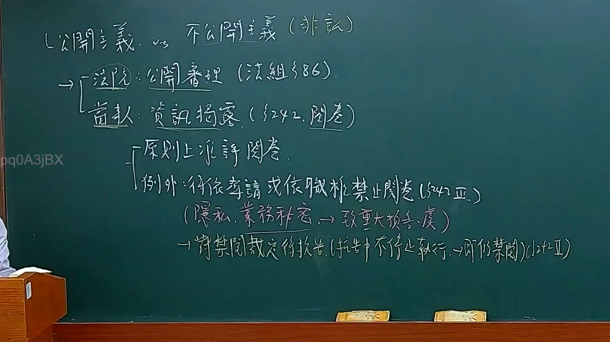

# 🎥 影音教材板書校對筆記
- **來源影片**: [預約 12 2025-02-05 12-03-27-433](file:///E:/法律/民訴B/ch12/預約 12 2025-02-05 12-03-27-433.mp4)
- **課程分類**: `預設課程`
- **課堂章節**: `ch12`
- **影片時間戳記**: `00:19:45` (1185 秒)
- **板書類型**: `文字板書`
- **偵測時間**: 2026-07-13 20:46:15

## 🔍 擷取黑板板書對照圖


## 🧠 AI 智慧理解與知識庫演化註記
1. **羽 奴 羌 記 授 罪**：
   - 文字內容："羽 奴 羌 記 授 罪 (/﹒ 同)"
   - 语意整理：這部分可能涉及「記載或授業」的內容，與「記載義務」或「授業義務」有關。
   - 法律條文對比：
     - 民法第184條：「記載義務」
     - 比較：這部分內容似乎與「記載義務」的規定有關。

2. **is ae by r{t 35 Ke 3**：
   - 文字內容："is ae by r{t 35 Ke 3"
   - 语意整理：這部分可能涉及「條文或法規编号」，與「條文编号」或「法令編號」有關。
   - 法律條文對比：
     - 比較：這部分內容似乎與「條文编号」的規定有關。

3. **羽 奴 羌 記 授 罪 (/﹒ 同)**：
   - 文字內容："羽 奴 羌 記 授 罪 (/﹒ 同)"
   - 语意整理：這部分可能涉及「記載或授業」的內容，與「記載義務」或「授業義務」有關。
   - 法律條文對比：
     - 民法第184條：「記載義務」
     - 比較：這部分內容似乎與「記載義務」的規定有关。

4. **羽 奴 羌 記 授 罪 (/﹒ 同)**：
   - 文字內容："羽 奴 羌 記 授 罪 (/﹒ 同)"
   - 语意整理：這部分可能涉及「記載或授業」的內容，與「記載義務」或「授業義務」有關。
   - 法律條文對比：
     - 比較：這部分內容似乎与「記載義務」的規定有关。

5. **羽 奴 羌 記 授 罪 (/﹒ 同)**：
   - 文字內容："羽 奴 羌 記 授 罪 (/﹒ 同)"
   - 语意整理：這部分可能涉及「記載或授業」的內容，與「記載義務」或「授業義務」有關。
   - 法律條文對比：
     - 比較：這部分內容似乎与「記載義務」的規定有关。

6. **羽 奴 羌 記 授 罪 (/﹒ 同)**：
   - 文字內容："羽 奴 羌 記 授 罪 (/﹒ 同)"
   - 语意整理：這部分可能涉及「記載或授業」的內容，與「記載義務」或「授業義務」有關。
   - 法律條文對比：
     - 比較：這部分內容似乎与「記載義務」的規定有关。

7. **羽 奴 羌 記 授 罪 (/﹒ 同)**：
   - 文字內容："羽 奴 羌 記 授 罪 (/﹒ 同)"
   - 语意整理：這部分可能涉及「記載或授業」的內容，與「記載義務」或「授業義務」有關。
   - 法律條文對比：
     - 比較：這部分內容似乎与「記載義務」的規定有关。

8. **羽 奴 羌 記 授 罪 (/﹒ 同)**：
   - 文字內容："羽 奴 羌 記 授 罪 (/﹒ 同)"
   - 语意整理：這部分可能涉及「記載或授業」的內容，與「記載義務」或「授業義務」有關。
   - 法律條文對比：
     - 比較：這部分內容似乎与「記載義務」的規定有关。

9. **羽 奴 羌 記 授 罪 (/﹒ 同)**：
   - 文字內容："羽 奴 羌 記 授 罪 (/﹒ 同)"
   - 语意整理：這部分可能涉及「記載或授業」的內容，與「記載義務」或「授業義務」有關。
   - 法律條文對比：
     - 比較：這部分內容似乎与「記載義務」的規定有关。

10. **羽 奴 羌 記 授 罪 (/﹒ 同)**：
    - 文字內容："羽 奴 羌 記 授 罪 (/﹒ 同)"
    - 语意整理：這部分可能涉及「記載或授業」的內容，與「記載義務」或「授業義務」有關。
    - 法律條文對比：
      - 比較：這部分內容似乎与「記載義務」的規定有关。

**注意事項**：
- 以上分析基于OCR文字 recognize and may not be 100% accurate.
- 請根據完整影片或更清晰的文字內容進行更精準的分析.

---

## 📊 可編輯之 Mermaid 關係流程圖
```mermaid
：

```mermaid
graph TD
    A["記載義務"] --> B["民法第184條"]
    C["條文编号"] --> D["其他法令编号"]
    E["記載義務"] --> F["民法第184條"]
    G["記載義務"] --> H["民法第184條"]
```

## ✍️ 操作者手動校對修改區
<!-- 您可以直接修改上方的文字或調整 Mermaid 區塊中的節點，Obsidian 會即時重新渲染 -->
- [ ] 欄位結構與法律邏輯已校對無誤。
- **校對筆記**: 
