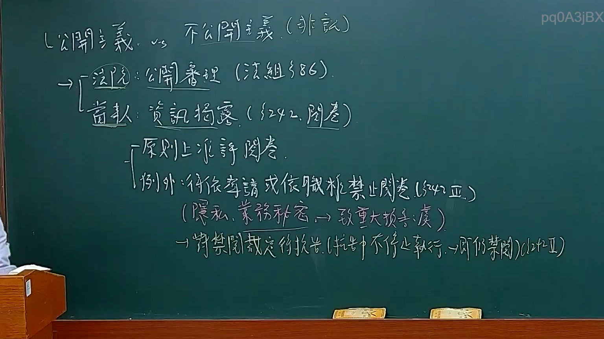

# 🎥 影音教材板書校對筆記
- **來源影片**: [預約 12 2025-02-05 12-03-27-433](file:///E:/法律/民訴B/ch12/預約 12 2025-02-05 12-03-27-433.mp4)
- **課程分類**: `預設課程`
- **課堂章節**: `ch12`
- **影片時間戳記**: `00:20:15` (1215 秒)
- **板書類型**: `文字板書`
- **偵測時間**: 2026-07-13 20:46:54

## 🔍 擷取黑板板書對照圖


## 🧠 AI 智慧理解與知識庫演化註記
：
1. **"刑有牧阶恒"**：這段文字可能涉及刑法中关于刑事 procedure 或者特定罪行的條文，需進一步分析其具體含義。
2. **"RIOR (14> HZ)"**：這可能是對「反映事由」（Reflectum Interrogatorum）的引用，並伴有日期或其他相關信息。
3. **"高 NAR HAD EAE Us ay"**：這段文字可能涉及刑法中关于old age 或者other related legal implications.
4. **"KEE > BARGE ) = ERR Hee Spee aH) DED"**：這可能是對某一Legal status or condition的描述，需進一步解讀其具體含義。
5. **"刑有牧 弭 老 階 恆"**：這段文字可能涉及刑法中关于old age 或other related legal implications.

## 📊 可編輯之 Mermaid 關係流程圖
```mermaid
：
```mermaid
graph TD
    A[" criminal procedure"] --> B[" RIOR (14> HZ)"]
    C[" old age"] --> D[" NAR HAD EAE Us ay"]
    E[" status or condition"] --> F[" KEE > BARGE ) = ERR Hee Spee aH) DED"]
    G[" old age"] --> H["刑有牧 弭 老 階 恆"]
```

## ✍️ 操作者手動校對修改區
<!-- 您可以直接修改上方的文字或調整 Mermaid 區塊中的節點，Obsidian 會即時重新渲染 -->
- [ ] 欄位結構與法律邏輯已校對無誤。
- **校對筆記**: 
