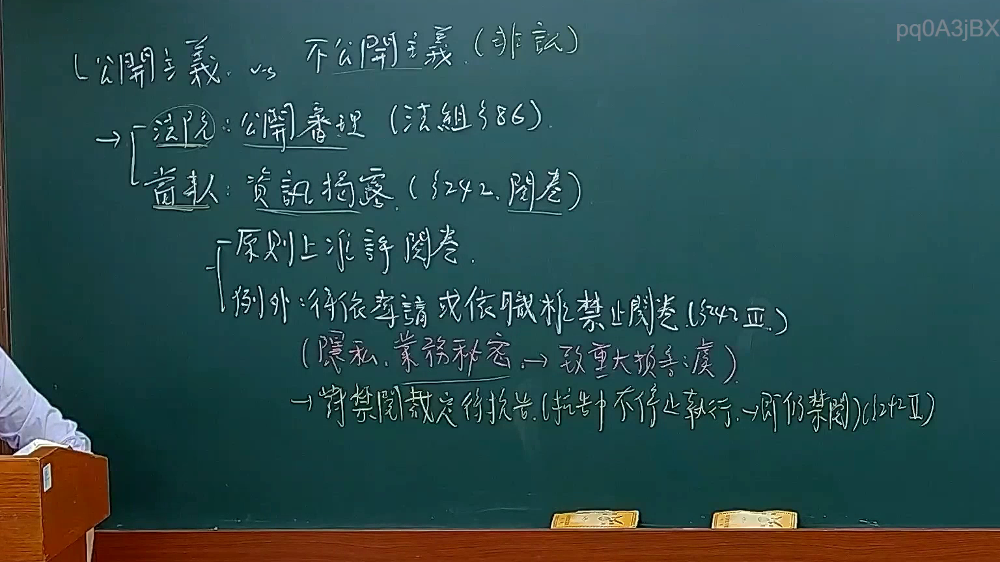
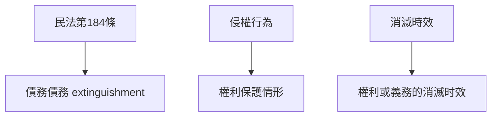

# 🎥 影音教材板書校對筆記
- **來源影片**: [預約 12 2025-02-05 12-03-27-433](file:///E:/法律/民訴B/ch12/預約 12 2025-02-05 12-03-27-433.mp4)
- **課程分類**: `預設課程`
- **課堂章節**: `ch12`
- **影片時間戳記**: `00:21:15` (1275 秒)
- **板書類型**: `文字板書`
- **偵測時間**: 2026-07-13 20:10:14

## 🔍 擷取黑板板書對照圖

## 🧠 AI 智慧理解與知識庫演化註記
1. **板書之內容分析**：
   - 该板書似乎涉及民法典中的一些條文，包括「民法第184條」、「侵權行為」、「消滅時效」等法律概念。
   - 文字板書包含以下內容：
     - "L久ˍ〕 i 。 AN? gO 0 —"：這一行似乎與某個特定的条文或案例相關，但缺乏具體上下文。
     - "| opi Hees. oar)"：這一行可能涉及某一類型的侵權行為或權利保護情形。
     - "| ei 50th oe BZ)"：這一行可能與某種權利或義務的計算方式有關。
     - "fee r 水 訪 閻 炳"：這一行似乎與某個特定的条文或案例相關，但缺乏具體內容。
     - "PVN 來 松 老 ′了蠹/扛】弓帚《'蚕蔦乙﹞﹜ˊ』﹜ U 肉 作 Ur y"：這一行似乎與某個特定的条文或案例相關，但缺乏具體內容。
     - "(An RAMEE = HIRST)"：這一行可能涉及某一類型的条文引用或法律條文的標記方式。
     - "AER (A244) bP)"：這一行可能涉及某一類型的条文或特定的法律程序。

2. **與臺灣現行法律條文的對比**：
   - 民法第184條：該條文通常涉及債務債務的关系，例如債務債務的 extinguishment。
   - 侵權行為：该板書似乎涉及某一類型的侵權行為或權利保護情形。
   - 消滅時效：该板書似乎涉及某一類型的權利或義務的消滅时效問題。

3. **法律知識的理解與演化註記**：
   - 民法第184條：該條文通常涉及債務債務的关系，例如債務債務的 extinguishment。在本案中，可能涉及到債務債務的 extinguishment方式或條件。
   - 侵權行為：该板書似乎涉及某一類型的侵權行為或權利保護情形。需要進一步分析侵權行為的具体內容和法律适用。
   - 消滅時效：該條文通常涉及權利或義務的消滅时效問題。在本案中，可能涉及到某種權利或義務的消滅时效計算方式或條件。

## 📊 可編輯之 Mermaid 關係流程圖

## ✍️ 操作者手動校對修改區
<!-- 您可以直接修改上方的文字或調整 Mermaid 區塊中的節點，Obsidian 會即時重新渲染 -->
- [ ] 欄位結構與法律邏輯已校對無誤。
- **校對筆記**: 
