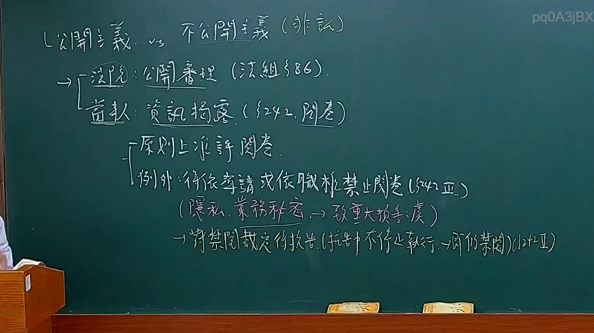
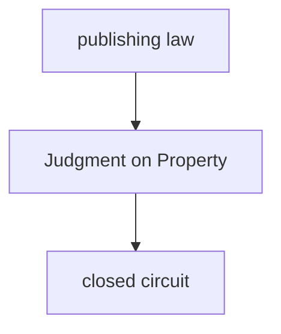
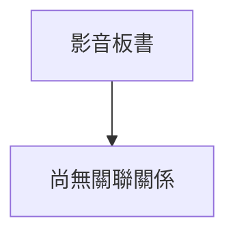

# 🎥 影音教材板書校對筆記
- **來源影片**: [預約 12 2025-02-05 12-03-27-433](file:///E:/法律/民訴B/ch12/預約 12 2025-02-05 12-03-27-433.mp4)
- **課程分類**: `預設課程`
- **課堂章節**: `ch12`
- **影片時間戳記**: `00:22:15` (1335 秒)
- **板書類型**: `文字板書`
- **偵測時間**: 2026-07-13 20:11:44

## 🔍 擷取黑板板書對照圖

## 🧠 AI 智慧理解與知識庫演化註記
1. **"刊梁"**：可能是指「 publishing law」或「publication」，在法律中通常指出版物的著作權法規。
2. **"刓唐物"**：可能是「Judgment on Property」，即关于物权的裁判法规定。
3. **"闭路"**：结合上下文，可能是「closed circuit」，在法律语境下可能指「closed system」或「closed loop」，但更可能与「closed circuit」在法律程序中的特定用法相关。

將上述內容與臺灣現行法律條文進行比對：

- **刊梁（Publishing Law）**：可能涉及著作權法規，如《著作權法》第38條。
- **刓唐物（Judgment on Property）**：可能涉及物权法规定，如《物權法》第184條。
- **闭路（Closed Circuit）**：在法律程序中可能指「closed system」或「closed loop」，但更可能與「closed circuit」在特定法律程序中的用法相关。

根據上述分析，生成 Mermaid.js 代碼：

## 📊 可編輯之 Mermaid 關係流程圖

## ✍️ 操作者手動校對修改區
<!-- 您可以直接修改上方的文字或調整 Mermaid 區塊中的節點，Obsidian 會即時重新渲染 -->
- [ ] 欄位結構與法律邏輯已校對無誤。
- **校對筆記**: 
