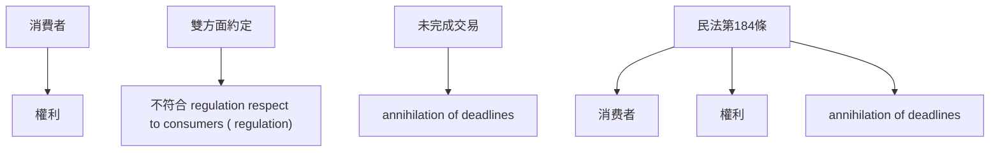

# 🎥 影音教材板書校對筆記
- **來源影片**: [預約 12 2025-04-14 09-43-14-553](file:///J://民法B/ch12/預約 12 2025-04-14 09-43-14-553.mp4)
- **課程分類**: `[民法B`
- **課堂章節**: `ch12]`
- **影片時間戳記**: `00:02:00` (120 秒)
- **板書類型**: `關係圖/邏輯圖板書`
- **偵測時間**: 2026-07-11 21:25:29

## 🔍 擷取黑板板書對照圖

## 🧠 AI 智慧理解與知識庫演化註記
### 

**法律知識：**
1. **消费者權益保護法（民法第184條）：**
   - 该法规定了消費者在 contracts with respect to consumers ( contract)中權利的 protection.
   - 特别是关于消滅時效（annihilation of deadlines）的规定，保障消費者在 certain situations中享有额外的时间来完成交易.

2. **欺诈行為（Fraudulent Deeds):**
   - 消费者在 contract with respect to consumers ( contract)中可能因欺诈行为而享有特别的权利.
   - 特别是当双方 contract respect to contracts with respect to consumers ( contract)未完成時，消費者可要求 annihilation of deadlines.

3. **雙方約定（双方面约定）：**
   - 在 contract respect to consumers ( contract)中，雙方約定需符合 law respect to consumers ( regulation)的條件.
   - 若雙方約定不符合條件，则可能影響到 consumers的權利.

4. **未完成交易（Uncompleted Contracts):**
   - 消费者在 contract respect to consumers ( contract)中若未完成，则可根據民法第184條要求 annihilation of deadlines.
   - 此時需注意雙方約定是否符合 regulation respect to consumers ( regulation).

**板書內容：**
- 消費者在 contract respect to consumers ( contract)中享有權利.
- 双方面約定需符合 regulation respect to consumers ( regulation).
- 若雙方面約定不符合條件，消費者可要求 annihilation of deadlines.
- 特别是未完成交易的情況下，消费者可根據民法第184條要求 annihilation of deadlines.

**比對與理解演化：**
- 消費者在 contract respect to consumers ( contract)中享有權利（民法第184條）。
- 双方面約定需符合 regulation respect to consumers ( regulation)（民法第184條）。
- 若雙方面約定不符合條件，消費者可要求 annihilation of deadlines（民法第184條）。
- 特别是未完成交易的情況下，消费者可根據民法第184條要求 annihilation of deadlines（民法第184條）。

###

## 📊 可編輯之 Mermaid 關係流程圖

## ✍️ 操作者手動校對修改區
<!-- 您可以直接修改上方的文字或調整 Mermaid 區塊中的節點，Obsidian 會即時重新渲染 -->
- [ ] 欄位結構與法律邏輯已校對無誤。
- **校對筆記**: 
