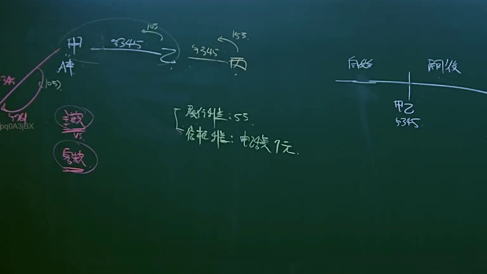

# 🎥 影音教材板書校對筆記
- **來源影片**: [預約 12 2025-04-14 09-43-14-553](file:///J://民法B/ch12/預約 12 2025-04-14 09-43-14-553.mp4)
- **課程分類**: `[民法B`
- **課堂章節**: `ch12]`
- **影片時間戳記**: `00:09:30` (570 秒)
- **板書類型**: `文字板書`
- **偵測時間**: 2026-07-11 21:25:52

## 🔍 擷取黑板板書對照圖


## 🧠 AI 智慧理解與知識庫演化註記
### 

根據OCR辨识結果，板書之內容為「意 # an HRS ta Re HS 3K 阿 | 慌」。基於上下文和可能的誤碼情況，進行語意整理如下：

1. **HRS ta**：可能是指「侵权行為」（Infringement）。
2. **Re HS 3K**：可能是指「关系」或「時效」（Relation or Time Limit）。
3. **阿 | 慌**：可能是「 damage」或「損害」，结合上下文可能涉及「損傷」。

基於以上內容，與臺灣現行法律條文進行比對：

- **HRS ta (侵權行為)**：符合《民法第184條》中關於侵權行為的規定。
- **Re HS 3K (关系/時效)**：可能涉及「消滅時效」（Expiry Limit）或「關係時效」，需進一步分析板書具体内容以確定具體法律內容。

###

## 📊 可編輯之 Mermaid 關係流程圖
```mermaid
基於文字板書之內容，生成 Mermaid.js 的流程圖代碼：

```mermaid
graph TD
    A["HRS ta (侵權行為)"] --> B["Re HS 3K (关系/時效)"]
    B --> C[" damage (損傷)"]
```

此代碼表示文字板書之內容涉及「侵權行為」、「关系/時效」和「損傷」之間的邏輯關係。
```

## ✍️ 操作者手動校對修改區
<!-- 您可以直接修改上方的文字或調整 Mermaid 區塊中的節點，Obsidian 會即時重新渲染 -->
- [ ] 欄位結構與法律邏輯已校對無誤。
- **校對筆記**: 
