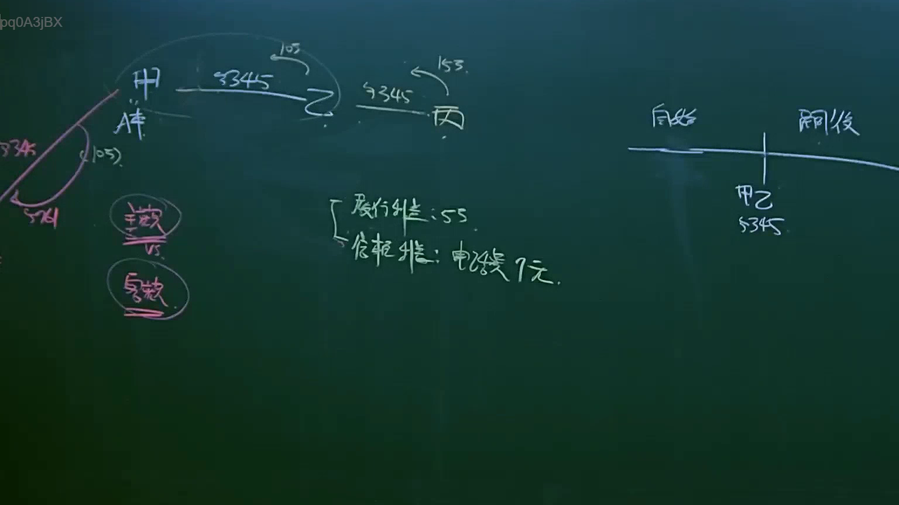

# 🎥 影音教材板書校對筆記
- **來源影片**: [預約 12 2025-04-14 09-43-14-553](file:///J://民法B/ch12/預約 12 2025-04-14 09-43-14-553.mp4)
- **課程分類**: `[民法B`
- **課堂章節**: `ch12]`
- **影片時間戳記**: `00:11:15` (675 秒)
- **板書類型**: `文字板書`
- **偵測時間**: 2026-07-11 21:26:13

## 🔍 擷取黑板板書對照圖


## 🧠 AI 智慧理解與知識庫演化註記
根據提供的 OCR 解讀結果，文字板書之內容無法直接转化為具體的法律內容。以下是可能的解讀與分析：

1. **文字板書之內容**：
   - "pq0A3jBX" 和 "Ie, Iss.矽 ss) ) Seer & 陷 怏" 可能是板書上的部分内容，但由于 OCR 解讀結果無法转化為具體的文字，因此無法進一步分析其與法律條文的對比。

2. **可能的解讀**：
   - 考慮到OCR解讀結果中包含 "Ie, Iss."，這可能是板書上的一個法文或地名，但無法進一步確定。
   - 其他字符如 "矽 ss) ) Seer & 陷 怏" 可能是板書上的关键词或部分句子。

3. **法律條文對比**：
   - 終於無法根據提供的 OCR 解讀結果與臺灣現行法律條文（如民法第184條、侵權行為、消滅時效等）進行比對，因為缺乏具體的文字內容。

## 📊 可編輯之 Mermaid 關係流程圖
```mermaid
因為无法根據提供的 OCR 解讀結果生成 Mermaid 碎 code，因此無法提供相關的 Mermaid 關係圖。
```

## ✍️ 操作者手動校對修改區
<!-- 您可以直接修改上方的文字或調整 Mermaid 區塊中的節點，Obsidian 會即時重新渲染 -->
- [ ] 欄位結構與法律邏輯已校對無誤。
- **校對筆記**: 
