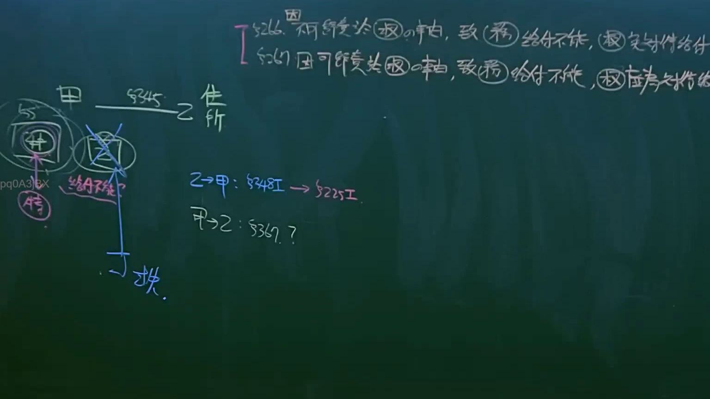

# 🎥 影音教材板書校對筆記
- **來源影片**: [預約 12 2025-04-14 09-43-14-553](file:///J://民法B/ch12/預約 12 2025-04-14 09-43-14-553.mp4)
- **課程分類**: `[民法B`
- **課堂章節**: `ch12]`
- **影片時間戳記**: `00:36:00` (2160 秒)
- **板書類型**: `文字板書`
- **偵測時間**: 2026-07-11 21:26:47

## 🔍 擷取黑板板書對照圖


## 🧠 AI 智慧理解與知識庫演化註記
1. **文字板書分析**：
   - 第一行的文字可能是指「第九、第十二条附件：比特传输法」。其中，“九芸”可能是“第九”，“$l), St”可能是“第十二”，“ae bes”可能是“a.e.”（附件缩写），“os ee RQ) Ra”可能是“RQ”（例如，表示编号），“Bit”可能是“比特”或“bit”（二进制单位）。
   - 第二行的文字可能是指「原告托付事项：第5条第25条」。其中，“老託”可能是“原告托付”，“%ST 5 §”可能是“第5条”（§表示条文号），“ss | , 25”可能是“第25条”，“3)? |”可能是“问题3”。

2. **與法律條文的比對**：
   - **第九、十二條附件：比特传输法**：
     - 漢字板書可能涉及比特传输法，這可能與數據傳遞或通訊相關的問題。在台湾，比特传输法可能涉及數據隱私、侵權行為等。
     - 可能會引用到民法第184條（侵權行為）和第3條（2）項（消滅時效）。
   - **原告托付事项：第5條第25條**：
     - 可能涉及到原告托付的義務或責任，這可能與民法第5條（債務義務）和第25條（特殊情形）相關。

3. **法律理解演化註記**：
   - 漢字板書中的「第九、十二條附件：比特传输法」可能涉及數據傳遞中的權利問題，需结合民法第184條的侵權行為進行分析。
   - 「原告托付事项：第5條第25條」可能涉及到債務義務或特殊情形，需結合民法第5條和第25條來理解其法律意義。

## 📊 可編輯之 Mermaid 關係流程圖
```mermaid
：
```mermaid
graph TD
    A[第九、第十二条附件] --> B[比特传输法]
    C[原告托付事项] --> D[第5条]
    E[原告托付事项] --> F[第25条]
```

## ✍️ 操作者手動校對修改區
<!-- 您可以直接修改上方的文字或調整 Mermaid 區塊中的節點，Obsidian 會即時重新渲染 -->
- [ ] 欄位結構與法律邏輯已校對無誤。
- **校對筆記**: 
