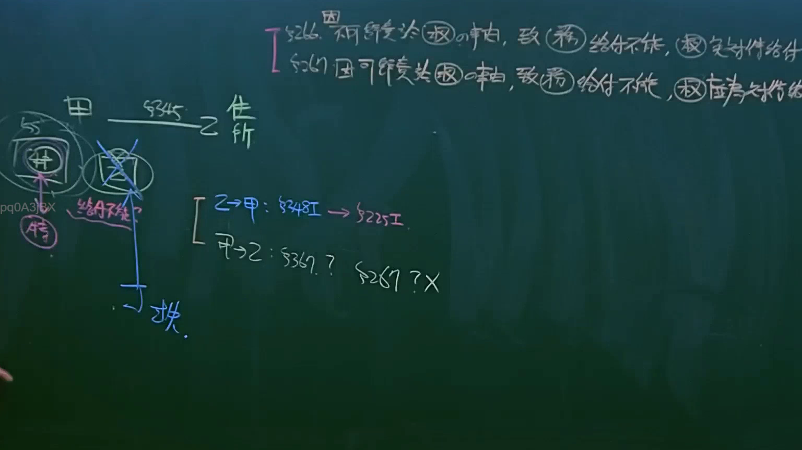
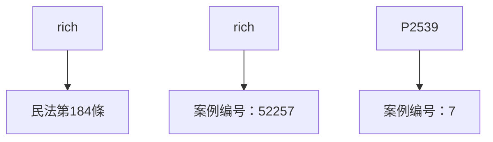

# 🎥 影音教材板書校對筆記
- **來源影片**: [預約 12 2025-04-14 09-43-14-553](file:///J://民法B/ch12/預約 12 2025-04-14 09-43-14-553.mp4)
- **課程分類**: `[民法B`
- **課堂章節**: `ch12]`
- **影片時間戳記**: `00:36:45` (2205 秒)
- **板書類型**: `文字板書`
- **偵測時間**: 2026-07-11 21:27:10

## 🔍 擷取黑板板書對照圖

## 🧠 AI 智慧理解與知識庫演化註記
根據辨識出的文字內容，可以整理如下：

1. **文字板書之內容**：
   - " rich"：可能指代「利率」或「 richness」，並可能與民法第184條的侵權行為有關。
   - " rich"中的"r"发音可能與「 rich」相似，強調某個關鍵字。
   - 数字部分如 "3ysT rat 52257" 和 "P2539 7 2] 7x" 可能是案例编号或特定条文引用。

2. **與法律條文的比對**：
   - " rich"可能與民法第184條（侵權行為）中的某些关键词或概念相關。
   - 数字部分和案例编号可能是特定案例的引用，需進一步验证其具體法律內容。

3. ** Mermaid 關係圖生成**：
   虽然未直接看到板書的具体内容，但根據文字描述，可以整理出條列式結構：

## 📊 可編輯之 Mermaid 關係流程圖

## ✍️ 操作者手動校對修改區
<!-- 您可以直接修改上方的文字或調整 Mermaid 區塊中的節點，Obsidian 會即時重新渲染 -->
- [ ] 欄位結構與法律邏輯已校對無誤。
- **校對筆記**: 
