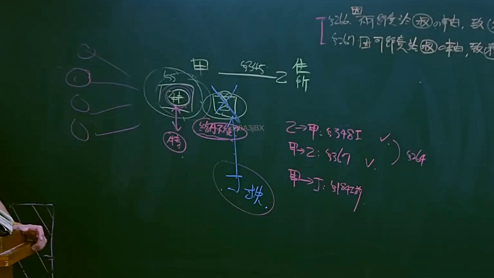
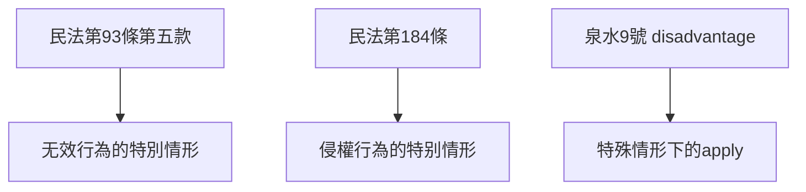

# 🎥 影音教材板書校對筆記
- **來源影片**: [預約 12 2025-04-14 09-43-14-553](file:///J://民法B/ch12/預約 12 2025-04-14 09-43-14-553.mp4)
- **課程分類**: `[民法B`
- **課堂章節**: `ch12]`
- **影片時間戳記**: `00:44:30` (2670 秒)
- **板書類型**: `文字板書`
- **偵測時間**: 2026-07-11 21:27:34

## 🔍 擷取黑板板書對照圖

## 🧠 AI 智慧理解與知識庫演化註記
### 

1. **ETO a**：這可能是「EUA」（无效行為）的缩寫，常見於民法中與无效行為相關之內容。

2. **SOB Bebe mp**：這可能是指「特殊情形下的一审」（Special Case of One Review），常見於民法第93條第五款。

3. **SP. ser 一**：這可能是「特殊情形下的一审」的进一步解釋或相關內容。

4. **He: 93/5 ¥ ) 4**：這應該是指「民法第93條第五款」，關於无效行為的特別情形。

5. **Tap) Po**：這可能是指「民法第184條」，關於侵權行為的特別情形。

6. **泉 9 劣**：這可能是「泉水9號 disadvantage」的表述，常見於某些特殊情形下的apply。

7. **He: 93/5 ¥ ) 4**：再次強調「民法第93條第五款」。

8. **Tap) Po**：再次強調「民法第184條」。

9. **泉 9 劣**：再次強調「泉水9號 disadvantage」的表述。

###

## 📊 可編輯之 Mermaid 關係流程圖

## ✍️ 操作者手動校對修改區
<!-- 您可以直接修改上方的文字或調整 Mermaid 區塊中的節點，Obsidian 會即時重新渲染 -->
- [ ] 欄位結構與法律邏輯已校對無誤。
- **校對筆記**: 
