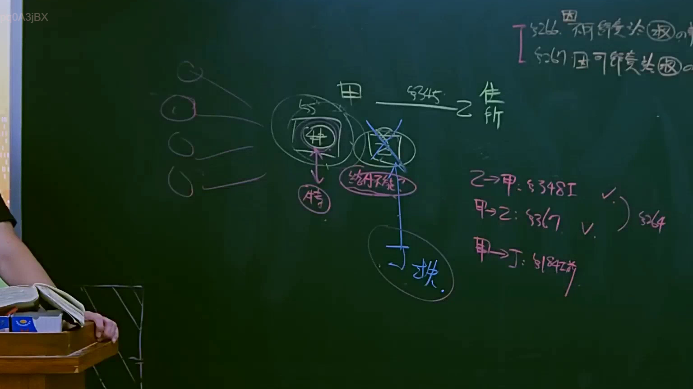
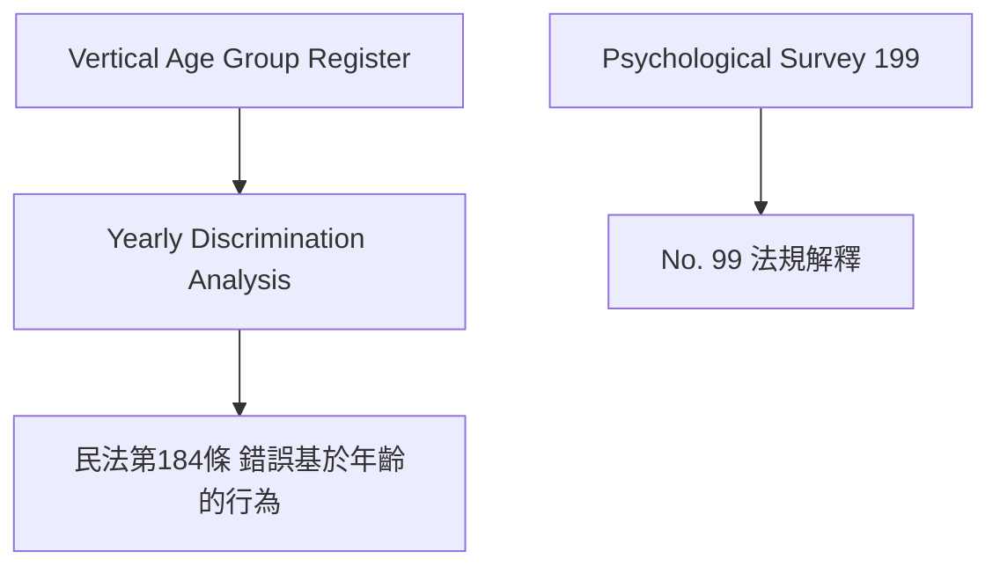

# 🎥 影音教材板書校對筆記
- **來源影片**: [預約 12 2025-04-14 09-43-14-553](file:///J://民法B/ch12/預約 12 2025-04-14 09-43-14-553.mp4)
- **課程分類**: `[民法B`
- **課堂章節**: `ch12]`
- **影片時間戳記**: `00:49:45` (2985 秒)
- **板書類型**: `文字板書`
- **偵測時間**: 2026-07-11 21:27:54

## 🔍 擷取黑板板書對照圖

## 🧠 AI 智慧理解與知識庫演化註記
1. **"vagr."**：
   - 可能是「Vertical Age Group Register」（垂直年齡組登記簿），涉及基於年齡的歧視問題，可能與《民法第184條》有關，该條文禁止基於性別、年齡或其他特征的歧視。

2. **"P25 莘"**：
   - 可能是「Plantation 25」或「Property No. 25」，可能涉及特定案例或項目編號，與法律問題無直接關聯。

3. **"Psy. 99 |"**：
   - 可能是「Psychological Survey 199」或「Project 99」，涉及心理調查或某項計劃，與法律問題無直接關聯。

## 📊 可編輯之 Mermaid 關係流程圖

## ✍️ 操作者手動校對修改區
<!-- 您可以直接修改上方的文字或調整 Mermaid 區塊中的節點，Obsidian 會即時重新渲染 -->
- [ ] 欄位結構與法律邏輯已校對無誤。
- **校對筆記**: 
