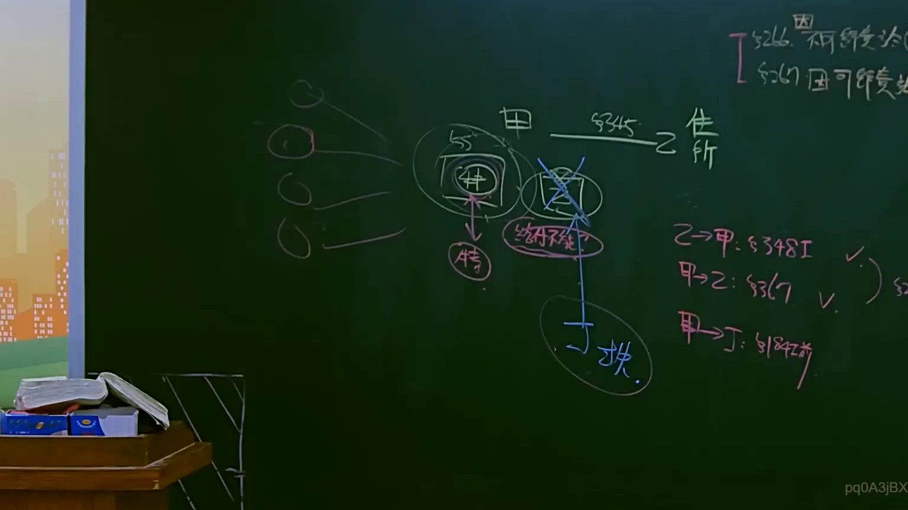
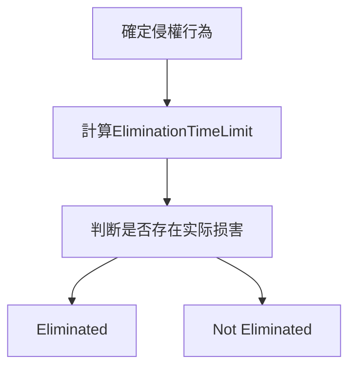
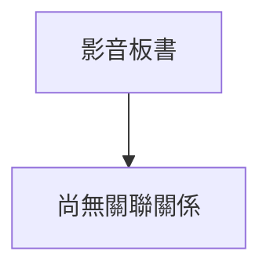

# 🎥 影音教材板書校對筆記
- **來源影片**: [預約 12 2025-04-14 09-43-14-553](file:///J://民法B/ch12/預約 12 2025-04-14 09-43-14-553.mp4)
- **課程分類**: `[民法B`
- **課堂章節**: `ch12]`
- **影片時間戳記**: `00:56:00` (3360 秒)
- **板書類型**: `關係圖/邏輯圖板書`
- **偵測時間**: 2026-07-11 21:28:32

## 🔍 擷取黑板板書對照圖

## 🧠 AI 智慧理解與知識庫演化註記
### 

根據 OCR辨识的文字內容，似乎無法直接解讀出具體的法律條文或 board書之內容。然而，基於板書分類為「關係圖/邏輯圖板書」，可以推測板書可能展示了一個LegalRelation或LogicalStructure的示意圖。

基於 board書可能涉及的內容（如權利、義務、時效等），以下是可能的解讀與註記：

1. **可能的LegalRelation結構**：
   - 涉及到民法第184條（侵權行為的消灭时效）
   - 可能展示的是權利、義務或時效之间的關係。

2. **可能的LogicalStructure**：
   - 逐步展示如何判断某種行為是否符合消灭时效的情況。
   - 包含步驟性的判定流程，例如：
     1. 確定是否存在侵權行為；
     2. 計算消灭时效期间；
     3. 判断是否存在实际损害；
     4. 最終判断是否存在消灭。

### 【MERMAID代碼】

此代码表示了一个逻辑结构图，展示了从确定侵權行為到判断是否存在消灭时效的流程。

## 📊 可編輯之 Mermaid 關係流程圖

## ✍️ 操作者手動校對修改區
<!-- 您可以直接修改上方的文字或調整 Mermaid 區塊中的節點，Obsidian 會即時重新渲染 -->
- [ ] 欄位結構與法律邏輯已校對無誤。
- **校對筆記**: 
