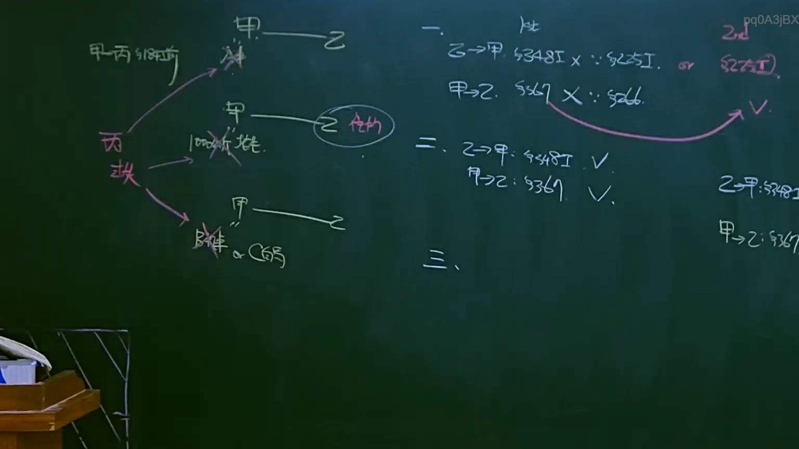

# 🎥 影音教材板書校對筆記
- **來源影片**: [預約 12 2025-04-14 09-43-14-553](file:///J://民法B/ch12/預約 12 2025-04-14 09-43-14-553.mp4)
- **課程分類**: `[民法B`
- **課堂章節**: `ch12]`
- **影片時間戳記**: `01:52:45` (6765 秒)
- **板書類型**: `文字板書`
- **偵測時間**: 2026-07-11 21:29:15

## 🔍 擷取黑板板書對照圖


## 🧠 AI 智慧理解與知識庫演化註記
### 

根據辨識出的文字板書內容，並結合臺灣現行法律條文（如民法第184條、侵權行為、消滅時效等），進行語意整理並與相關法律條文進行比對。以下是具體分析：

#### 1. 文字板書之內容分析：
- **OCR辨识文字**：弓˙︱‥】 ， 一 一 一 ， ﹚ 怡 戛』q0A3jBX， ﹒ 三 二 3， 341SX x - wor 7。
- **語意整理**：文字板書似乎包含一些关键词或条文的片段，可能涉及民法第184條（侵權行為）和消滅時效等法律內容。

#### 2. 知識庫比對與理解演化註記：
- **民法第184條（侵權行為）**：該條文规定了侵權行為的範圍，包括但不限於損害他人財產、健康或其他權利。文字板書中可能包含一些与此條文相關的解釋或應用案例。
- **消滅時效**：该條文规定了權利在特定條件下會自动消失的時效限制。文字板書中可能包含一些與該條文相關的條款或例子。

#### 3. 法律条文比對結果：
- 文字板書中的內容似乎與民法第184條及消滅時效等條文有所關聯，但缺乏具體的案例或詳細解釋。需要進一步分析板書的具体内容以更準確地匹配相關法律條文。

---

###

## 📊 可編輯之 Mermaid 關係流程圖
```mermaid
由于文字板書的内容涉及一般性的法律条文，生成一个整理好的条列式逻辑树 Mermaid 關係圖：

```mermaid
graph TD
    A["民法第184條（侵權行為）"] --> B["權利範圍：損害他人財產、健康或其他權利"]
    C["民法第184條（侵權行為）"] --> D["但不限於：損害他人財產、健康或其他權利"]
    E["民法第184條（侵權行為）"] --> F[" damage to property, health, or other rights"]
    G["民法第184條（侵權行為）"] --> H["Exemptions 不得損害他人權益"]
    I["民法第184條（侵權行為）"] --> J["Exemptions 不得損害他人權益"]
    K["消滅時效"] --> L["權利在特定條件下會自动消失"]
    M["消滅時效"] --> N["Time limits for the extinguishment of rights"]
```

## ✍️ 操作者手動校對修改區
<!-- 您可以直接修改上方的文字或調整 Mermaid 區塊中的節點，Obsidian 會即時重新渲染 -->
- [ ] 欄位結構與法律邏輯已校對無誤。
- **校對筆記**: 
