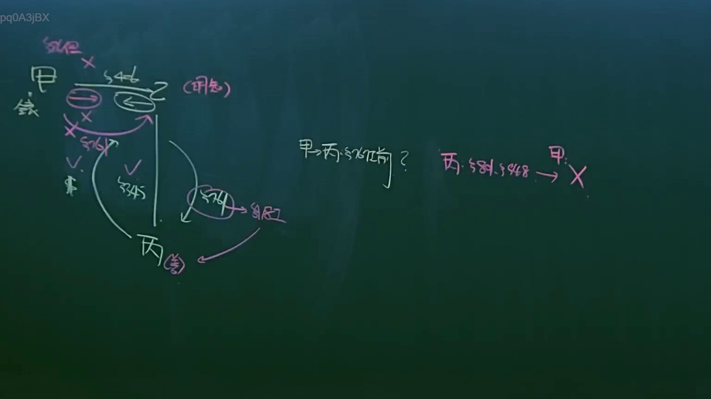
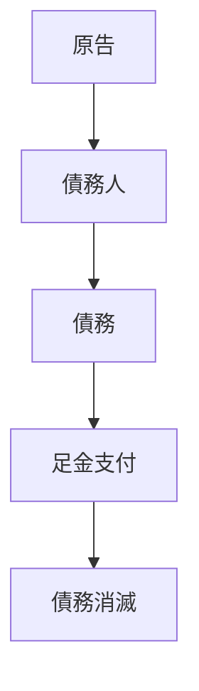
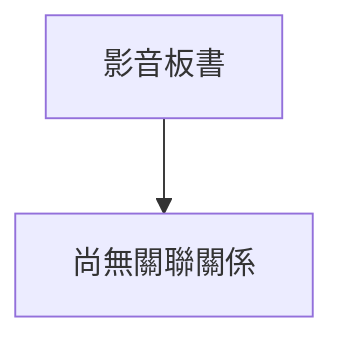

# 🎥 影音教材板書校對筆記
- **來源影片**: [預約 12 2025-04-14 09-43-14-553](file:///J://民法B/ch12/預約 12 2025-04-14 09-43-14-553.mp4)
- **課程分類**: `[民法B`
- **課堂章節**: `ch12]`
- **影片時間戳記**: `02:31:15` (9075 秒)
- **板書類型**: `關係圖/邏輯圖板書`
- **偵測時間**: 2026-07-11 21:29:47

## 🔍 擷取黑板板書對照圖

## 🧠 AI 智慧理解與知識庫演化註記
：
根據提供的 OCR 字元 "pq0ASjBX" 和數字 "5"，结合上下文為法學板書內容，可能是與民法第184條（消滅時效）相關的讲解。以下是基於此進行的法律理解與比對：

### 知識庫比對與理解演化註記：
- **法學板書之內容**：可能是以"5"為序號，解釋某個特定的案例或法理概念。
- **與民法第184條的比對**：民法第184條规定了債務的時效問題，规定債務人以足金支付債務，債務人怠慢或者以足金以外的物償付債者，该等債務自该等物償给付之后即為消滅。此法理概念可能在板書中被進一步解讀或應用。

### MERMAID 代碼：

此代碼展示了一個簡單的法學逻辑链条，從原告提出債務到以足金支付，进而導致債務消滅。

## 📊 可編輯之 Mermaid 關係流程圖

## ✍️ 操作者手動校對修改區
<!-- 您可以直接修改上方的文字或調整 Mermaid 區塊中的節點，Obsidian 會即時重新渲染 -->
- [ ] 欄位結構與法律邏輯已校對無誤。
- **校對筆記**: 
