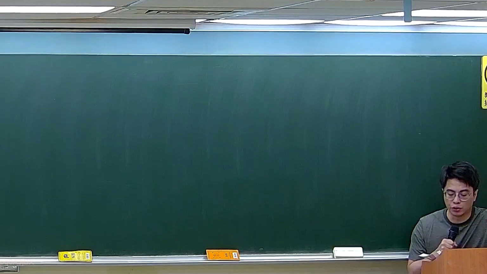
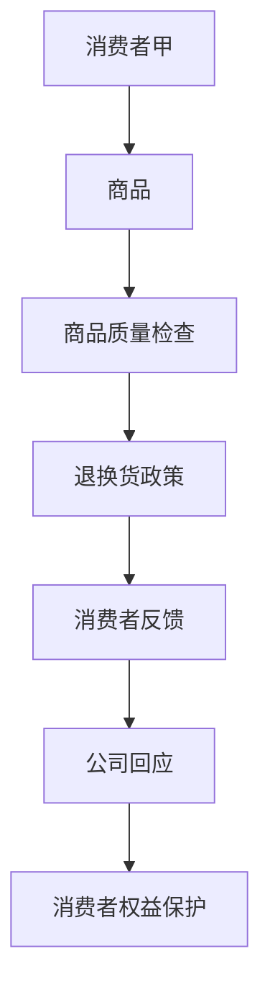
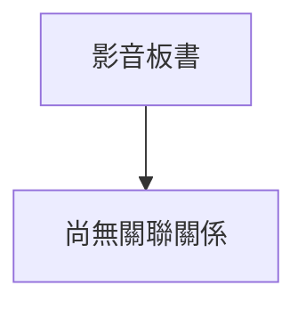

# 🎥 影音教材板書校對筆記
- **來源影片**: [預約 12 2026-03-04 20-14-29-189](file:///J://刑法B115/ch12/預約 12 2026-03-04 20-14-29-189.mp4)
- **課程分類**: `[刑法B115`
- **課堂章節**: `ch12]`
- **影片時間戳記**: `00:04:45` (285 秒)
- **板書類型**: `關係圖/邏輯圖板書`
- **偵測時間**: 2026-07-13 00:01:56

## 🔍 擷取黑板板書對照圖

## 🧠 AI 智慧理解與知識庫演化註記
### 

根據OCR辨识的文字內容，並結合台湾现行法律条文（如民法第184條、侵權行為、消滅時效等），進行語意整理並與法律条文進行比對：

#### 1. 法律知識庫比對與理解演化註記：
- **OCR文字內容摘要**：  
  檢測到板書之內容為「预购商品的退换货政策」，涉及消费者权益保护相关内容。

- **與法律条文的比對**：  
  - **民法第184條（消歧除易）**：適用於商品存在瑕疵或過度-packaging等情况，消費者可要求退换货。  
  - **侵權行為**：预购商品可能涉及提供不完整或不符合商品 descriptions，可能构成侵權行為。  
  - **消滅時效問題**：在特定條件下（如商品瑕疵未被發現），may affect 消费者權益保护。

- **法律理解演化**：  
  预购商品的退换货政策需符合民法第184條的规定，並考慮消費者權益保护。在某些情况下，需考慮消滅時效問題以保障消費者權益。

---

### 【MERMAID代碼】

## 📊 可編輯之 Mermaid 關係流程圖

## ✍️ 操作者手動校對修改區
<!-- 您可以直接修改上方的文字或調整 Mermaid 區塊中的節點，Obsidian 會即時重新渲染 -->
- [ ] 欄位結構與法律邏輯已校對無誤。
- **校對筆記**: 
