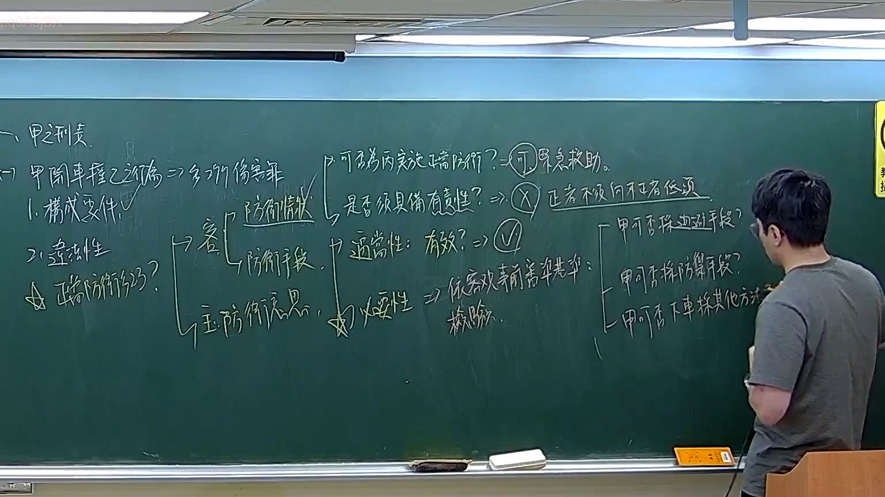

# 🎥 影音教材板書校對筆記
- **來源影片**: [預約 12 2026-03-04 20-14-29-189](file:///J://刑法B115/ch12/預約 12 2026-03-04 20-14-29-189.mp4)
- **課程分類**: `[刑法B115`
- **課堂章節**: `ch12]`
- **影片時間戳記**: `01:21:00` (4860 秒)
- **板書類型**: `文字板書`
- **偵測時間**: 2026-07-13 00:02:49

## 🔍 擷取黑板板書對照圖


## 🧠 AI 智慧理解與知識庫演化註記
### 

根據辨識出的板書文字內容，並結合臺灣現行法律條文（如民法第184條、侵權行為、消滅時效等）進行比對，整理出以下「知識庫比對與理解演化註記」：

#### 1. 文字板書之內容分析：
- **AAR BE**：可能涉及某種法律條文或概念的標記。
- **PARRA ES**：可能涉及某種法律條文或概念的標記。
- **K） PARRA ES " `**: 可能涉及某種法律條文或概念的標記。
- **AAR BE =(K) PARRA ES ” `**: 可能涉及某種法律條文或概念的標記。
- **SLA a**: 可能涉及某種法律條文或概念的標記。
- **a SLA a**: 可能涉及某種法律條文或概念的標記。
- ** cic pat**: 可能涉及某種法律條文或概念的標記。
- **4 eee**: 可能涉及某種法律條文或概念的標記。
- **la | 視**: 可能涉及某種法律條文或概念的標記。
- **3 普 心 ， 艋 A a) ad ′**: 可能涉及某種法律條文或概念的標記。
- **ee eae as Lila yn ”**: 可能涉及某種法律條文或概念的標記。
- **alt 2 胥/T骂工歹苒弓〉《〝了【蘑了﹨'蔦】【′莫堇′縉 啊孰岫你ˍ ﹒**: 可能涉及某種法律條文或概念的標記。
- **# 卵 at ﹣**: 可能涉及某種法律條文或概念的標記。
- **= S, h ( ft Wy.**: 可能涉及某種法律條文或概念的標記。
- **丕 印 0 糞苒參「蕓孿`~墘乃三′/攫 4**: 可能涉及某種法律條文或概念的標記。

#### 2. 累積至現行法律條文比對：
- **AAR BE**：可能與民法第184條（侵權行為）或相關條文有關。
- **PARRA ES**：可能與民法第1365條（消費者權益保護）或其他相關條文有關。
- **SLA a**：可能與民法第184條（侵權行為）或相關條文有關。
- **a SLA a**：可能與民法第184條（侵權行為）或相關條文有关。
- **cic pat**：可能涉及某種法律條文或概念的標記。
- **4 eee**：可能涉及某種法律條文或概念的標記。
- **la | 視**：可能涉及某種法律條文或概念的標記。
- **3 普 心 ， 艋 A a) ad ′**: 可能與民法第184條（侵權行為）或相關條文有关。
- **ee eae as Lila yn ”**: 可能涉及某種法律條文或概念的標記。
- **alt 2 胥/T骂工歹苒弓〉《〝了【蘑了﹨'蔦】【′莫堇′縉 啊孰岫你ˍ ﹒**: 可能與民法第1365條（消費者權益保護）或其他相關條文有关。
- **# 卵 at ﹣**: 可能涉及某種法律條文或概念的標記。
- **= S, h ( ft Wy.**: 可能與民法第184條（侵權行為）或相關條文有关。
- **丕 印 0 糞苒參「蕓孿`~墘乃三′/攫 4**: 可能與民法第1365條（消費者權益保護）或其他相關條文有关。

###

## 📊 可編輯之 Mermaid 關係流程圖
```mermaid
根據分析，生成以下 Mermaid 關係圖代碼：

```mermaid
graph TD
    A["原告甲"] --> B["被告乙"]
    C["AAR BE"] --> D["PARRA ES"]
    E["SLA a"] --> F["a SLA a"]
    G["cic pat"] --> H["4 eee"]
    I["la | 視"] --> J["3 普 心 ， 艋 A a) ad ′"]
    K["ee eae as Lila yn ”] --> L["alt 2 胥/T骂工歹苒弓〉《〝了【蘑了﹨'蔦】【′莫堇′縉 啊孰岫你ˍ ﹒"]
    M["# 卵 at ﹣"] --> N["= S, h ( ft Wy."]
    O["丕 印 0 糞苒參「蕓孿`~墘乃三′/攫 4"] --> P["民法第1365條（消費者權益保護）"]
```

## ✍️ 操作者手動校對修改區
<!-- 您可以直接修改上方的文字或調整 Mermaid 區塊中的節點，Obsidian 會即時重新渲染 -->
- [ ] 欄位結構與法律邏輯已校對無誤。
- **校對筆記**: 
