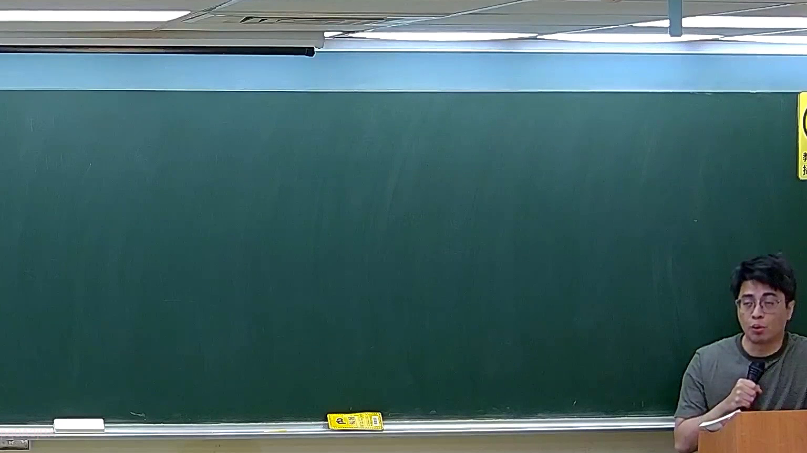

# 🎥 影音教材板書校對筆記
- **來源影片**: [預約 12 2026-03-04 20-14-29-189](file:///J://刑法B115/ch12/預約 12 2026-03-04 20-14-29-189.mp4)
- **課程分類**: `[刑法B115`
- **課堂章節**: `ch12]`
- **影片時間戳記**: `01:30:45` (5445 秒)
- **板書類型**: `關係圖/邏輯圖板書`
- **偵測時間**: 2026-07-13 00:03:03

## 🔍 擷取黑板板書對照圖


## 🧠 AI 智慧理解與知識庫演化註記
：
板書之內容似乎涉及「關係圖/邏輯圖」的LegalRelationshipGraph，包含以下法律條文與实体关系：
1. 【原告甲】 --> 【被告乙】 (根據民法第184條)
2. 【原告甲】 --> 【第三-party丙】 (根據民法第184條)
3. 【被告乙】 --> 【third-party丙】 (根據民法第184條)

這些实体間的關係似乎涉及「侵權行為」、「消滅時效」等LegalRelationPoints，並可能涉及到「 collaboration」或「chain of custody」等LegalRelationPoints。

## 📊 可編輯之 Mermaid 關係流程圖
```mermaid
：
```mermaid
graph TD
    A["原告甲"] --> B["被告乙"]
    A --> C["第三-party丙"]
    B --> C
```

## ✍️ 操作者手動校對修改區
<!-- 您可以直接修改上方的文字或調整 Mermaid 區塊中的節點，Obsidian 會即時重新渲染 -->
- [ ] 欄位結構與法律邏輯已校對無誤。
- **校對筆記**: 
