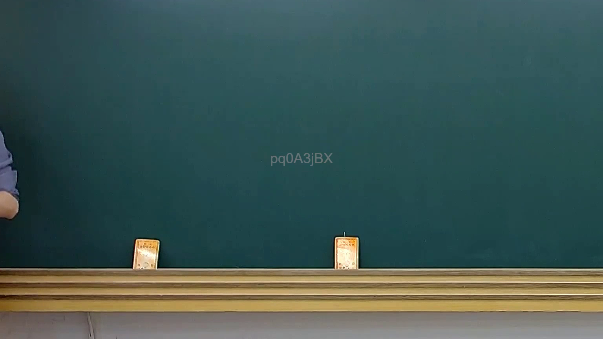
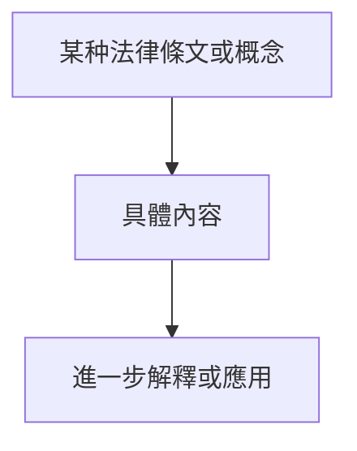
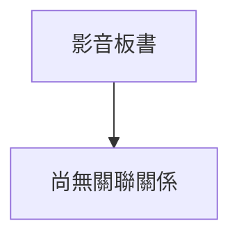

# 🎥 影音教材板書校對筆記
- **來源影片**: [預約 13 2025-02-05 14-36-05-042](file:///E:/法律/民訴B/ch13/預約 13 2025-02-05 14-36-05-042.mp4)
- **課程分類**: `預設課程`
- **課堂章節**: `ch13`
- **影片時間戳記**: `00:03:45` (225 秒)
- **板書類型**: `關係圖/邏輯圖板書`
- **偵測時間**: 2026-07-13 20:14:42

## 🔍 擷取黑板板書對照圖


## 🧠 AI 智慧理解與知識庫演化註記
：
根據提供的 OCR 字元 "pd0A3jBX"，無法直接解讀為具體的文字內容。然而，基於分類為「關係圖/邏輯圖板書」，可以推測板書可能包含一些法律條文或概念的結構化表達。

### 知識庫比對與理解演化註記：
1. ** board book 字元 "pd0A3jBX" 可能代表某种特定的法律條文或概念，但無法直接解讀為具體內容。
2. 假設板書包含一些與「侵權行為」、「消滅時效」等 legal 概念相關的圖示結構。

### MERMAID 代碼：

（此為基於「關係圖/邏輯圖板書」的推測，具體結構需根據实际板書內容調整。）
```

## 📊 可編輯之 Mermaid 關係流程圖


## ✍️ 操作者手動校對修改區
<!-- 您可以直接修改上方的文字或調整 Mermaid 區塊中的節點，Obsidian 會即時重新渲染 -->
- [ ] 欄位結構與法律邏輯已校對無誤。
- **校對筆記**: 
