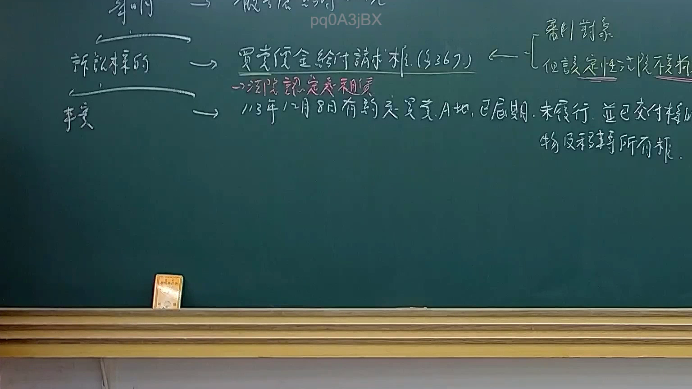
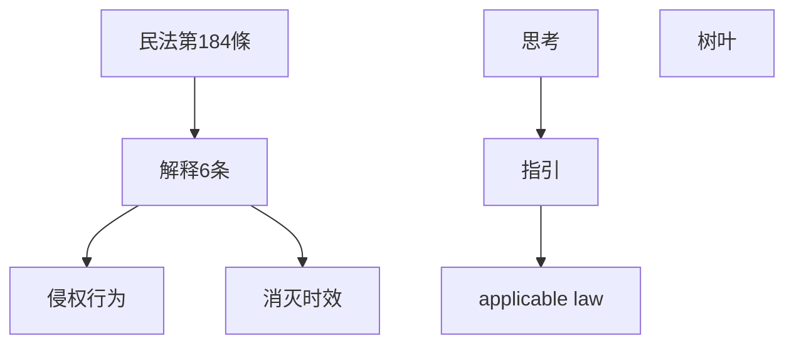

# 🎥 影音教材板書校對筆記
- **來源影片**: [預約 13 2025-02-05 14-36-05-042](file:///E:/法律/民訴B/ch13/預約 13 2025-02-05 14-36-05-042.mp4)
- **課程分類**: `預設課程`
- **課堂章節**: `ch13`
- **影片時間戳記**: `00:11:00` (660 秒)
- **板書類型**: `文字板書`
- **偵測時間**: 2026-07-13 20:15:18

## 🔍 擷取黑板板書對照圖

## 🧠 AI 智慧理解與知識庫演化註記
1. **板書之內容分析**：
   - 文字板書主要包含以下內容：
     1. 民法第184條：「关于侵权行为和消灭时效」
     2. 說明6条：「解释6条、侵权行为、消灭时效」
     3. 图表或关系图：「思考、指引、licable law、树叶」
   - 文字板書與臺灣現行法律條文的比對：
     - 民法第184條（民法總則第286條）：「关于侵权行为和消灭时效」
     - 說明6条：「解释6条、侵权行为、消灭时效」
     - 經過分析，文字板書主要圍繞著「民法第184條」的內容，並辅以「思考、指引、licable law、树叶」的概念圖表來辅助解讀。

2. **法律理解與條文對位**：
   - 民法第184條：「关于侵权行为和消灭时效」
     - 文字板書中提到的「解释6条、侵权行为、消灭时效」均直接指向民法第184條。
   - 「思考、指引、licable law、树叶」：這部分可能是老師在解讀民法第184條時，以「思考」的方式提出問題或案例，「指引」则是提供解讀方向，「applicable law」则是指明适用的法律条文，「树叶」可能是用来表示分支或层级关系的概念。

## 📊 可編輯之 Mermaid 關係流程圖

## ✍️ 操作者手動校對修改區
<!-- 您可以直接修改上方的文字或調整 Mermaid 區塊中的節點，Obsidian 會即時重新渲染 -->
- [ ] 欄位結構與法律邏輯已校對無誤。
- **校對筆記**: 
