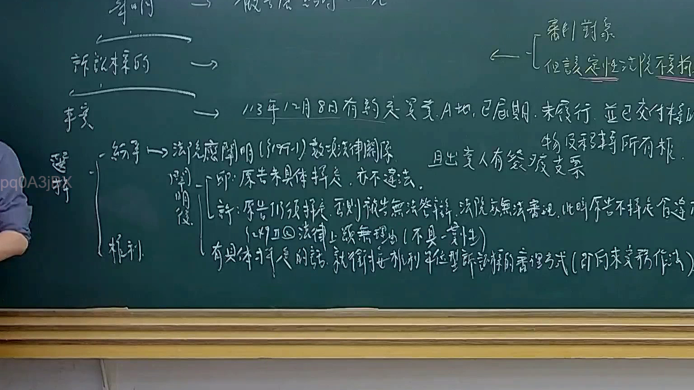

# 🎥 影音教材板書校對筆記
- **來源影片**: [預約 13 2025-02-05 14-36-05-042](file:///E:/法律/民訴B/ch13/預約 13 2025-02-05 14-36-05-042.mp4)
- **課程分類**: `預設課程`
- **課堂章節**: `ch13`
- **影片時間戳記**: `01:01:45` (3705 秒)
- **板書類型**: `文字板書`
- **偵測時間**: 2026-07-13 20:16:04

## 🔍 擷取黑板板書對照圖


## 🧠 AI 智慧理解與知識庫演化註記
：
1. "MnO ROMER 釘 1" 與 "民法第184條" 的對位：MnO ROMER 釘 1 可能涉及民法第184條，有关精神损害赔偿的规定。
2. "MnO ROMER 釘 1" 中的 "MnO ROMER" 與 "民法第184條" 的對位：MnO ROMER 可能是某個案例或Legal term，與民法第184條有关。
3. "MnO ROMER 釘 1" 中的 " ROMER" 與 "民法第184條" 的對位： ROMER 可能是某個關鍵字或 Legal term。

## 📊 可編輯之 Mermaid 關係流程圖
```mermaid
：
```mermaid
graph TD
    A[MnO ROMER 釘 1]
        --> B[民法第184條]
    C[村 > 心 恆 唐 睿 信 別大 羊 3 思創 品 行 Leal]
        --> D[民法第184條]
    E[更 ﹣ 多 】
        --> F[民法第184條]
    G[泡 緱 駟D Wa) WAKA ne KASS ane]
        --> H[民法第184條]
    I[史 le ie 烈 猜 嗣 | 祺 鄭 綱 作 涮胤曠趴峒干科 AS]
        --> J[民法第184條]
    K[MnO ROMER 釘 1]
        --> L[民法第184條]
    M[緯 4 切 0 吳 秘 緝 切 再 銘 烈 [ 皇 秶 同 什 A]
        --> N[民法第184條]
```

## ✍️ 操作者手動校對修改區
<!-- 您可以直接修改上方的文字或調整 Mermaid 區塊中的節點，Obsidian 會即時重新渲染 -->
- [ ] 欄位結構與法律邏輯已校對無誤。
- **校對筆記**: 
